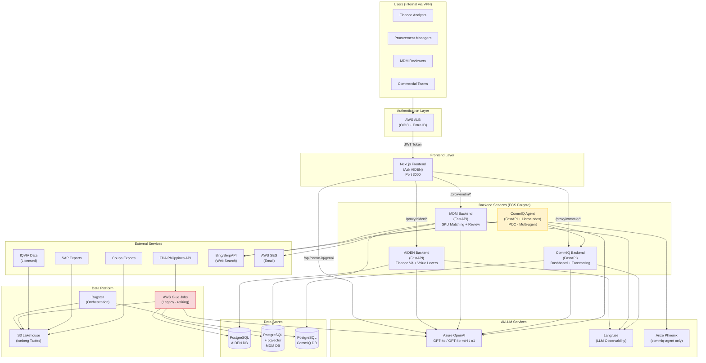
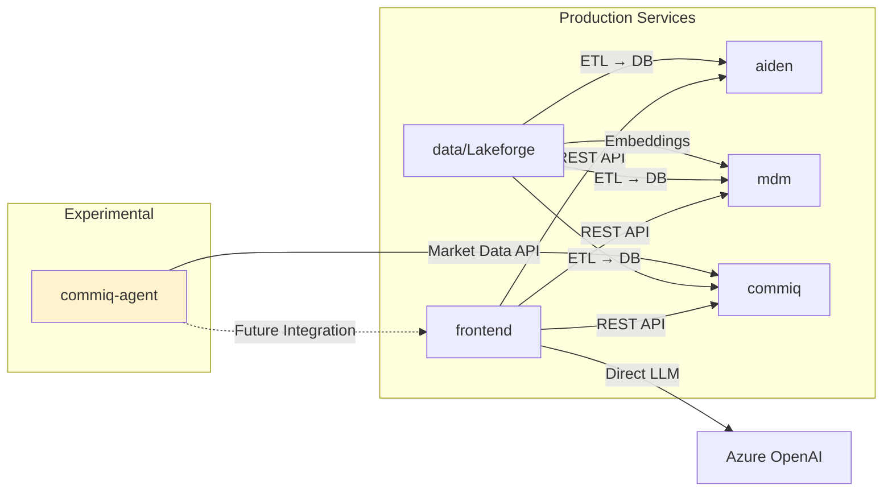
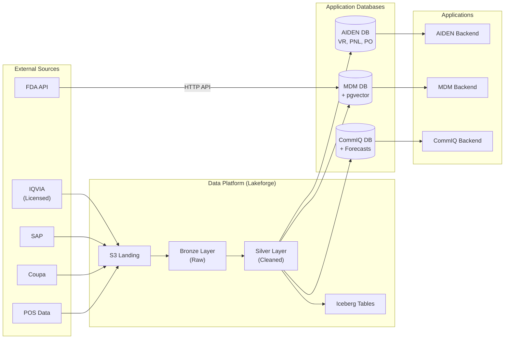
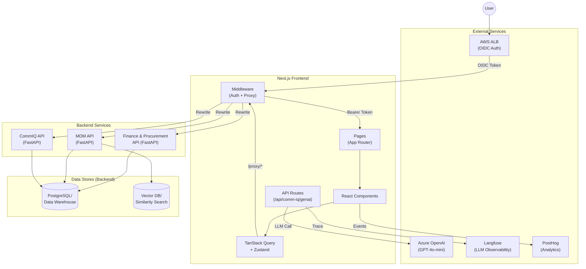
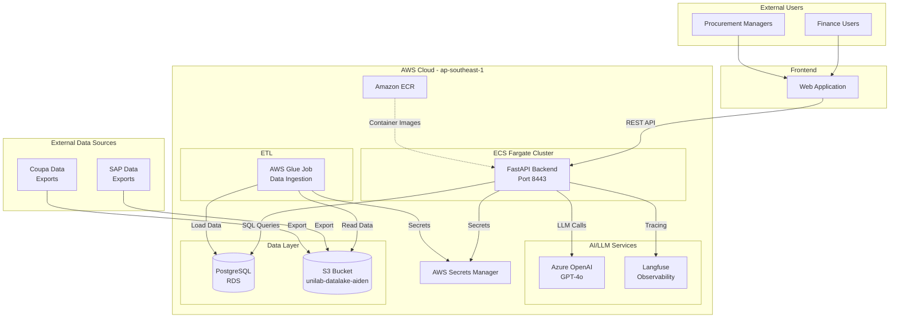
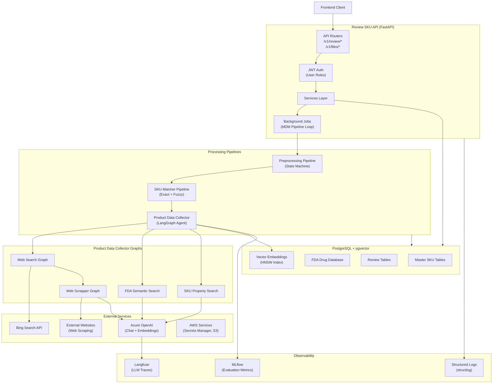
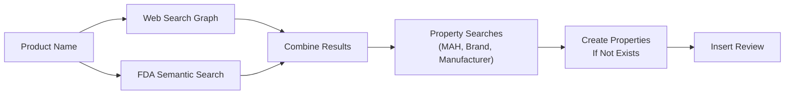
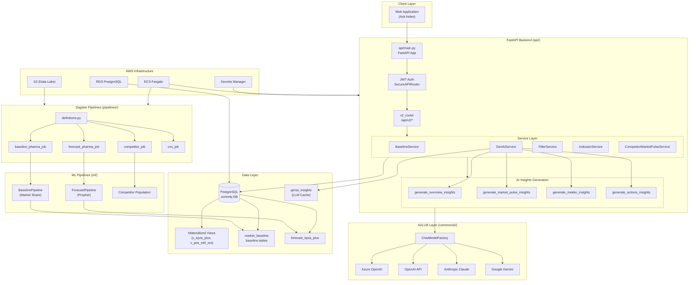
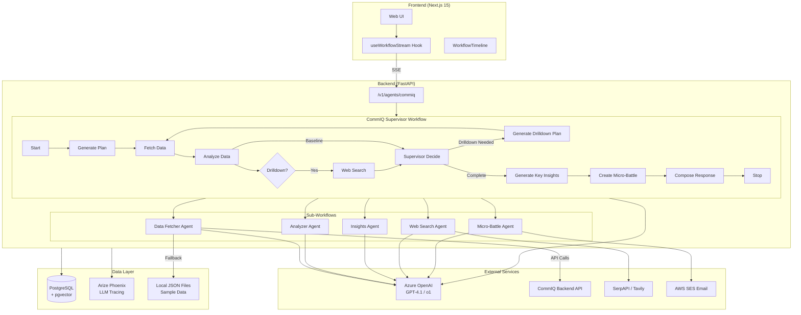
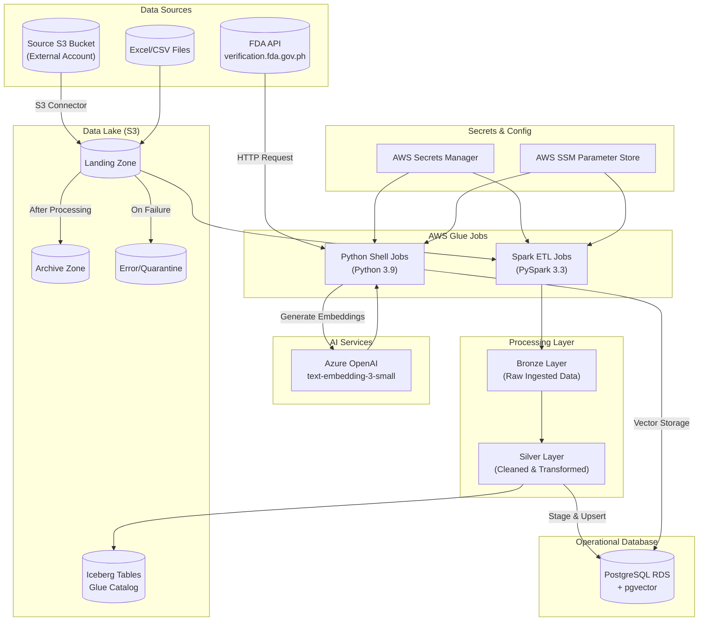

# Unilab — AIDEN application suite

This markdown consolidates the documentation for the set of applications delivered under Unilab’s **AIDEN** program. It combines multiple repositories / services into a single view (product + architecture + AI capabilities), and then appends the underlying technical documentation “as-is” plus development insights and anecdotes captured in stakeholder materials.

## Applications included (combined)

- **Unified Web Frontend (“Ask AIDEN”)** — Next.js application surfacing all use cases in one UI.
- **AIDEN Backend (Finance & Procurement)** — Finance/Procurement assistant + procurement value levers.
- **MDM (Master Data Management)** — AI-assisted SKU matching + human-in-the-loop review workflows.
- **Commercial IQ (CommIQ)** — Market intelligence dashboards, forecasting, and GenAI-generated summaries.
- **CommIQ Agent (PoC)** — Agentic workflow for micro-battle ideation and automation.
- **Data Platform (“Lakeforge”)** — Ingestion/ETL, lakehouse storage, and shared data/embedding pipelines.


# Code documentation

<details>
<summary><strong>Portfolio synthesis (overall architecture & portfolio)</strong> (portfolio_synthesis.md)</summary>

# AIDEN Platform - Technical & AI Portfolio Overview

## Executive Summary

**AIDEN** is Unilab's enterprise AI-powered business intelligence platform, providing a unified suite of GenAI-enabled applications for pharmaceutical business operations in the Philippines. The portfolio comprises **6 repositories** delivering **4 major use cases** through a shared infrastructure and technology stack.

### Key Statistics

| Metric                       | Value                                          |
| ---------------------------- | ---------------------------------------------- |
| **Repositories**             | 6 (5 production, 1 POC)                        |
| **Primary Use Cases**        | Finance VA, Procurement Analytics, MDM, CommIQ |
| **AI/ML Capabilities**       | 12+ distinct AI features                       |
| **LLM Provider**             | Azure OpenAI (GPT-4o, GPT-4o-mini, o1)         |
| **Orchestration Frameworks** | LangChain, LangGraph, LlamaIndex               |
| **Cloud Infrastructure**     | AWS (ECS, RDS, S3, Glue→Dagster)               |
| **Observability**            | Langfuse, Arize Phoenix, PostHog               |

### Critical Findings Summary

| Finding                                              | Impact                       | Repos Affected |
| ---------------------------------------------------- | ---------------------------- | -------------- |
| **Comprehensive AI capabilities**                    | Strength                     | All            |
| **Consistent tech stack**                            | Strength                     | All            |
| **LLM observability mature**                         | Strength                     | All            |
| **JWT signature verification disabled**              | Accepted Risk                | aiden, mdm     |
| **No prompt injection protection**                   | Accepted Risk (low priority) | All            |
| **Glue→Dagster migration in progress**               | Transition                   | data, commiq   |
| **POC code (commiq-agent) separate from production** | Technical Debt Potential     | commiq-agent   |

---

## 1. Portfolio Composition

### 1.1 Repository Catalog

| Repository           | Role                        | Status       | AI-Enabled  | Primary Domain                       |
| -------------------- | --------------------------- | ------------ | ----------- | ------------------------------------ |
| **aiden**            | Backend API                 | Production   | ✅ Heavy    | Finance VA, Procurement Value Levers |
| **frontend**         | Unified Web UI              | Production   | ✅ Moderate | All use cases (Ask AIDEN)            |
| **mdm**              | SKU Management              | Production   | ✅ Heavy    | Master Data Management               |
| **commiq**           | Market Intelligence Backend | Production   | ✅ Heavy    | Commercial IQ Dashboard              |
| **commiq-agent**     | Agentic Insights POC        | Experimental | ✅ Heavy    | Multi-agent market analysis          |
| **data** (Lakeforge) | Data Platform               | Production   | ✅ Light    | ETL, Lakehouse, Embeddings           |

### 1.2 System Landscape Diagram



### 1.3 Service Dependencies



**Key Dependencies:**

- **frontend** → All backend services (aiden, mdm, commiq) via REST API **(Confirmed)**
- **data** → All backend databases via ETL pipelines **(Confirmed)**
- **commiq-agent** → commiq backend for market data **(Confirmed)**
- **mdm** consumes FDA embeddings generated by **data** pipeline **(Confirmed)**

---

## 2. Technology Stack

### 2.1 Shared Technologies

| Technology              | Used In                                | Purpose              | Version Consistency |
| ----------------------- | -------------------------------------- | -------------------- | ------------------- |
| **Python**              | aiden, mdm, commiq, commiq-agent, data | Backend runtime      | 3.10-3.13 (varies)  |
| **FastAPI**             | aiden, mdm, commiq, commiq-agent       | REST API framework   | ✅ Consistent       |
| **PostgreSQL**          | All                                    | Primary database     | 17 (Confirmed)      |
| **Azure OpenAI**        | All                                    | LLM provider         | ✅ Consistent       |
| **LangChain**           | aiden, mdm, commiq, data               | LLM orchestration    | ✅ Consistent       |
| **Langfuse**            | aiden, frontend, mdm, commiq           | LLM observability    | ✅ Consistent       |
| **SQLAlchemy/SQLModel** | All backends                           | ORM                  | ✅ Consistent       |
| **Docker**              | All                                    | Containerization     | ✅ Consistent       |
| **GitLab CI/CD**        | All                                    | Deployment pipeline  | ✅ Consistent       |
| **AWS (ECS, S3, RDS)**  | All                                    | Cloud infrastructure | ✅ Consistent       |
| **Pydantic**            | All                                    | Data validation      | ✅ Consistent       |
| **structlog**           | mdm, commiq, commiq-agent              | Structured logging   | ✅ Consistent       |

### 2.2 Technology Divergence

| Need                          | Choice A                               | Choice B                              | Recommendation                           |
| ----------------------------- | -------------------------------------- | ------------------------------------- | ---------------------------------------- |
| **Python Version**            | 3.10 (data), 3.12 (aiden, mdm, commiq) | 3.13 (commiq-agent)                   | Standardize on 3.12 for stability        |
| **Orchestration Framework**   | LangGraph (aiden, mdm)                 | LlamaIndex Workflow (commiq-agent)    | Document rationale; both are valid       |
| **LLM Observability**         | Langfuse (all production)              | Arize Phoenix (commiq-agent)          | Evaluate Phoenix for production adoption |
| **ML Pipeline Orchestration** | AWS Glue (data - legacy)               | Dagster (commiq, data - new)          | Complete migration to Dagster            |
| **Logging**                   | Python logging (aiden, data)           | structlog (mdm, commiq, commiq-agent) | Standardize on structlog                 |
| **Frontend Framework**        | Next.js 14 (frontend)                  | Next.js 15 (commiq-agent)             | Align when commiq-agent promoted         |

### 2.3 Framework & Library Alignment

**AI/ML Frameworks:**
| Framework | Repos | Purpose |
|-----------|-------|---------|
| LangChain | aiden, mdm, commiq, data | LLM calls, embeddings, chains |
| LangGraph | aiden, mdm | Multi-step agent workflows |
| LlamaIndex | commiq-agent | Multi-agent orchestration |
| Prophet | commiq | Time series forecasting |
| SentenceTransformers | aiden, mdm | Text embeddings |
| Hugging Face | mdm | Medical domain embeddings |

**Backend Frameworks:**

- FastAPI: Universal across all Python backends **(Confirmed)**
- Uvicorn: ASGI server for all services **(Confirmed)**
- SQLAlchemy/SQLModel: ORM layer **(Confirmed)**

**Frontend Frameworks:**

- Next.js: App Router pattern **(Confirmed)**
- React: UI library **(Confirmed)**
- Tailwind CSS: Styling **(Confirmed)**
- shadcn/ui + Radix: Component library **(Confirmed)**
- TanStack Query: Server state management **(Confirmed)**
- Zustand: Client state management **(Confirmed)**

---

## 3. AI/ML/GenAI Capabilities

### 3.1 Capability Matrix

| Capability                               | Repo(s)                  | Implementation Pattern                | Models Used            | Maturity       |
| ---------------------------------------- | ------------------------ | ------------------------------------- | ---------------------- | -------------- |
| **LLM-powered Chatbot**                  | aiden, frontend          | LangGraph agent + tool calling        | GPT-4o                 | Production     |
| **Tool-calling Agents**                  | aiden, mdm, commiq-agent | LangChain/LlamaIndex function calling | GPT-4o, GPT-4.1        | Production/POC |
| **Multi-agent Orchestration**            | mdm, commiq-agent        | LangGraph graphs, LlamaIndex Workflow | GPT-4o, o1             | Production/POC |
| **RAG (Retrieval-Augmented Generation)** | mdm                      | pgvector + LLM validation             | GPT-4o + embeddings    | Production     |
| **Embeddings & Semantic Search**         | mdm, data                | Azure OpenAI + pgvector HNSW          | text-embedding-3-small | Production     |
| **Text Clustering**                      | aiden                    | SentenceTransformers + DBSCAN         | all-MiniLM-L6-v2       | Production     |
| **Time Series Forecasting**              | commiq                   | Prophet + OLS regression              | Statistical (non-LLM)  | Production     |
| **Multimodal Analysis**                  | commiq, frontend         | Chart images + text prompts           | GPT-4o-mini            | Production     |
| **Structured Output Extraction**         | All                      | Pydantic + with_structured_output()   | Various                | Production     |
| **Web Research Agents**                  | mdm, commiq-agent        | Bing Search, SerpAPI, Tavily          | GPT-4o                 | Production/POC |
| **LLM-generated Insights**               | aiden, commiq, frontend  | Prompt chains                         | GPT-4o, GPT-4o-mini    | Production     |
| **Image Classification**                 | mdm                      | Vision prompts                        | GPT-4o (vision)        | Production     |

### 3.2 Model Provider Landscape

| Provider                 | Models                     | Repositories       | Configuration Pattern         |
| ------------------------ | -------------------------- | ------------------ | ----------------------------- |
| **Azure OpenAI**         | GPT-4o                     | aiden, mdm, commiq | Primary LLM, deployment-based |
| **Azure OpenAI**         | GPT-4o-mini                | frontend, commiq   | Cost-optimized insights       |
| **Azure OpenAI**         | o1                         | commiq-agent       | Thinking/reasoning tasks      |
| **Azure OpenAI**         | GPT-4.1                    | commiq-agent       | Agent tool calling            |
| **Azure OpenAI**         | text-embedding-3-small     | mdm, data          | Vector embeddings (1536 dim)  |
| **Hugging Face**         | MedEmbed-base-v0.1         | mdm                | Medical domain embeddings     |
| **SentenceTransformers** | all-MiniLM-L6-v2           | aiden              | Text clustering               |
| **OpenAI (direct)**      | gpt-4o-mini                | commiq (fallback)  | Multi-provider support        |
| **Anthropic**            | claude-sonnet-4-5-20250929 | commiq (fallback)  | Multi-provider support        |
| **Google**               | gemini-1.5-pro             | commiq (fallback)  | Multi-provider support        |

**Credential Management:**

- AWS Secrets Manager for production **(Confirmed across all repos)**
- Environment variables for development **(Confirmed)**
- Secret names: `azure-openai`, `azure-openai-embeddings`, etc. **(Confirmed)**

### 3.3 Orchestration Patterns

| Pattern                     | Repos                    | Description                                       |
| --------------------------- | ------------------------ | ------------------------------------------------- |
| **Simple LLM API calls**    | frontend, data           | Direct Azure OpenAI SDK calls                     |
| **Sequential Chains**       | aiden, commiq            | Data → Analysis → Formatting pipeline             |
| **Tool-calling Agents**     | aiden, mdm, commiq-agent | LLM selects and invokes tools iteratively         |
| **Multi-agent Supervisors** | commiq-agent             | Supervisor decides which sub-agents to invoke     |
| **State Machine Workflows** | mdm                      | Pipeline states with conditional transitions      |
| **Graph-based Workflows**   | aiden, mdm               | LangGraph with parallel and conditional edges     |
| **Sub-graph Composition**   | mdm                      | Nested graphs (WebSearchGraph → WebScrapperGraph) |

**Agent Architecture Comparison:**

```
AIDEN (LangGraph):
├── DataExtractionGraph
│   ├── DataCollectionGraph (Agent + 7 tools)
│   └── CalculationGraph (Agent + 3 tools)
└── FormatPlotGraph

MDM (LangGraph):
├── ProductDataCollectorGraph
│   ├── WebSearchGraph (sub-graph)
│   │   └── WebScrapperGraph (sub-sub-graph)
│   ├── FDASearch (parallel entry)
│   └── SKUPropertySearch (parallel entry)

CommIQ-Agent (LlamaIndex Workflow):
├── CommIQSupervisorWorkflow
│   ├── DataFetcherWorkflow
│   ├── AnalyzerWorkflow
│   ├── InsightsWorkflow
│   ├── WebSearchWorkflow
│   └── MicroBattleWorkflow
```

### 3.4 Prompt Management

| Aspect                 | aiden        | mdm                | commiq               | commiq-agent | frontend          |
| ---------------------- | ------------ | ------------------ | -------------------- | ------------ | ----------------- |
| **Storage Format**     | Python files | Python files       | Python files         | Python files | TypeScript        |
| **Location**           | `prompts/`   | `prompts/`         | `services/insights/` | `prompts/`   | Inline            |
| **Versioning**         | Git only     | Git only           | Git only             | Git only     | Git only          |
| **Template Variables** | f-strings    | ChatPromptTemplate | f-strings            | f-strings    | Template literals |
| **Governance**         | Code review  | Code review        | Code review          | Code review  | Code review       |

**Prompt Characteristics:**

- Role-based context injection (user role, divisions) **(Confirmed in aiden)**
- Reference data injection (codes, mappings) **(Confirmed in aiden)**
- Structured output instructions via Pydantic schemas **(Confirmed across all)**
- Date/time awareness **(Confirmed in aiden, commiq)**
- Chain-of-thought guidance in system prompts **(Confirmed in commiq-agent)**

---

## 4. Data Architecture

### 4.1 Data Store Landscape

| Database/Store          | Type                  | Repositories               | Primary Use                              |
| ----------------------- | --------------------- | -------------------------- | ---------------------------------------- |
| **PostgreSQL (AIDEN)**  | Relational            | aiden, data                | Finance VA data (VR, PNL, PO, Expenses)  |
| **PostgreSQL (MDM)**    | Relational + pgvector | mdm, data                  | SKU master data, FDA embeddings, reviews |
| **PostgreSQL (CommIQ)** | Relational            | commiq, commiq-agent, data | Market data, forecasts, GenAI cache      |
| **S3 Lakehouse**        | Object + Iceberg      | data                       | Raw/transformed data, medallion layers   |
| **AWS Glue Catalog**    | Metadata              | data                       | Iceberg table catalog                    |

### 4.2 Cross-Repository Data Flows



**Data Flow Summary:**

1. **Source → S3 Landing**: Manual upload, RPA, automated exports **(Confirmed)**
2. **Landing → Bronze**: Raw ingestion with lineage columns **(Confirmed)**
3. **Bronze → Silver**: Cleaning, normalization, deduplication **(Confirmed)**
4. **Silver → PostgreSQL**: Stage and upsert pattern **(Confirmed)**
5. **Silver → Iceberg**: Lakehouse persistence **(Confirmed)**

### 4.3 Vector/Embedding Infrastructure

| Component           | Implementation                                 | Repos     |
| ------------------- | ---------------------------------------------- | --------- |
| **Embedding Model** | Azure OpenAI text-embedding-3-small (1536 dim) | mdm, data |
| **Vector Store**    | PostgreSQL + pgvector extension                | mdm       |
| **Index Type**      | HNSW (Hierarchical Navigable Small World)      | mdm       |
| **Distance Metric** | Cosine similarity                              | mdm       |
| **Threshold**       | 0.33 (FDA search)                              | mdm       |

**Embedding Use Cases:**

- **FDA Semantic Search**: Match product names to FDA drug registry **(Confirmed)**
- **SKU Similarity Search**: Find candidate master SKU matches **(Confirmed)**
- **Property Search**: Brand, manufacturer, MAH name matching **(Confirmed)**

**Embedding Template (data/FDA pipeline):**

```
"{generic_name} is a {dosage_strength} {dosage_form} marketed under the
brand name {brand_name}. Classified as a {classification}..."
```

---

## 5. Security & Governance

### 5.1 Authentication Landscape

| Repository       | Auth Method                | Role Model                   | Notes                                 |
| ---------------- | -------------------------- | ---------------------------- | ------------------------------------- |
| **frontend**     | ALB OIDC → JWT passthrough | Per-feature roles            | Role check via `checkUserCanAccess()` |
| **aiden**        | JWT Bearer (no sig verify) | Finance + Procurement roles  | ALB handles validation                |
| **mdm**          | JWT Bearer (no sig verify) | MDM_SUPER_USER, MDM_REVIEWER | ALB handles validation                |
| **commiq**       | JWT Bearer                 | USER, ADMIN                  | SecureAPIRouter enforces              |
| **commiq-agent** | JWT Bearer (optional)      | Azure AD / Okta              | `DISABLE_USER_AUTH=true` default      |

**Authentication Flow (Confirmed):**

```
User → VPN → ALB (OIDC/Entra ID) → JWT validation → Backend (user access check)
```

**Role Definitions:**

| Domain          | Roles                                                  |
| --------------- | ------------------------------------------------------ |
| **Finance**     | Finance Leader, Finance Manager, Finance Analyst       |
| **Procurement** | Procurement Leader, PM Manager, RM Manager, IM Manager |
| **MDM**         | MDM Super User, MDM Reviewer                           |
| **CommIQ**      | commiq Admin Role, commiq User Role                    |

### 5.2 AI Safety Assessment

| Risk Area                         | Repos with Mitigation                          | Repos without Mitigation | Status                         |
| --------------------------------- | ---------------------------------------------- | ------------------------ | ------------------------------ |
| **Prompt injection protection**   | None                                           | All                      | Accepted Risk (internal users) |
| **Output content filtering**      | frontend (disclaimer), Azure defaults          | aiden, mdm, commiq       | Partial                        |
| **PII handling in LLM prompts**   | aiden (user ID hashing), mdm (user ID hashing) | -                        | Mitigated                      |
| **Rate limiting on AI endpoints** | mdm (10 req/s LLM)                             | aiden, commiq, frontend  | Partial                        |
| **LLM response validation**       | All (Pydantic structured output)               | -                        | Good                           |
| **JWT/token security**            | ALB validates                                  | App-level disabled       | Accepted Pattern               |
| **LLM response logging**          | All (Langfuse/Phoenix)                         | -                        | Good                           |

**Accepted Risk Decisions:**

- Prompt injection protection deemed low priority due to limited internal user pool **(Confirmed)**
- JWT signature verification disabled at app level; ALB is trusted validator **(Confirmed)**
- Standard Azure OpenAI content moderation relied upon **(Confirmed)**

### 5.3 Data Classification

| Data Type                    | Classification | Handling                      | Repos        |
| ---------------------------- | -------------- | ----------------------------- | ------------ |
| Pharmaceutical sales (IQVIA) | Confidential   | Licensed, internal only       | commiq, data |
| Financial data (VR, PNL)     | Internal       | Role-based access             | aiden        |
| Purchase orders              | Internal       | Division-based segmentation   | aiden        |
| SKU/Product master           | Internal       | Review workflow               | mdm          |
| FDA drug registry            | Public         | Freely accessible             | mdm, data    |
| User data (email, UPN)       | PII            | SHA-256 hashed before logging | All          |
| GenAI insights               | Internal       | Cached, not externally shared | commiq       |

---

## 6. Observability & Testing

### 6.1 Logging Landscape

| Repository       | Logging Framework | Structure                 | LLM-specific          |
| ---------------- | ----------------- | ------------------------- | --------------------- |
| **aiden**        | Python logging    | Basic format              | Via Langfuse          |
| **frontend**     | Pino              | JSON (prod), Pretty (dev) | Via Langfuse          |
| **mdm**          | structlog         | JSON                      | Via Langfuse + MLflow |
| **commiq**       | structlog         | JSON                      | Via Langfuse          |
| **commiq-agent** | structlog         | JSON                      | Via Arize Phoenix     |
| **data**         | Python logging    | Basic format              | Progress bar only     |

### 6.2 LLM Observability

| Repository       | Tool                | Capabilities                  | Integration Depth |
| ---------------- | ------------------- | ----------------------------- | ----------------- |
| **aiden**        | Langfuse            | Full trace, token usage, cost | Deep (callbacks)  |
| **frontend**     | Langfuse            | Generation tracking           | Moderate          |
| **mdm**          | Langfuse + MLflow   | Traces + evaluation metrics   | Deep              |
| **commiq**       | Langfuse (inferred) | Mentioned in docs             | Unknown           |
| **commiq-agent** | Arize Phoenix       | OpenTelemetry spans           | Deep              |
| **data**         | None (progress bar) | Batch progress only           | Minimal           |

**Cost Tracking (Confirmed):**

- PostHog for user analytics
- Azure AI Dashboard for API usage
- Langfuse for token/cost metrics

### 6.3 Testing Coverage Matrix

| Repository       | Unit           | Integration   | E2E | AI/Eval    | Notable Gaps                          |
| ---------------- | -------------- | ------------- | --- | ---------- | ------------------------------------- |
| **aiden**        | ✅             | ✅            | ❌  | ❌         | No full chat flow tests, no LLM evals |
| **frontend**     | ✅ (112 files) | ❌            | ❌  | ❌         | No E2E, no LLM tests                  |
| **mdm**          | ✅ (19 files)  | ✅ (22 files) | ❌  | ✅ (basic) | Image classification tests present    |
| **commiq**       | ✅             | ✅            | ❌  | ❌         | No golden dataset evaluation          |
| **commiq-agent** | ✅             | ✅            | ❌  | ❌         | No workflow integration tests         |
| **data**         | ✅ (9 files)   | ✅ (11 files) | N/A | ❌         | Embeddings mocked, not tested real    |

**AI-Specific Testing Observations:**

- MDM has image classification and FDA search integration tests **(Confirmed)**
- No golden dataset evaluation across portfolio **(Confirmed)**
- LLM calls consistently mocked in tests **(Confirmed)**
- No prompt regression testing **(Confirmed)**

---

## 7. Deployment & Infrastructure

### 7.1 Cloud Architecture Summary

| Repository       | Cloud Provider       | Compute         | Database                  | Secrets               |
| ---------------- | -------------------- | --------------- | ------------------------- | --------------------- |
| **aiden**        | AWS                  | ECS Fargate     | RDS PostgreSQL            | Secrets Manager       |
| **frontend**     | AWS                  | ECS Fargate     | N/A                       | Secrets Manager       |
| **mdm**          | AWS                  | ECS Fargate     | RDS PostgreSQL + pgvector | Secrets Manager       |
| **commiq**       | AWS                  | ECS Fargate     | RDS PostgreSQL            | Secrets Manager       |
| **commiq-agent** | Docker Compose (dev) | Local           | PostgreSQL + pgvector     | Environment vars      |
| **data**         | AWS                  | Glue (→Dagster) | RDS PostgreSQL            | Secrets Manager + SSM |

### 7.2 CI/CD Landscape

| Repository       | Platform     | Stages                         | Environments  | Automation Level |
| ---------------- | ------------ | ------------------------------ | ------------- | ---------------- |
| **aiden**        | GitLab CI    | lint→test→build→deploy         | QA, Prod      | Full             |
| **frontend**     | GitLab CI    | lint→test→build→deploy         | Dev, QA, Prod | Full             |
| **mdm**          | GitLab CI    | build→deploy→migrate→release   | QA, Prod      | Full             |
| **commiq**       | GitLab CI    | lint→test→alembic→build→deploy | Dev, QA, Prod | Full             |
| **commiq-agent** | None         | N/A                            | Local only    | Manual           |
| **data**         | Make + boto3 | deploy                         | Per-job       | Semi-automated   |

**Deployment Patterns:**

- GitLab CI with semantic versioning **(Confirmed)**
- Docker images pushed to ECR **(Confirmed)**
- ECS service updates with task definition **(Confirmed)**
- Alembic migrations run as deploy step **(Confirmed)**
- Rollback: GitLab pipeline or auto-rollback on container failure **(Confirmed)**

### 7.3 Container Strategy

| Repository       | Base Image         | Optimizations                     | Port        |
| ---------------- | ------------------ | --------------------------------- | ----------- |
| **aiden**        | python:3.12.0-slim | Poetry, multi-stage               | 8443        |
| **frontend**     | node:20-alpine     | Standalone Next.js, non-root user | 80          |
| **mdm**          | python:3.12.0-slim | Poetry, multi-stage               | 8443        |
| **commiq**       | python:3.12-slim   | Poetry, multi-stage               | 8443        |
| **commiq-agent** | N/A (local dev)    | uv package manager                | 8000        |
| **data**         | ubuntu:22.04       | Python 3.10 + 3.9, OpenJDK 8      | N/A (batch) |

---

## 8. Cross-Cutting Analysis

### 8.1 Positive Patterns

| Pattern                               | Description                                        | Repos          |
| ------------------------------------- | -------------------------------------------------- | -------------- |
| **Consistent LLM Provider**           | Azure OpenAI as primary across all repos           | All            |
| **Structured Output**                 | Pydantic models for LLM response validation        | All            |
| **Observability Integration**         | Langfuse/Phoenix for LLM tracing                   | All            |
| **Role-Based Access**                 | Consistent RBAC pattern with division segmentation | All backends   |
| **User ID Anonymization**             | SHA-256 hashing before logging                     | aiden, mdm     |
| **Medallion Architecture**            | Bronze→Silver data transformation                  | data           |
| **Configuration via Secrets Manager** | No hardcoded credentials                           | All            |
| **GitLab CI/CD**                      | Consistent deployment pipeline                     | All production |
| **FastAPI + SQLAlchemy**              | Uniform backend stack                              | All backends   |
| **Audit Columns**                     | load_dttm, batch_id for lineage                    | data           |

### 8.2 Technical Debt & Anti-Patterns

| Issue                                   | Severity       | Repos                   | Recommendation                        |
| --------------------------------------- | -------------- | ----------------------- | ------------------------------------- |
| **JWT signature verification disabled** | Low (accepted) | aiden, mdm              | Document as design decision           |
| **No prompt injection protection**      | Low (accepted) | All                     | Monitor, implement if user base grows |
| **Python version inconsistency**        | Low            | All                     | Standardize on 3.12                   |
| **Dual orchestration (Glue + Dagster)** | Medium         | data, commiq            | Complete Dagster migration            |
| **Logging framework inconsistency**     | Low            | All                     | Standardize on structlog              |
| **POC code in separate repo**           | Medium         | commiq-agent            | Plan integration path                 |
| **No E2E testing**                      | Medium         | All                     | Implement Playwright/similar          |
| **No LLM evaluation framework**         | Medium         | All                     | Add golden dataset testing            |
| **Hardcoded prompt templates**          | Low            | All                     | Consider external management          |
| **No rate limiting on most endpoints**  | Low            | aiden, commiq, frontend | Add if public exposure planned        |

### 8.3 Consolidation Opportunities

| Opportunity                  | Current State                    | Recommendation                                 | Effort |
| ---------------------------- | -------------------------------- | ---------------------------------------------- | ------ |
| **Shared Python library**    | Duplicated config, auth, logging | Extract `aiden-common` package                 | Medium |
| **Unified logging**          | Mixed logging + structlog        | Standardize on structlog with shared config    | Low    |
| **LLM client abstraction**   | Similar patterns across repos    | Shared LLM factory module                      | Medium |
| **Prompt versioning system** | Hardcoded in source              | External prompt store (e.g., Langfuse prompts) | Medium |
| **Common Pydantic models**   | Duplicated user/auth models      | Shared schema package                          | Low    |
| **Test utilities**           | Separate mock setups             | Shared test fixtures package                   | Low    |
| **commiq + commiq-agent**    | Separate repos                   | Integrate agent into main commiq               | High   |

---

## 9. Strategic Assessment

### 9.1 Portfolio Strengths

| Strength                          | Evidence                                                |
| --------------------------------- | ------------------------------------------------------- |
| **Mature AI/GenAI capabilities**  | 12+ AI features across portfolio, production-deployed   |
| **Consistent technology choices** | FastAPI, PostgreSQL, Azure OpenAI, GitLab CI across all |
| **Strong observability**          | Langfuse integration, Phoenix evaluation framework      |
| **Multiple AI patterns**          | RAG, agents, forecasting, embeddings, multimodal        |
| **Human-in-the-loop workflows**   | MDM review process ensures data quality                 |
| **Multi-provider LLM support**    | commiq supports Azure, OpenAI, Anthropic, Google        |
| **Separation of concerns**        | Clear boundaries between data, backend, frontend        |
| **Incremental AI adoption**       | POC (commiq-agent) → Production path visible            |

### 9.2 Portfolio Risks

| Risk                                | Impact | Likelihood | Mitigation                              |
| ----------------------------------- | ------ | ---------- | --------------------------------------- |
| **Azure OpenAI dependency**         | High   | Medium     | Multi-provider support exists in commiq |
| **No disaster recovery defined**    | High   | Low        | Confirm with infra team                 |
| **LLM cost unpredictability**       | Medium | Medium     | Tracking via Langfuse + Azure + PostHog |
| **Prompt drift without versioning** | Medium | Medium     | Implement prompt management             |
| **POC code not integrated**         | Medium | High       | Plan commiq-agent promotion             |
| **No SLAs defined**                 | Medium | Medium     | Define based on usage patterns          |
| **Single embedding model**          | Low    | Low        | Azure OpenAI generally reliable         |
| **Internal-only AI safety**         | Low    | Low        | Revisit if external exposure planned    |

### 9.3 Recommendations

#### Immediate Actions (Security, Stability)

1. **Document JWT pattern**: Formally document ALB-as-validator pattern as accepted design decision
2. **Complete Glue→Dagster migration**: Eliminate dual orchestration in data platform
3. **Confirm DR strategy**: Work with infra team to document RTO/RPO

#### Short-term Improvements (1-3 months)

4. **Extract shared library**: Create `aiden-common` package with auth, config, logging utilities
5. **Standardize logging**: Migrate all repos to structlog with unified format
6. **Add E2E tests**: Implement Playwright tests for critical user flows
7. **Implement LLM evaluation**: Add golden dataset tests for key AI features
8. **Plan commiq-agent integration**: Define path to merge into main commiq or promote to production

#### Long-term Strategy (3-6 months)

9. **Prompt management system**: Consider Langfuse prompt management or similar
10. **Model governance framework**: Establish process for model version changes
11. **Cost allocation**: Implement per-use-case LLM cost attribution
12. **Scalability review**: Assess architecture for horizontal scaling if user base grows
13. **Evaluate Arize Phoenix**: Consider adopting for all repos based on commiq-agent experience

---

## 10. Appendices

### 10.1 Limitations & Open Questions

| Question                             | Affected Repos | Why Unknown                      |
| ------------------------------------ | -------------- | -------------------------------- |
| VPC layout and security groups       | All            | Managed by infra team            |
| Disaster recovery strategy           | All            | Needs infra team confirmation    |
| Glue job scheduling mechanism        | data           | Migration to Dagster in progress |
| Token refresh strategy               | All            | Unknown, ALB handles             |
| Specific ECS task configurations     | All            | Managed by infra team            |
| pgvector index configuration details | mdm            | DDL not in repository            |
| Production Phoenix deployment        | commiq-agent   | POC only                         |

### 10.2 Repository Reference Index

| Repository       | Primary Entry                                | Config                          | AI/LLM                          | Prompts                           |
| ---------------- | -------------------------------------------- | ------------------------------- | ------------------------------- | --------------------------------- |
| **aiden**        | `backend/procurement_bot/main.py`            | `config.py`                     | `services/llms/`                | `prompts/`                        |
| **frontend**     | `app/(aiden)/layout.tsx`                     | `.env.*`                        | `api/comm-iq/genai/route.ts`    | Inline                            |
| **mdm**          | `review_sku_api/main.py`                     | `common/config/`                | `common/ai/`                    | `product_data_collector/prompts/` |
| **commiq**       | `api/main.py`                                | `common/config/`                | `common/ai/`                    | `api/services/insights/`          |
| **commiq-agent** | `backend/backend-app/src/commiq/app/main.py` | `commiq-common/.../settings.py` | `commiq-common/.../llms.py`     | `agentic/prompts/`                |
| **data**         | `lakeforge/scripts/pipeline_*.py`            | `lakeforge/globals.py`          | `fda_data_pipeline/pipeline.py` | `pipeline.py:75`                  |

### 10.3 Glossary

| Term                       | Definition                                                                |
| -------------------------- | ------------------------------------------------------------------------- |
| **AIDEN**                  | Ask Intelligent Data Engine - umbrella brand for the platform             |
| **Ask AIDEN**              | Unified frontend web application                                          |
| **Finance VA**             | Finance Virtual Assistant chatbot                                         |
| **Value Levers**           | Procurement analytics tools (Price Rationalization, Sole Source, Catalog) |
| **MDM**                    | Master Data Management - SKU matching system                              |
| **CommIQ**                 | Commercial Intelligence - market analysis platform                        |
| **Lakeforge**              | Internal name for data platform                                           |
| **ABT**                    | Area Business Team - regional sales organization                          |
| **MAH**                    | Market Authorization Holder - entity authorized to sell a drug            |
| **Micro-battle**           | Strategic initiative charter (commiq-agent)                               |
| **Medallion Architecture** | Bronze (raw) → Silver (cleaned) → Gold (aggregated) data layers           |

---

_Document generated: January 13, 2026_
_Analysis based on repository documentation from: aiden.md, frontend.md, mdm.md, commiq.md, commiq-agent.md, data.md, commiq-solution-design-doc.md_
_All items marked (Confirmed) are based on direct documentation evidence. Items marked (Inferred) are based on patterns. Items marked (Unknown) require external verification._

</details>

<details>
<summary><strong>Frontend (Ask AIDEN) — Next.js unified UI</strong> (frontend.md)</summary>

# Technical & AI Overview - UNILAB Frontend

## 1. High-level Summary

### What the Application Does

This is the **unified frontend** for UNILAB's suite of GenAI-powered business applications. It serves as a centralized Next.js web application providing multiple use cases for pharmaceutical business operations:

1. **Finance and Procurement Virtual Assistant** - AI-powered chat interface for finance analysts
2. **Procurement Value Levers** - Data analytics dashboards for procurement optimization (Price Rationalization, Sole Source Negotiation, Catalog Indirect Spend)
3. **Master Data Management (MDM)** - SKU matching, review, and management system with AI-assisted product identification
4. **Commercial IQ (CommIQ)** - Market intelligence platform with GenAI-generated insights for pharma market analysis

### AI/ML/GenAI Capabilities

**Confirmed:** The application includes significant AI/GenAI capabilities:

- **LLM Integration**: Azure OpenAI (GPT-4o-mini) for generating market insights and chat responses
- **Observability**: Langfuse integration for LLM tracing and monitoring
- **Backend AI**: Multiple backend services likely implement additional AI features (chat, SKU matching via embedding/similarity search)

### Key Properties

| Property               | Value                                                |
| ---------------------- | ---------------------------------------------------- |
| **Framework**          | Next.js 14.2.x (App Router, React Server Components) |
| **Architecture Style** | Modular Monolith with microservices backend pattern  |
| **State Management**   | Zustand, TanStack Query                              |
| **Styling**            | Tailwind CSS, shadcn/ui, Radix UI                    |
| **Language**           | TypeScript                                           |
| **Package Manager**    | pnpm                                                 |

---

## 2. Components & Modules

| Component / Module     | Path(s)                      | Responsibility / Description                                                                                |
| ---------------------- | ---------------------------- | ----------------------------------------------------------------------------------------------------------- |
| **App Router (aiden)** | `app/(aiden)/`               | Main application pages including finance, MDM, CommIQ, procurement value levers **(Confirmed)**             |
| **App Router (vms)**   | `app/(vms)/`                 | VMS-specific pages **(Confirmed)**                                                                          |
| **Finance Chat**       | `components/chat/`           | Chat UI components for Finance VA including messages, input form, scrollable container **(Confirmed)**      |
| **CommIQ Charts**      | `components/comm-iq/charts/` | Market analytics visualizations (channel performance, market overview, competitor analysis) **(Confirmed)** |
| **CommIQ VMS**         | `components/comm-iq_vms/`    | Extended CommIQ components including GenAI insights panel, filter panels, navigation **(Confirmed)**        |
| **MDM Components**     | `components/mdm/`            | Master Data Management UI components **(Confirmed)**                                                        |
| **Data Tables**        | `components/data-table/`     | Reusable data table with pagination, export, filtering **(Confirmed)**                                      |
| **UI Library**         | `components/ui/`             | shadcn/ui components (44 components) **(Confirmed)**                                                        |
| **React Query Hooks**  | `react-query/`               | Auto-generated API hooks from OpenAPI specs for 3 backend services **(Confirmed)**                          |
| **State Stores**       | `libs/stores/`               | Zustand stores for chat state and global state **(Confirmed)**                                              |
| **Custom Hooks**       | `libs/hooks/`                | Reusable React hooks (sidebar, scroll anchor, filters) **(Confirmed)**                                      |
| **Utils**              | `libs/utils/`                | Utility functions including auth check, logger, formatting **(Confirmed)**                                  |
| **Middleware**         | `middleware.ts`              | Auth token forwarding and API proxy routing **(Confirmed)**                                                 |

---

## 3. Architecture Diagram



---

## 4. Core Feature Flows / Critical Paths

### 4.1 Finance and Procurement Chat Assistant

**What it does:** Conversational AI interface for finance analysts to query procurement and financial data.

**Entry points:**

- Route: `/finance-procurement`
- Page: `app/(aiden)/finance-procurement/page.tsx`

**Flow & modules involved:**

1. User submits message via `ChatInputForm` → `components/chat/chat-input-form.tsx`
2. `useSubmitUserMessage` hook calls `useChatV1CategoryManagerPost` mutation → `libs/hooks/use-submit-user-message.tsx:17-34`
3. Request proxied via middleware to Finance API → `middleware.ts:52-61`
4. Response stored in Zustand chat store → `libs/stores/chat-store.ts:17-18`
5. Chat messages rendered via `ChatList` → `components/chat/chat-list.tsx`

**AI involvement:**

- Backend API (`/v1/category-manager`) implements LLM-based chat (implementation in backend, not this repo) **(Confirmed)**
- Chat responses include token usage tracking (`total_tokens`, `input_tokens`, `output_tokens`, `total_cost`) **(Confirmed)**

**External dependencies:** Finance & Procurement Backend API

**Edge cases / error handling:**

- Authorization errors display "Sorry, I am only allowed to provide you data related to your division" → `libs/hooks/use-submit-user-message.tsx:40-43`
- Generic errors handled with fallback message **(Confirmed)**

---

### 4.2 CommIQ GenAI Insights

**What it does:** Generates AI-powered market analysis insights for pharmaceutical products using Azure OpenAI.

**Entry points:**

- Route: `/comm-iq/[segment]/[subsegment]/[molecule]`
- API Route: `/api/comm-iq/genai` → `app/(aiden)/api/comm-iq/genai/route.ts`

**Flow & modules involved:**

1. `GenAIInsightsPanel` fetches insight list → `components/comm-iq_vms/gen-ai-insights-panel/gen-ai-insights-panel.tsx:25-30`
2. Individual insights fetched via hooks → `components/comm-iq_vms/gen-ai-insights-panel/hooks.tsx`
3. For molecule-level insights, frontend API route calls Azure OpenAI → `app/(aiden)/api/comm-iq/genai/route.ts:138-176`
4. Response rendered as markdown insights

**AI involvement:** **(Confirmed)**

- **Provider:** Azure OpenAI
- **Model:** `gpt-4o-mini`
- **Temperature:** 0.2
- **System prompt:** "You are CommIQ-Insight-GPT. Never invent numbers; output Markdown only."
- **User prompt:** Structured pharma market analysis prompt with JSON data payload → `route.ts:49-123`

**Prompt template structure:**

```
Role: pharma-market analyst for Unilab's {molecule} portfolio
Objective: Improve market share and revenue

Sections requested:
1. Top 3-5 Insights (20-30 words each)
2. Correlation Analysis (Pearson r calculations)
3. Sub-segment Pattern Check
4. Anomalies & Outliers
5. Actionable Recommendations (2-3)

Data payload: market_pulse, market_trend, market_size, channel_performance, account_performance, market_growth, competitor_growth
```

**LLM Observability:**

- Langfuse integration for tracing → `route.ts:125-129, 141-147, 166-174`
- Token usage logged per generation **(Confirmed)**

**External dependencies:** Azure OpenAI API, Langfuse

**Edge cases / error handling:**

- Detailed OpenAI error extraction → `route.ts:182-200`
- HTTP 400 for invalid request body, 502 for OpenAI failures **(Confirmed)**

---

### 4.3 Master Data Management (MDM)

**What it does:** Upload, review, match, and manage pharmaceutical SKU master data with AI-assisted matching.

**Entry points:**

- Routes: `/master-data-management/upload`, `/review`, `/download`, `/usage-metrics`
- Pages: `app/(aiden)/master-data-management/`

**Flow & modules involved:**

1. **Upload:** File upload via `useUploadFileV1FilesUploadPost` mutation
2. **Review Match:** SKU matching review with `useGetSkuMatchReviewsV1ReviewMatchGet`
3. **New SKU Creation:** `useCreateV1ReviewNewCreatePost` with web scrape form → `app/(aiden)/master-data-management/review/[fileId]/_components/web-scrape-form/`
4. **Download:** Bulk download via `useDownloadFileV1FilesDownloadPost`

**AI involvement:** **(Inferred)**

- SKU property search uses similarity search (`SearchFdaPropertyV1SkuPropertyFdaGet`, `SearchSkuPropertyV1SkuPropertySkuPropertyGet`) - likely embedding-based matching in backend
- Poll endpoints for async AI processing (`usePollSkuMatchReviewV1ReviewMatchPollSkuMatchReviewIdPost`)

**External dependencies:** MDM Backend API

---

### 4.4 Procurement Value Levers

**What it does:** Analytics dashboards for procurement optimization with three sub-modules.

**Entry points:**

- Route: `/procurement-value-levers`
- Sub-routes: `/price-rationalization`, `/sole-source-negotiation`, `/catalog-indirect-spend`

**Flow & modules involved:**

- Price rationalization summary and correlation analysis
- Sole source negotiation insights and savings calculations
- Catalog indirect spend distribution and visualization

**AI involvement:** None directly in frontend; backend may provide computed insights **(Inferred)**

**External dependencies:** Finance & Procurement Backend API

---

## 5. Data Model & Persistence

### 5.1 Frontend State Models

**Chat State** (`libs/stores/chat-store.ts`):

```typescript
interface ChatState {
  chat_messages: ChatResponse[];
  isChatLoading: boolean;
}
```

**ChatResponse Schema** (from OpenAPI):

- `message`: { id, role, content }
- Token tracking: `total_tokens`, `input_tokens`, `output_tokens`, `total_cost`
- `data_source_info`: Array of data sources used

### 5.2 Key API Schemas

| Schema                     | Service | Description                                 |
| -------------------------- | ------- | ------------------------------------------- |
| `AuthenticatedUser`        | All     | User auth with roles and access permissions |
| `ChatRequest/ChatResponse` | Finance | Chat message structure with token metrics   |
| `FileMetadataModel`        | MDM     | Uploaded file tracking and status           |
| `SkuMatchReview`           | MDM     | SKU matching review records                 |
| `MasterSkuModel`           | MDM     | Master SKU data structure                   |
| `MarketPulseResponse`      | CommIQ  | Market share aggregation                    |
| `CompetitorGrowthResponse` | CommIQ  | Competitor market analysis                  |

### 5.3 Storage Technologies

| Technology               | Usage                              | Location           |
| ------------------------ | ---------------------------------- | ------------------ |
| **Zustand**              | Client-side state (chat messages)  | Frontend           |
| **TanStack Query Cache** | Server state caching               | Frontend           |
| **LocalStorage**         | Filter persistence (compressed)    | Frontend           |
| **PostgreSQL**           | Primary data store                 | Backend (Inferred) |
| **Vector DB**            | Similarity search for SKU matching | Backend (Inferred) |

---

## 6. AI / ML / GenAI Capabilities

### Solution Types & Patterns

| Pattern                                  | Implemented | Location                                     |
| ---------------------------------------- | ----------- | -------------------------------------------- |
| **Simple LLM API Integration**           | ✅ Yes      | CommIQ GenAI Insights (`/api/comm-iq/genai`) |
| **Chatbot / Conversational Agent**       | ✅ Yes      | Finance VA (backend implementation)          |
| **Classification / Extraction**          | ✅ Likely   | MDM SKU matching (backend)                   |
| **Text Generation**                      | ✅ Yes      | Market insights generation                   |
| **Retrieval-Augmented Generation (RAG)** | Unknown     | Not visible in frontend code                 |

### Modalities

- **Text**: Chat messages, market insights, SKU descriptions **(Confirmed)**
- **Structured Data**: JSON market data, SKU properties **(Confirmed)**

### Where AI is Invoked

| Location                          | Purpose                    | Invocation Method            |
| --------------------------------- | -------------------------- | ---------------------------- |
| `/api/comm-iq/genai`              | Market insights generation | Direct Azure OpenAI API call |
| `/v1/category-manager` (backend)  | Finance chat responses     | Backend-managed LLM          |
| `/v1/sku/property/*` (backend)    | SKU similarity search      | Backend embedding search     |
| `/v2/indicator/genai/*` (backend) | CommIQ insights by type    | Backend-managed LLM          |

---

## 7. Models, Providers & Orchestration

### Model Providers

| Provider         | Model         | Configuration                         | Usage                                    |
| ---------------- | ------------- | ------------------------------------- | ---------------------------------------- |
| **Azure OpenAI** | `gpt-4o-mini` | temperature=0.2, response_format=text | CommIQ molecule insights **(Confirmed)** |

### Configuration

- Endpoint: `AZURE_ENDPOINT` environment variable
- API Key: `AZURE_OPENAI_API_KEY` environment variable
- API Version: `AZURE_OPENAI_API_VERSION` (default: `2024-02-15-preview`)
- Deployment: `AZURE_DEPLOYMENT_NAME` (default: `mdm-aiden-nonprod`)

### Orchestration Frameworks

- **None detected in frontend** - Direct OpenAI SDK usage without LangChain/LlamaIndex
- Backend services may use orchestration frameworks **(Unknown)**

### Prompt Templates

**CommIQ Insight Prompt** (`app/(aiden)/api/comm-iq/genai/route.ts:49-123`):

- Dynamically generated based on molecule, time period, and region
- Includes structured JSON data payload
- Output formatting rules (bullet points, word limits)
- Role-based system prompt

### RAG / Vector Search

**In Frontend:** Not implemented

**In Backend (Inferred):**

- MDM SKU similarity search endpoints suggest embedding-based retrieval
- `SimilaritySearchModel*` response types in API schemas **(Confirmed)**

---

## 8. Configuration, Deployment & Infrastructure

### Configuration Mechanisms

| Type                      | Location                                 | Purpose                                             |
| ------------------------- | ---------------------------------------- | --------------------------------------------------- |
| **Environment Variables** | `.env`, `.env.development`, `.env.local` | API hosts, secrets, feature flags                   |
| **Build Config**          | `next.config.js`                         | Standalone output, proxy timeout, external packages |
| **TypeScript**            | `tsconfig.json`                          | Path aliases, strict mode                           |
| **Tailwind**              | `tailwind.config.ts`                     | Theme, custom colors                                |

### Key Environment Variables

| Variable                | Purpose                       |
| ----------------------- | ----------------------------- |
| `BACKEND_HOST`          | Finance & Procurement API URL |
| `MDM_BACKEND_HOST`      | MDM API URL                   |
| `COMMIQ_BACKEND_HOST`   | CommIQ API URL                |
| `AZURE_ENDPOINT`        | Azure OpenAI endpoint         |
| `AZURE_OPENAI_API_KEY`  | Azure OpenAI API key          |
| `AZURE_DEPLOYMENT_NAME` | Azure OpenAI deployment       |
| `LANGFUSE_SECRET_KEY`   | Langfuse secret               |
| `LANGFUSE_PUBLIC_KEY`   | Langfuse public key           |
| `LANGFUSE_BASE_URL`     | Langfuse server URL           |
| `MOCK_ACCESS_TOKEN`     | Dev-only mock JWT             |
| `NEXT_PUBLIC_BASE_URL`  | Public frontend URL           |

### Deployment Architecture

**Cloud Provider:** AWS **(Confirmed)**

**Components:**

- **AWS ALB**: SSL termination, OIDC authentication
- **AWS ECS**: Container orchestration (Inferred from CI/CD)
- **Docker**: Node.js Alpine container, standalone Next.js output

**Dockerfile Configuration:**

- Base: `node:20-alpine`
- Output: Standalone Next.js build
- Port: 80 (container), mapped to 3000 (dev)
- Non-root user: `nextjs:nodejs`

**CI/CD Pipeline (GitLab CI):**

- Stages: lint → test → build-dev → deploy-dev → build → deploy
- Environments: dev, qa, prod (main branch)
- Image: `streaklabph/ci_cd_awscli_v2:latest`

### Integrations

| Integration   | Purpose                                 |
| ------------- | --------------------------------------- |
| **PostHog**   | User analytics and tracking             |
| **Langfuse**  | LLM observability and tracing           |
| **Storybook** | Component development and documentation |

---

## 9. Data, Governance & Safety

### Types and Sources of Data

| Data Type          | Source       | Sensitivity                   |
| ------------------ | ------------ | ----------------------------- |
| Market sales data  | Backend APIs | Proprietary business data     |
| SKU/Product data   | MDM system   | Internal product catalog      |
| User data          | OIDC tokens  | PII (email, user ID)          |
| Chat conversations | User input   | May contain sensitive queries |

### Data Governance

**Data Access Control:** **(Confirmed)**

- Role-based access via `checkUserCanAccess()` → `libs/constants/user-roles.ts:31-39`
- Per-feature role restrictions (Finance, Procurement, MDM, CommIQ)
- Division-based data segmentation (`has_access_to` field)

**Roles Defined:**

- Finance: `Finance Leader`, `Finance Manager`, `Finance Analyst`
- Procurement: `Procurement Leader`, `Packaging Materials Manager`, `Raw Materials Manager`, `Indirect Materials Manager`
- MDM: `MDM Super User`, `MDM Reviewer`
- CommIQ: `commiq Admin Role`, `commiq User Role`

### Security, Privacy & Safety (AI)

**Implemented:**

- ✅ Bearer token forwarding via middleware **(Confirmed)**
- ✅ Role-based page access restrictions **(Confirmed)**
- ✅ LLM output disclaimer: "CommIQ uses AI and may occasionally produce errors" **(Confirmed)**
- ✅ System prompt instructions: "Never invent numbers" **(Confirmed)**

**Not Detected / Unknown:**

- ❓ Prompt injection protection
- ❓ Input sanitization before LLM calls
- ❓ Output moderation/filtering
- ❓ PII detection/masking in prompts
- ❓ Rate limiting on LLM endpoints

**Inferred Risks:**

- Chat input passed directly to backend without visible frontend sanitization
- Market data JSON included in prompts could be large (context window concerns)
- No visible guardrails for LLM output content

---

## 10. Cross-cutting Concerns

### Logging, Monitoring & Observability

**Logging:**

- Pino logger with environment-based configuration → `libs/utils/logger.ts`
- Production: JSON format, warn level
- Development: Pretty print, debug level
- Module-level child loggers for tracing

**LLM Observability (Langfuse):** **(Confirmed)**

- Trace creation per LLM call
- Generation tracking with token usage metrics
- Prompt/completion tokens logged

**Analytics:**

- PostHog integration for user tracking → `components/posthog-provider.tsx`

### Testing

**Framework:** Vitest with React Testing Library

**Test Coverage:**

- 112 test files in `__tests__/` directory
- Component tests (103 `.tsx` files)
- Unit tests (9 `.ts` files)

**Test Types:**

- ✅ Component rendering tests
- ✅ Mock data in `__mocks__/`
- ✅ MSW for API mocking (dev dependency)

**Gaps (Inferred):**

- No visible E2E tests (Playwright report exists but empty)
- No dedicated AI/LLM evaluation tests visible
- Coverage status unknown

### Performance Considerations

**Optimizations:**

- TanStack Query with configurable retry and caching
- Standalone Next.js output for optimal container size
- Proxy timeout extended to 120s for LLM calls → `next.config.js:5`
- Server components for data fetching

**Potential Issues:**

- Large JSON payloads in LLM prompts
- No visible streaming for chat responses

---

## 11. Limitations & Open Questions

### Unknown / Needs Manual Confirmation

| Item                               | Reason                                                  |
| ---------------------------------- | ------------------------------------------------------- |
| **Backend LLM implementation**     | Chat VA implementation not in this repo                 |
| **Embedding models for MDM**       | SKU similarity search implementation in backend         |
| **Production deployment topology** | Only dev/qa/prod branches visible, actual infra unknown |
| **Database schema**                | Only frontend API types visible                         |
| **LLM rate limits and costs**      | No cost tracking visible in frontend                    |
| **Test coverage metrics**          | Coverage reports not in repo                            |
| **RAG implementation details**     | If used in backend services                             |
| **Model fine-tuning**              | No evidence of custom model training                    |
| **Data retention policies**        | Chat history persistence unclear                        |
| **Incident response**              | No runbooks or alerting config visible                  |

### Explicit Gaps in Documentation

1. **API Spec Sync**: OpenAPI specs in `openapi/` may drift from backend
2. **Environment Setup**: `.env.template` exists but contents not readable
3. **Deployment Runbook**: CI/CD config exists but operational docs minimal
4. **AI Governance**: No visible model governance or approval workflows

---

## Appendix: File References

| Description          | Path                                                   |
| -------------------- | ------------------------------------------------------ |
| Main layout          | `app/(aiden)/layout.tsx`                               |
| Middleware           | `middleware.ts`                                        |
| GenAI API route      | `app/(aiden)/api/comm-iq/genai/route.ts`               |
| Chat store           | `libs/stores/chat-store.ts`                            |
| Auth check           | `libs/utils/auth-check.ts`                             |
| User roles           | `libs/constants/user-roles.ts`                         |
| Finance API hooks    | `react-query/finance-and-procurement/apiComponents.ts` |
| MDM API hooks        | `react-query/master-data-management/apiComponents.ts`  |
| CommIQ API hooks     | `react-query/commiq/apiComponents.ts`                  |
| GenAI insights panel | `components/comm-iq_vms/gen-ai-insights-panel/`        |
| Chat components      | `components/chat/`                                     |
| CI/CD config         | `.gitlab-ci.yml`                                       |
| Dockerfile           | `Dockerfile`                                           |

</details>

<details>
<summary><strong>AIDEN backend — Finance VA & Procurement Value Levers</strong> (aiden.md)</summary>

# Technical & AI Overview: Finance and Procurement Assistant (AIDEN)

## 1. High-level Summary

### What the Application Does

**AIDEN** (Finance and Procurement Assistant) is an enterprise-grade AI-powered virtual assistant designed for Unilab's finance and procurement divisions. The system provides:

1. **Finance Virtual Assistant (Finance VA)**: A conversational AI chatbot that enables finance professionals to query spending data, budgets, expenses, and operational metrics using natural language. The assistant extracts data from the database, performs calculations, and generates formatted responses with optional chart visualizations.

2. **Value Lever Analysis Tools**: A suite of procurement analytics services that help category managers identify cost-saving opportunities through:
   - **Price Rationalization**: Vendor and material price analysis with savings potential identification
   - **Sole Source Negotiation**: Year-over-year price/quantity growth analysis for tail-spend materials
   - **Catalog Indirect Spend**: Text clustering for spend categorization using ML embeddings

### AI/ML/GenAI Capabilities Summary

| Capability                         | Implementation                                           | Status                        |
| ---------------------------------- | -------------------------------------------------------- | ----------------------------- |
| **LLM-powered Chatbot**            | LangGraph + Azure OpenAI (GPT-4o)                        | **(Confirmed)**               |
| **Tool-calling Agents**            | LangChain agent pattern with custom database tools       | **(Confirmed)**               |
| **Text Embeddings for Clustering** | SentenceTransformers (all-MiniLM-L6-v2) + DBSCAN         | **(Confirmed)**               |
| **LLM-generated Insights**         | Prompt chains for vendor analysis & correlation insights | **(Confirmed)**               |
| **LLM Observability**              | Langfuse integration for tracing and monitoring          | **(Confirmed)**               |
| **RAG / Vector Search**            | Not implemented                                          | **(Confirmed - Not Present)** |

### Key High-level Properties

- **Stack**: Python 3.12, FastAPI, PostgreSQL, LangChain/LangGraph, Azure OpenAI, AWS (ECS, RDS, S3, Glue, Secrets Manager)
- **Architecture Style**: Modular monolith with separate ETL pipeline
- **Major Subsystems**: Backend API service, ETL data ingestion pipeline, PostgreSQL database
- **Deployment**: Containerized (Docker) on AWS ECS Fargate with GitLab CI/CD

---

## 2. Components & Modules

| Component / Module       | Path(s)                                          | Responsibility / Description                                                                                 |
| ------------------------ | ------------------------------------------------ | ------------------------------------------------------------------------------------------------------------ |
| **Backend API**          | `backend/`                                       | FastAPI REST API serving the Finance VA chatbot and Value Lever analytics endpoints **(Confirmed)**          |
| **Procurement Bot Core** | `backend/procurement_bot/`                       | Main application package containing all business logic, services, and models **(Confirmed)**                 |
| **LangGraph Services**   | `backend/procurement_bot/services/graphs/`       | AI orchestration graphs for data extraction, calculation, and response formatting **(Confirmed)**            |
| **Agent Tools**          | `backend/procurement_bot/services/agents/tools/` | Custom LangChain tools for database data collection and calculations **(Confirmed)**                         |
| **LLM Services**         | `backend/procurement_bot/services/llms/`         | Azure OpenAI model configuration and caching **(Confirmed)**                                                 |
| **Value Lever Services** | `backend/procurement_bot/services/value_lever/`  | Business logic for procurement analytics (Price Rationalization, Sole Source, Catalog Spend) **(Confirmed)** |
| **Prompts**              | `backend/procurement_bot/prompts/`               | LLM prompt templates for Finance VA and Value Lever insights **(Confirmed)**                                 |
| **Database Tables**      | `backend/procurement_bot/tables/`                | SQLAlchemy ORM models for all database entities **(Confirmed)**                                              |
| **Repositories**         | `backend/procurement_bot/repositories/`          | Database access layer and data handlers **(Confirmed)**                                                      |
| **API Routers**          | `backend/procurement_bot/routers/v1/`            | FastAPI endpoint definitions for all API routes **(Confirmed)**                                              |
| **ETL Pipeline**         | `etl/virtual-assistant-ingestion/`               | Data ingestion service that loads data from S3 into PostgreSQL, deployed as AWS Glue job **(Confirmed)**     |
| **Database Migrations**  | `backend/alembic/`                               | Alembic migration scripts for database schema management **(Confirmed)**                                     |
| **CI/CD Configuration**  | `cicd/`                                          | GitLab CI/CD pipeline templates for build, test, and deployment **(Confirmed)**                              |

---

## 3. Architecture Diagram



---

## 4. Core Feature Flows / Critical Paths

### 4.1 Finance Virtual Assistant (Chatbot)

**What it does**: Enables finance users to ask natural language questions about spending, budgets, expenses, and operational data. The system extracts relevant data, performs calculations, and returns formatted responses with optional chart visualizations.

**Entry Points**:

- `POST /api/v1/category-manager` - Main chat endpoint

**Flow & Modules Involved**:

```
1. User Question → ChatRequest
   └── category_manager_router.py:12-21

2. FinanceVAService.chat()
   └── finance_va_service.py:41-163

3. Chat History Classification (LLM)
   └── Determines if question is continuation or new topic
   └── finance_va_service.py:165-206

4. Data Extraction Graph (LangGraph)
   ├── Data Collection Graph
   │   ├── Agent selects appropriate tools
   │   └── Tools execute SQL queries
   │   └── data_collection_graph.py:26-113
   └── Calculation Graph
       ├── Agent applies calculations (sum, sort, remaining budget)
       └── calculation_graph.py:20-87

5. Format/Plot Graph (LangGraph)
   ├── Response Formatting (LLM)
   │   └── Generates human-readable response
   └── Plotting Data Extraction (LLM)
       └── Extracts Chart.js format data if user requested a graph
   └── format_plot_graph.py:16-83

6. Response Assembly
   └── finance_va_service.py:122-163
```

**AI Involvement**:

- **Chat History Classifier**: LLM determines if current question is a continuation or new topic
- **Data Collection Agent**: LLM selects appropriate database tools based on user question
- **Calculation Agent**: LLM determines which calculations to perform on extracted data
- **Output Formatter**: LLM formats raw data into human-readable response
- **Plot Classifier & Extractor**: LLM determines if visualization is needed and extracts chart data

**Key Prompts**:

- `finance_va_chatbot_system_prompt` - Main agent prompt with role-based access control
- `finance_va_calculation_system_prompt` - Calculation agent prompt
- `finance_va_output_formatter_prompt` - Response formatting prompt
- `finance_va_plotting_system_prompt` - Chart data extraction prompt

**External Dependencies**:

- Azure OpenAI (GPT-4o model via `AZURE_DEPLOYMENT_NAME`)
- PostgreSQL database (VR, PNL, PPD, Expense tables)
- Langfuse (observability)

**Edge Cases / Error Handling**:

- Token limit checking: Responses truncated if input exceeds `MAX_LLM_INPUT_TOKENS` (128K)
- `UserQueryException` for invalid user queries (e.g., accessing unauthorized divisions)
- Recursion limit of 10 on LangGraph execution
- Tool loop prevention: Agents cannot re-call previously invoked tools

### 4.2 Price Rationalization Value Lever

**What it does**: Analyzes purchase order data to identify price variations across vendors and materials, calculating potential savings opportunities.

**Entry Points**:

- `GET /api/v1/value-lever/price-rationalization/summary`
- `GET /api/v1/value-lever/price-rationalization/correlation`
- `GET /api/v1/value-lever/price-rationalization/insight/vendor/{vendor}`
- `GET /api/v1/value-lever/price-rationalization/insight/correlation`

**Flow & Modules Involved**:

```
1. Request with date range
   └── price_rationalization_router.py:16-141

2. PriceRationalizationService
   ├── get_summary() - Statistical analysis
   ├── get_vendor_insights() - LLM-generated vendor analysis
   └── get_correlation_insights() - LLM-generated correlation analysis
   └── price_rationalization_service.py:23-291
```

**AI Involvement**:

- **Vendor Insights Generation**: LLM analyzes vendor-specific pricing data and generates actionable recommendations
- **Correlation Insights**: LLM interprets price-quantity correlation data and suggests negotiation strategies

**Prompts Used**:

- `prompts/value_levers/price_rationalization/vendor.py` - Vendor analysis prompt
- `prompts/value_levers/correlation.py` - Correlation insights prompt

### 4.3 Catalog Indirect Spend Analysis

**What it does**: Uses ML-based text clustering to group similar item descriptions for spend categorization.

**Flow**:

```
1. TextClassificationService.split_texts_into_groups()
   └── text_classification_service.py:6-54

2. SentenceTransformer embedding generation
   └── Model: "all-MiniLM-L6-v2"

3. DBSCAN clustering
   └── eps=0.2, min_samples=2, metric="cosine"
```

**AI Involvement**:

- **Text Embeddings**: SentenceTransformers model generates semantic embeddings for item descriptions
- **Clustering**: DBSCAN algorithm groups similar items based on embedding distances
- **No LLM involvement** - Pure ML-based classification

---

## 5. Data Model & Persistence

### 5.1 Data Models and Schemas

The system uses **SQLAlchemy ORM** with the following key entities:

| Table                 | Description                                   | Key Fields                                                                                          |
| --------------------- | --------------------------------------------- | --------------------------------------------------------------------------------------------------- |
| `vr`                  | Variance Reports - Monthly actuals vs budgets | fiscal_year_period, cost_center, activity_type, mtd_actual, mtd_budget                              |
| `pnl`                 | P&L Data - Brand/division level spend         | sales_division_code, brand_code, key_figures, current_fy_ytd_actual, current_fy_ytd_original_budget |
| `po`                  | Purchase Orders - Procurement transactions    | purchasing_document, vendor, material, net_order_value, created_on                                  |
| `po_line`             | PO Line Items                                 | purchasing_document, material, order_quantity, price_per_unit                                       |
| `ppd`                 | PPD (Procurement Planning Documents)          | ppd_id, total_ppd_budget, status                                                                    |
| `ppd_line`            | PPD Line Items                                | ppd_id, division_code, activity_types, line_total                                                   |
| `expenses`            | Employee expenses from Coupa                  | expense_date, total_php, account_if_w_tax                                                           |
| `cost_centre_mapping` | Cost center reference data                    | cost_center, division, division_description                                                         |
| `division_mapping`    | Division reference data                       | division_code, division_name                                                                        |
| `user_role`           | User role assignments                         | user_id, finance_role_id, procurement_role_id                                                       |
| `user_division`       | User-to-division access mapping               | user_id, division_code                                                                              |
| `benchmark`           | Benchmarking reference data                   | benchmark fields                                                                                    |
| `bmr`                 | Bill of Materials Reference                   | bmr fields                                                                                          |
| `commodity_list`      | Commodity classification                      | commodity fields                                                                                    |
| `sales_division`      | Sales division mapping                        | sales_division_code, finance_division_name                                                          |

### 5.2 Storage Technologies

- **Primary Database**: PostgreSQL (AWS RDS) **(Confirmed)**
- **Data Lake**: AWS S3 (`unilab-datalake-aiden` bucket) **(Confirmed)**
- **Intermediate Processing**: S3 storage for ETL intermediate files **(Confirmed)**

### 5.3 Key Relationships and Constraints

```
VR.cost_center → CostCentreMapping.cost_center (FK)
PO.cost_center → CostCentreMapping.cost_center (FK)
PPDLine.division_code → DivisionMapping.division_code
UserDivision.division_code → DivisionMapping.division_code
```

**Indexes** (Confirmed):

- `po.created_on` - Date-based queries
- `po.purchasing_doc_type` - Document type filtering
- `po.vendor` - Vendor lookups
- `po.material_type` - Material type filtering

---

## 6. AI / ML / GenAI Capabilities

### 6.1 Solution Types and Patterns Used

| Pattern                         | Implementation                                      | Location                                              |
| ------------------------------- | --------------------------------------------------- | ----------------------------------------------------- |
| **Tool-calling Agent**          | LangGraph agent with custom database tools          | `services/graphs/data_collection_graph.py`            |
| **Sequential Chain**            | Data Extraction → Calculation → Formatting pipeline | `services/graphs/data_extraction_graph.py`            |
| **Structured Output**           | Pydantic model validation for LLM responses         | `models/extraction.py`, `models/graphs/finance_va.py` |
| **Prompt Chain**                | LLM chains for value lever insights                 | `services/value_lever/*.py`                           |
| **Text Embedding + Clustering** | SentenceTransformers + DBSCAN                       | `services/value_lever/text_classification_service.py` |

### 6.2 Modalities

- **Text**: Primary modality - natural language queries and responses **(Confirmed)**
- **Structured Data**: DataFrame responses with tabular data **(Confirmed)**
- **Charts**: Chart.js format data extraction for frontend visualization **(Confirmed)**

### 6.3 Where AI is Invoked

| Component                   | AI Type         | Purpose                                                  |
| --------------------------- | --------------- | -------------------------------------------------------- |
| Finance VA Chat             | LLM (GPT-4o)    | Query understanding, tool selection, response generation |
| Chat History Classification | LLM (GPT-4o)    | Determine if question is continuation or new topic       |
| Data Collection Agent       | LLM (GPT-4o)    | Select appropriate database query tools                  |
| Calculation Agent           | LLM (GPT-4o)    | Determine which calculations to apply                    |
| Output Formatter            | LLM (GPT-4o)    | Format data into human-readable response                 |
| Plot Extractor              | LLM (GPT-4o)    | Extract chart data in Chart.js format                    |
| Vendor Insights             | LLM (GPT-4o)    | Generate procurement recommendations                     |
| Correlation Insights        | LLM (GPT-4o)    | Interpret price-quantity correlations                    |
| Sole Source Insights        | LLM (GPT-4o)    | Analyze savings opportunities                            |
| Text Clustering             | Embedding Model | Semantic similarity for item grouping                    |

---

## 7. Models, Providers & Orchestration

### 7.1 Model Providers and Specific Models

| Provider                 | Model                        | Configuration                        | Purpose                                        |
| ------------------------ | ---------------------------- | ------------------------------------ | ---------------------------------------------- |
| **Azure OpenAI**         | GPT-4o (via deployment name) | `temperature=0`, `max_tokens=128000` | All LLM operations **(Confirmed)**             |
| **SentenceTransformers** | `all-MiniLM-L6-v2`           | Default                              | Text embeddings for clustering **(Confirmed)** |

**Configuration** (`config.py:45-50`):

```python
AZURE_ENDPOINT: str  # Azure OpenAI endpoint
AZURE_OPENAI_API_KEY: SecretStr  # API key
AZURE_DEPLOYMENT_NAME: str = "Finance-Aiden"  # Deployment name
AZURE_OPENAI_API_VERSION: str = "2024-02-15-preview"
```

**Credential Management**:

- Development: Environment variables via `.env` file
- Production: AWS Secrets Manager (`azure-openai` secret) **(Confirmed)**

### 7.2 Orchestration Frameworks and Agent Patterns

**LangGraph** is used for multi-step AI workflows:

```
DataExtractionGraph
├── DataCollectionGraph (Agent + Tools)
│   ├── ExpenseDateRangeSumTool
│   ├── ExpenseDateRangeFilterTool
│   ├── OperationalSpendTool
│   ├── SpendDateRangeTool
│   ├── PPDTool
│   ├── SupplierSpendDateRangeSumTool
│   └── SupplierSpendDateRangeFilterTool
└── CalculationGraph (Agent + Tools)
    ├── SumByColumnTool
    ├── SortByColumnTool
    └── CalculateRemainingBudgetTool

FormatPlotGraph
├── format_response (LLM)
└── extract_plotting_data (LLM)
```

**Agent Design Pattern**: Tool-calling agent with conditional edges and loop prevention

Key features:

- `connect_to_tools_without_looping()` - Prevents agents from calling same tools repeatedly
- `remaining_steps` limit (10) - Prevents infinite loops
- Tool artifacts are passed between graphs but hidden from LLM context

### 7.3 Prompt Templates Management

**Location**: `backend/procurement_bot/prompts/`

| Prompt File                                        | Purpose                                                                                |
| -------------------------------------------------- | -------------------------------------------------------------------------------------- |
| `finance_va_prompts.py`                            | All Finance VA system prompts (chatbot, collection, calculation, formatting, plotting) |
| `value_levers/correlation.py`                      | Price-quantity correlation insights                                                    |
| `value_levers/price_rationalization/vendor.py`     | Vendor-specific insights                                                               |
| `value_levers/sole_source_negotiation/insights.py` | Sole source savings insights                                                           |

**Prompt Characteristics**:

- Role-based context injection (user role, accessible divisions)
- Reference data injection (activity type codes, division codes)
- Structured output instructions via Pydantic schemas
- Date awareness (current date injected)

### 7.4 RAG / Retrieval & Vector Search

**Not Implemented** **(Confirmed)**

The system does not use RAG or vector search. All data retrieval is done through:

- Direct SQL queries via SQLAlchemy ORM
- LLM-selected database tools (not vector-based)

---

## 8. Configuration, Deployment & Infrastructure

### 8.1 Configuration Mechanisms

**Environment Variables** (`backend/procurement_bot/config.py`):

| Variable                                 | Purpose                                |
| ---------------------------------------- | -------------------------------------- |
| `ENVIRONMENT`                            | `development` or `production`          |
| `DB_HOST`, `DB_PORT`, `DB_NAME`          | Database connection                    |
| `DB_USER`, `DB_PASSWORD`                 | Database credentials (dev)             |
| `DB_SECRET_NAME`                         | AWS Secrets Manager secret name (prod) |
| `AZURE_ENDPOINT`, `AZURE_OPENAI_API_KEY` | Azure OpenAI connection                |
| `AZURE_DEPLOYMENT_NAME`                  | Model deployment name                  |
| `LANGFUSE_*`                             | Langfuse observability credentials     |
| `AWS_REGION`, `AWS_BUCKET_NAME`          | AWS configuration                      |
| `CORS_ALLOW_ORIGINS`                     | CORS origins                           |

**Secrets Management**:

- **Development**: `.env` file (gitignored)
- **Production**: AWS Secrets Manager **(Confirmed)**
  - `rds!db-*` - Database credentials
  - `azure-openai` - Azure OpenAI credentials
  - `langfuse` - Langfuse credentials
  - `aws-data-account` - Cross-account S3 access
  - `user-email-salt` - PII anonymization salt

### 8.2 Deployment Architecture

**Cloud Provider**: AWS (ap-southeast-1 region) **(Confirmed)**

**Compute Infrastructure**:

- **Backend**: AWS ECS Fargate (containerized) **(Confirmed)**
- **ETL**: AWS Glue (serverless Spark) **(Confirmed)**
- **Database**: AWS RDS PostgreSQL **(Confirmed)**

**Deployment Topology**:

```
Environments:
├── QA (AWS Account: 605134469550)
│   ├── ECS Cluster: a-ecs-cluster-aiden-qa-001
│   ├── ECS Service: a-service-askaiden-backend-qa-001
│   └── RDS: a-db-aiden-qa-001
└── Production (AWS Account: 010438507562)
    ├── ECS Cluster: prod-aiden
    └── ECS Service: ul-aiden-ecs-service-backend
```

**Container Configuration** (`backend/Dockerfile`):

- Base image: `python:3.12.0-slim`
- Build: Poetry for dependency management
- Port: 8443
- Entrypoint: Uvicorn ASGI server

### 8.3 CI/CD Pipeline

**GitLab CI/CD** (`.gitlab-ci.yml`, `cicd/`):

```
Stages:
├── prerelease - Calculate next semantic version
├── lint - Code quality checks (ruff, mypy)
├── test - Unit and integration tests
├── approve - Manual approval gate
├── build - Docker build and push to ECR
├── deploy - ECS service update, Alembic migrations
├── release - Semantic version tagging
└── manual - Manual deployments and rollbacks
```

**Branch Strategy**:

- `qa` branch → QA environment
- `main` branch → Production environment
- `release/*` branches → Trigger releases

### 8.4 Integrations

| System                  | Integration Type | Purpose                       |
| ----------------------- | ---------------- | ----------------------------- |
| **Azure OpenAI**        | API              | LLM inference                 |
| **Langfuse**            | API              | LLM observability and tracing |
| **AWS Secrets Manager** | SDK              | Secrets retrieval             |
| **AWS S3**              | SDK              | Data lake storage             |
| **AWS ECR**             | Docker Registry  | Container images              |
| **AWS ECS**             | Compute          | Container orchestration       |
| **AWS RDS**             | Database         | PostgreSQL hosting            |
| **AWS Glue**            | ETL              | Data ingestion jobs           |

---

## 9. Data, Governance & Safety

### 9.1 Types and Sources of Data

| Data Type               | Source           | Classification       |
| ----------------------- | ---------------- | -------------------- |
| Variance Reports (VR)   | SAP exports      | Internal proprietary |
| P&L Data                | SAP exports      | Internal proprietary |
| Purchase Orders         | SAP exports      | Internal proprietary |
| Expenses                | Coupa exports    | Internal proprietary |
| PPD Documents           | Coupa exports    | Internal proprietary |
| BMR (Bill of Materials) | SAP exports      | Internal proprietary |
| User Data               | Internal systems | PII **(Inferred)**   |

**Data Sensitivity Assessment**:

- **User emails**: Anonymized via SHA-256 hash with salt before logging **(Confirmed)**
- **Financial data**: Internal proprietary, access controlled by role
- **No customer PII detected** in primary data flows **(Inferred)**

### 9.2 Data Pipelines and ETL

**ETL Pipeline** (`etl/virtual-assistant-ingestion/`):

```
Flow:
1. Source Data (S3: unilab-datalake-aiden)
   ├── /archive/ - Historical data
   └── /latest/ - Current period data

2. Ingestion Steps (BaseIngestion pattern):
   ├── Read from S3 (xlsx, csv, parquet)
   ├── Pre-normalization transformations
   ├── Column mapping and type conversion
   ├── Deduplication by ID columns
   ├── Post-normalization transformations
   └── Write to intermediate S3

3. Database Load:
   ├── Create staging table
   ├── Import from S3 to staging
   └── Copy to production table
```

**Ingestion Jobs**:

- `CompanyIngestion`, `ActivityTypesIngestion`, `BenchmarkIngestion`
- `CostCentreMappingIngestion`, `DivisionMappingIngestion`
- `ExpenseIngestion`, `VRIngestion`, `POIngestion`, `POLineIngestion`
- `PPDIngestion`, `PPDLineIngestion`, `PNLIngestion`
- `BMRIngestion`, `SalesDivisionIngestion`, `CommodityListIngestion`

### 9.3 Data Governance

**Role-Based Access Control (RBAC)** **(Confirmed)**:

| Role               | Finance Access          | Procurement Access  |
| ------------------ | ----------------------- | ------------------- |
| Finance Leader     | All divisions           | -                   |
| Finance Manager    | Assigned divisions only | -                   |
| Finance Analyst    | Assigned divisions only | -                   |
| Procurement Leader | -                       | All material types  |
| PM Manager         | -                       | Packaging materials |
| RM Manager         | -                       | Raw materials       |
| IM Manager         | -                       | Indirect materials  |

**Access Control Implementation**:

- JWT token validation (signature verification disabled) **(Confirmed - Risk)**
- User role lookup from `user_role` table
- Division access from `user_division` table
- Role-based scoping in FastAPI Security dependencies

### 9.4 Security, Privacy and Safety for AI

**Authentication & Authorization** **(Confirmed)**:

- Bearer token authentication via JWT
- Role-based access control enforced at API level
- Division-based data segmentation in database queries

**AI Safety Measures**:

| Measure                     | Status              | Notes                              |
| --------------------------- | ------------------- | ---------------------------------- |
| Prompt injection protection | **Not Implemented** | No input sanitization detected     |
| Output content filtering    | **Not Implemented** | No guardrails on LLM output        |
| Moderation API              | **Not Implemented** | No content moderation              |
| PII in prompts              | **Mitigated**       | User IDs are hashed before logging |
| Response logging            | **Implemented**     | Full responses logged via Langfuse |
| Token limits                | **Implemented**     | 128K token limit enforced          |

**Identified Risks** **(Inferred)**:

1. **JWT signature not verified** - Token validation skips signature check (`verify_signature: False`)
2. **No prompt injection protection** - User input passed directly to LLM prompts
3. **No rate limiting** - No visible rate limiting on API endpoints
4. **Full prompt/response logging** - Potential data exposure in Langfuse

---

## 10. Cross-cutting Concerns

### 10.1 Logging, Monitoring & Observability

**Logging Strategy**:

- Structured logging via Python `logging` module
- Log level configurable via `LOG_LEVEL` environment variable
- Request/response logging for API calls

**LLM Observability** (`langfuse.py`) **(Confirmed)**:

- **Langfuse** integration for prompt/response tracing
- Automatic callback injection for LangChain/LangGraph
- User ID tracking (anonymized)
- Cost and token usage tracking via OpenAI callbacks

```python
# Metrics tracked:
- total_tokens, input_tokens, output_tokens
- total_cost
- trace_id, user_id (hashed), tags
```

**Observability Gaps** **(Inferred)**:

- No application-level metrics (Prometheus/CloudWatch)
- No distributed tracing for non-LLM calls
- No alerting configuration visible

### 10.2 Testing Strategy and Coverage

**Test Structure** (`backend/tests/`):

```
tests/
├── conftest.py - Fixtures (db, mocks, auth)
├── unit/
│   ├── models/ - Pydantic model tests
│   └── services/graphs/ - Graph and tool unit tests
└── integration/
    ├── api/ - Router integration tests
    └── services/agents/ - Tool integration tests
```

**Test Characteristics**:

- **Database**: Real PostgreSQL (test container on port 5433)
- **LLM Mocking**: `FakeListLLM` from LangChain
- **S3 Mocking**: `LocalFileSystem` from fsspec
- **Langfuse**: Disabled in tests

**Coverage Assessment** **(Inferred)**:

- Unit tests for data extraction graphs and tools
- Integration tests for agent tools with real database
- Router tests for value lever endpoints
- **Gap**: No end-to-end tests for full chat flow
- **Gap**: No LLM evaluation/quality tests

### 10.3 Performance, Scalability, Fault-tolerance

**Performance Considerations**:

- LLM response caching: `InMemoryCache` for repeated prompts **(Confirmed)**
- Database connection pooling via SQLAlchemy **(Confirmed)**
- Token limit checking before LLM calls **(Confirmed)**

**Scalability**:

- Stateless API design (chat history stored client-side)
- ECS Fargate allows horizontal scaling **(Inferred)**
- Database singleton pattern may limit concurrency **(Inferred Risk)**

**Fault-tolerance**:

- Graceful Langfuse failure handling **(Confirmed)**
- Database connection health check at startup **(Confirmed)**
- **Gap**: No circuit breaker for LLM calls
- **Gap**: No retry logic for Azure OpenAI failures

---

## 11. Limitations & Open Questions

### Unknown / Needs Manual Confirmation

| Item                                  | Reason Unknown                                  |
| ------------------------------------- | ----------------------------------------------- |
| Actual production deployment topology | Only QA infrastructure visible in CI/CD configs |
| Real data scale and query latency     | No performance metrics or benchmarks in repo    |
| Test coverage percentage              | No coverage reports committed                   |
| LLM quality metrics and evaluations   | No evaluation datasets or metrics found         |
| Model fine-tuning details             | No training code; appears to use base GPT-4o    |
| Disaster recovery procedures          | No DR documentation found                       |
| Frontend application code             | Not present in this repository                  |
| Cost allocation and budgets           | No cost tracking beyond Langfuse token counts   |
| Compliance requirements               | No compliance documentation (SOC2, GDPR, etc.)  |
| Human review workflows                | No approval workflows for AI outputs detected   |
| Model versioning strategy             | Single Azure deployment, no A/B testing         |

### Areas Requiring Further Investigation

1. **JWT Security**: Why is signature verification disabled? Is there an upstream authentication service?
2. **Prompt Injection**: What is the risk profile given the internal user base?
3. **Data Freshness**: What is the ETL schedule? How stale can data get?
4. **Frontend Integration**: How does the web app handle chat state and rendering?
5. **Azure OpenAI Quotas**: What are the rate limits and fallback strategies?
6. **Langfuse Data Retention**: How long are traces stored? Privacy implications?

---

## Appendix A: Key File References

| Category           | File                                                                                       | Lines | Purpose                    |
| ------------------ | ------------------------------------------------------------------------------------------ | ----- | -------------------------- |
| Main Entry         | `backend/procurement_bot/main.py`                                                          | 1-53  | FastAPI app initialization |
| Config             | `backend/procurement_bot/config.py`                                                        | 1-189 | Settings and secrets       |
| LLM Setup          | `backend/procurement_bot/services/llms/openai.py`                                          | 1-25  | Azure OpenAI model         |
| Langfuse           | `backend/procurement_bot/langfuse.py`                                                      | 1-89  | Observability integration  |
| Auth               | `backend/procurement_bot/auth.py`                                                          | 1-106 | JWT validation and RBAC    |
| Finance VA         | `backend/procurement_bot/services/finance_va_service.py`                                   | 1-251 | Main chat service          |
| Data Extract Graph | `backend/procurement_bot/services/graphs/data_extraction_graph.py`                         | 1-35  | LangGraph orchestration    |
| Data Collection    | `backend/procurement_bot/services/graphs/data_collection_graph.py`                         | 1-113 | Agent tool selection       |
| Calculation        | `backend/procurement_bot/services/graphs/calculation_graph.py`                             | 1-87  | Calculation agent          |
| Format/Plot        | `backend/procurement_bot/services/graphs/format_plot_graph.py`                             | 1-83  | Response formatting        |
| Prompts            | `backend/procurement_bot/prompts/finance_va_prompts.py`                                    | 1-207 | All Finance VA prompts     |
| Tools Base         | `backend/procurement_bot/services/agents/tools/data_collection/base.py`                    | -     | Base tool class            |
| Spend Tools        | `backend/procurement_bot/services/agents/tools/data_collection/operational_spend_tools.py` | 1-446 | Spend query tools          |
| Price Rational.    | `backend/procurement_bot/services/value_lever/price_rationalization_service.py`            | 1-291 | Value lever service        |
| Text Clustering    | `backend/procurement_bot/services/value_lever/text_classification_service.py`              | 1-55  | ML clustering              |
| ETL Main           | `etl/virtual-assistant-ingestion/virtual_assistant_ingestion/main.py`                      | 1-89  | ETL entry point            |
| ETL Base           | `etl/virtual-assistant-ingestion/virtual_assistant_ingestion/steps/base_ingestion.py`      | 1-115 | Base ingestion class       |

---

_Document generated: 2026-01-13_
_Repository: unilab/aiden_
_Analysis based on direct code inspection_

</details>

<details>
<summary><strong>MDM — Master Data Management backend</strong> (mdm.md)</summary>

# Technical & AI Overview

## 1. High-level Summary

The **MDM (Master Data Management)** project is a pharmaceutical SKU data management system designed to semi-automate the identification of master SKUs from POS (Point of Sale) transaction data. Its primary purpose is to track competitor movements in the market by identifying the "market authorization holder" of each SKU.

**Key Capabilities:**

- Automated web scraping and data extraction using AI agents
- Multi-stage SKU matching (exact match → fuzzy/semantic match → AI-agent review)
- Human-in-the-loop review workflow for validation
- FDA database semantic search for regulatory compliance
- Evaluation pipelines with MLflow tracking

**AI/ML/GenAI:** **Yes (Confirmed)** - The system heavily uses:

- **LangGraph** for multi-agent AI orchestration
- **Azure OpenAI** for LLM chat and embeddings
- **Hugging Face** sentence transformers for domain-specific embeddings
- **pgvector** for vector search
- **RAG pattern** combining semantic search with LLM validation

**Tech Stack:** Python 3.12 + FastAPI + PostgreSQL (pgvector) + LangChain/LangGraph + Azure OpenAI + Docker + AWS

**Architecture Style:** Modular monolith with state machine-based pipelines (Confirmed)

---

## 2. Components & Modules

| Component / Module         | Path(s)                   | Responsibility / Description                                                                                |
| -------------------------- | ------------------------- | ----------------------------------------------------------------------------------------------------------- |
| **Review SKU API**         | `review_sku_api/`         | FastAPI REST backend for SKU review workflows, authentication, and human review interface **(Confirmed)**   |
| **Product Data Collector** | `product_data_collector/` | LangGraph-based AI agent pipeline for web scraping, image analysis, and SKU data extraction **(Confirmed)** |
| **SKU Matcher**            | `sku_matcher/`            | Two-phase matching pipeline: exact string match → semantic/fuzzy match using embeddings **(Confirmed)**     |
| **Preprocessing**          | `preprocessing/`          | Data preparation pipeline using state machine (batching, non-drug filtering) **(Confirmed)**                |
| **Common**                 | `common/`                 | Shared utilities: AI (chat/embedding), config, database, repository, search, models **(Confirmed)**         |
| **Alembic**                | `alembic/`                | Database schema migrations (37 version files) **(Confirmed)**                                               |
| **Containers**             | `containers/`             | Dockerfiles for app and PostgreSQL with pgvector extension **(Confirmed)**                                  |
| **CI/CD**                  | `cicd/`                   | GitLab CI/CD pipelines for QA and Production deployments **(Confirmed)**                                    |
| **Tests**                  | `tests/`                  | Unit and integration tests organized by component **(Confirmed)**                                           |
| **Manual Scripts**         | `manual_scripts/`         | Data loading scripts for FDA and Master SKU data **(Confirmed)**                                            |

---

## 3. Architecture Diagram



---

## 4. Core Feature Flows / Critical Paths

### 4.1 MDM Pipeline (Main Processing Flow)

**What it does:** Orchestrates the complete SKU processing workflow from file upload through to human review.

**Entry points:**

- Background job started on API startup (`review_sku_api/main.py:22`)
- Runs in a continuous loop with 60-second intervals

**Flow & modules involved:**

```
File Upload → Preprocessing → SKU Matching → Product Data Collection → Human Review
```

1. **Preprocessing Pipeline** (`preprocessing/pipelines/drug_processing_pipeline.py`)

   - `BatcherState`: Groups incoming POS data
   - `RemoveKnownNonDrugsState`: Filters known non-drug items
   - `RemoveUnknownNonDrugsState`: Uses AI to classify unknown items

2. **SKU Matching Pipeline** (`sku_matcher/pipelines/sku_matching_pipeline.py`)

   - `ExactMatchState`: String exact matching against master SKU
   - `FuzzyMatchState`: Semantic similarity search using embeddings

3. **Product Data Collector Pipeline** (`product_data_collector/pipelines/product_data_collector_pipeline.py`)
   - `AgentProductCollectionState`: LangGraph agent for unmatched items

**AI involvement:** Yes - semantic search, LLM classification, web scraping with extraction

**External dependencies:** PostgreSQL (pgvector), Azure OpenAI, Bing Search API

**Error handling:** Pipeline resets on exception, state is persisted to allow resumption (`review_sku_api/jobs/mdm_pipeline.py:141-149`)

---

### 4.2 Product Data Collector (LangGraph Agent)

**What it does:** AI-powered agent that searches the web, scrapes product pages, extracts SKU data, and validates against FDA database.

**Entry points:** Called by MDM Pipeline for unmatched SKUs

**Flow & modules involved:**



**Key Files:**

- Graph definition: `product_data_collector/graphs/product_data_collector_graph/graph.py:26-71`
- Node implementations: `product_data_collector/graphs/product_data_collector_graph/nodes.py`
- State schema: `product_data_collector/graphs/product_data_collector_graph/state.py`

**AI involvement (Confirmed):**

- LLM calls for structured data extraction from HTML
- LLM calls for image classification and extraction
- Semantic search over FDA database with LLM validation
- Semantic search over SKU properties with LLM refinement

**Prompts used:**

```10:82:product_data_collector/prompts/extraction_prompts.py
partial_html_sku = ChatPromptTemplate(
    [
        (
            "system",
            "You are an expert in the pharmaceutical industry and extracting information from webpages.",
        ),
        (
            "human",
            """
You are given a product name: "{upos_product_name}".
Your aim is to extract as many relevant fields as possible from the webpage that specifically relate to the product mentioned.
// ... truncated for brevity ...
```

---

### 4.3 SKU Review Match (Human-in-the-Loop)

**What it does:** Presents fuzzy-matched SKUs to human reviewers for validation, with locking to prevent concurrent edits.

**Entry points:**

- `GET /v1/review/match` - List reviews with fuzzy matches
- `GET /v1/review/match/{id}` - Get single review with matches
- `POST /v1/review/match/found-match` - Confirm a match
- `POST /v1/review/match/no-match` - Mark as no match

**Flow & modules involved:**

- Router: `review_sku_api/routers/v1/review_match_router.py`
- Service: `review_sku_api/services/review_match_service.py`
- CRUD: `common/repository/crud/review_match_crud.py`
- Search: `common/search/sku_semantic_search.py`

**AI involvement:** Semantic search to find candidate matches using embeddings

**Edge cases / error handling:**

- Lock expiry (60 minutes default) to prevent stale locks
- Validation that user has lock before accepting submission
- Automatic lock release on completion

---

## 5. Data Model & Persistence

### 5.1 Core Data Models

**Master SKU Domain:**

```9:36:common/repository/tables/master_sku.py
class MasterSkuSchema(Base):
    __tablename__ = "master_sku"
    id = Column(String, primary_key=True)
    // ... relationships to Brand, FDA, Manufacturer, MAH ...
```

**Key Entities:**

- `master_sku` - Canonical SKU records
- `product` - Product details (volume, dosage, form)
- `brand` - Brand names with embeddings
- `manufacturer` - Manufacturer names with embeddings
- `market_authorization_holder` - MAH with embeddings
- `generic_drug` - Generic drug names with embeddings
- `form` - Dosage forms with embeddings
- `fda` - FDA drug registry data with embeddings

**SKU Mapping:**

```8:35:common/repository/tables/sku_mapping.py
class SkuMappingSchema(Base):
    __tablename__ = "sku_mapping"
    // ... product_name, embedding (Vector 1536), master_sku_id ...
    __table_args__ = (
        Index("ix_sku_mapping_search_vector_hnsw", embedding, postgresql_using="hnsw"),
    )
```

**Review Tables:**

- `review` - AI-generated reviews pending human validation
- `review_product` - Product details within reviews
- `sku_match_review` - Fuzzy match candidates for human review

### 5.2 Storage Technologies

| Technology              | Purpose                                           | Confirmed |
| ----------------------- | ------------------------------------------------- | --------- |
| **PostgreSQL**          | Primary relational database                       | ✅        |
| **pgvector extension**  | Vector storage and similarity search              | ✅        |
| **HNSW indexing**       | Approximate nearest neighbor search on embeddings | ✅        |
| **AWS S3**              | File storage for uploads                          | ✅        |
| **AWS Secrets Manager** | Credentials storage                               | ✅        |

### 5.3 Vector Embeddings

Embedding dimension: **1536** (Azure OpenAI text-embedding model)

Tables with embeddings:

- `fda.embedding` - FDA drug descriptions
- `sku_mapping.embedding` - SKU product names
- `brand.embedding`, `manufacturer.embedding`, `market_authorization_holder.embedding`, `generic_drug.embedding`, `form.embedding` - SKU property names

---

## 6. AI / ML / GenAI Capabilities

### 6.1 Solution Types & Patterns (Confirmed)

| Pattern                                  | Implementation                            | Location                                                                     |
| ---------------------------------------- | ----------------------------------------- | ---------------------------------------------------------------------------- |
| **RAG (Retrieval-Augmented Generation)** | Semantic search over FDA + LLM validation | `product_data_collector/graphs/product_data_collector_graph/nodes.py:90-156` |
| **Multi-Agent System**                   | LangGraph orchestrated graphs             | `product_data_collector/graphs/`                                             |
| **Web Scraping + Extraction**            | HTML parsing + LLM extraction             | `product_data_collector/graphs/web_scrapper_graph/`                          |
| **Image Classification**                 | LLM-based product image classification    | `product_data_collector/graphs/web_scrapper_graph/nodes.py:279-353`          |
| **Multimodal**                           | Text + Image processing                   | Vision prompts in `classification_prompts.py`                                |
| **Semantic Search**                      | Vector similarity with pgvector           | `common/search/`                                                             |
| **Tool-calling / Structured Output**     | Pydantic models with LangChain            | `product_data_collector/models/structured_output.py`                         |

### 6.2 Modalities

- **Text** - Web page content, product descriptions
- **Images** - Product packaging images (classification + extraction)

### 6.3 Where AI is Invoked

1. **Product Data Collector Pipeline:**

   - Web search result processing
   - HTML content extraction
   - Image classification and extraction
   - FDA database matching
   - SKU property refinement

2. **SKU Matcher Pipeline:**

   - Embedding generation for semantic matching

3. **Preprocessing Pipeline:**
   - Non-drug classification (Inferred from code structure)

---

## 7. Models, Providers & Orchestration

### 7.1 Model Providers (Confirmed)

| Provider         | Usage                 | Configuration                                                        |
| ---------------- | --------------------- | -------------------------------------------------------------------- |
| **Azure OpenAI** | Chat completion (LLM) | `common/ai/chat/openai.py`                                           |
| **Azure OpenAI** | Embeddings (1536 dim) | `common/ai/embedding/openai.py`                                      |
| **Hugging Face** | Medical embeddings    | `common/ai/embedding/huggingface.py` - `abhinand/MedEmbed-base-v0.1` |

**Model Configuration:**

```12:31:common/ai/chat/openai.py
@cache
def azure_model() -> AzureChatOpenAI:
    rate_limiter = InMemoryRateLimiter(
        requests_per_second=10,
        check_every_n_seconds=0.1,
    )
    model = AzureChatOpenAI(
        temperature=0,
        frequency_penalty=0.3,
        // ... deployment_name, api_version from settings ...
        rate_limiter=rate_limiter,
        max_retries=5,
    )
    set_llm_cache(InMemoryCache())
    return model
```

**Credential Management:**

- AWS Secrets Manager for production (`common/config/secret_config.py`)
- Environment variables for development
- Secret names: `azure-openai`, `azure-openai-embeddings`, `bing/api_key`

### 7.2 Orchestration Framework

**LangGraph** - Primary orchestration framework

**Graph Patterns:**

1. **ProductDataCollectorGraph** - Main agent graph with parallel entry points
2. **WebSearchGraph** - Sub-graph for web search + scraping
3. **WebScrapperGraph** - Sub-graph for HTML/image processing

**Graph Structure Example:**

```31:71:product_data_collector/graphs/product_data_collector_graph/graph.py
def create_graph(self) -> StateGraph:
    self.workflow = StateGraph(AgentState, input=InputState, output=OutputState)

    web_search_sub_graph = WebSearchGraph()

    self.workflow.add_node("web_search", web_search_sub_graph.compile_graph())
    self.workflow.add_node("fda_search", fda_search)
    self.workflow.add_node("combine", combine)
    // ... parallel property searches ...

    self.workflow.set_entry_point("web_search")
    self.workflow.set_entry_point("fda_search")  # Parallel entry
    // ... edges ...
```

### 7.3 Prompt Templates

**Location:** `product_data_collector/prompts/`

| Template                            | Purpose                         | File                        |
| ----------------------------------- | ------------------------------- | --------------------------- |
| `partial_html_sku`                  | Extract SKU from HTML chunk     | `extraction_prompts.py`     |
| `partial_image_sku`                 | Extract SKU from product image  | `extraction_prompts.py`     |
| `full_sku`                          | Combine partial extractions     | `extraction_prompts.py`     |
| `fda_search_top_result`             | Validate FDA search match       | `extraction_prompts.py`     |
| `all_data_sources_combine`          | Merge FDA + web data            | `extraction_prompts.py`     |
| `sku_property_search_refine`        | Validate property matches       | `extraction_prompts.py`     |
| `upos_product_image_classification` | Classify if image shows product | `classification_prompts.py` |
| `product_classification_prompt`     | Classify product type           | `classification_prompts.py` |

### 7.4 RAG / Vector Search

**Implementation:**

```40:93:common/search/fda_semantic_search.py
def get_matches(
    self,
    embedding: List[float],
    limit: int | None = 10,
    distance_threshold: float | None = 0.33,
) -> List[SimilaritySearchModel[FdaModel]]:
    with self.db.session_manager(commit=True) as session:
        distance = FdaSchema.embedding.cosine_distance(embedding).label("distance")
        query = (
            select(...)
            .where(distance < distance_threshold)
            .order_by(distance)
            .limit(limit)
        )
        // ... execute and return ...
```

**Query Flow:**

1. Generate embedding for query text
2. Cosine distance search in pgvector
3. Filter by distance threshold (default 0.33)
4. Return top-k results
5. LLM validates/refines matches

---

## 8. Configuration, Deployment & Infrastructure

### 8.1 Configuration Mechanisms

**Environment Variables + AWS Secrets Manager:**

```56:220:common/config/secret_config.py
class Settings(BaseSettings):
    model_config = SettingsConfigDict(env_file=find_dotenv(), ...)

    @property
    def AZURE_OPENAI_API_KEY(self) -> SecretStr | None:
        return aws_field(
            default=os.getenv("AZURE_OPENAI_API_KEY", None),
            aws_secret=os.getenv("AZURE_SECRET_NAME", "azure-openai"),
            aws_key_name="AZURE_OPENAI_API_KEY",
            is_secret=True,
        )
```

**AI-Specific Config (Hydra):**

```1:5:common/config/product_data_collector/default.yaml
llm_name: "test"
dataset_size: small
sku_limit: 50
semantic_threshold: 0.75
```

```1:7:common/config/sku_matcher/default.yaml
embedding_model: "text-embedding-3-small"
search_type: "semantic"
validation_set_len: 4000
max_recommendations: 10
semantic_threshold: 0.33
reset_mapping_table: True
```

### 8.2 Deployment Architecture

**Cloud Provider:** AWS (Confirmed)

- RDS for PostgreSQL
- S3 for file storage
- Secrets Manager for credentials
- EC2/ECS for compute (Inferred from CI/CD)

**Containerization:**

```1:37:containers/mdm.Dockerfile
FROM python:3.12.0-slim as builder
// ... poetry install ...

FROM python:3.12.0-slim as runtime
// ... copy app code ...
EXPOSE 8443
ENTRYPOINT ["uvicorn", "review_sku_api.main:app", "--host", "0.0.0.0", "--port", "8443"]
```

**Database:**

- PostgreSQL with pgvector extension
- Custom Dockerfile for vector support (`containers/postgres.Dockerfile`)

### 8.3 CI/CD (GitLab)

**Pipelines:** `cicd/prod.yml`, `cicd/qa.yml`

**Stages:**

1. Build and push Docker images
2. Deploy to environment
3. Run Alembic migrations
4. Semantic release versioning

**Environments:**

- QA: Triggered on feature branches
- Production: Triggered on release/\* → main merges

---

## 9. Data, Governance & Safety

### 9.1 Types and Sources of Data

| Data Type                | Source                 | Sensitivity                |
| ------------------------ | ---------------------- | -------------------------- |
| **POS Transaction Data** | Client uploads         | Internal/Proprietary       |
| **FDA Drug Registry**    | Public FDA database    | Public                     |
| **Web Scraped Data**     | External websites      | Public                     |
| **Product Images**       | External websites      | Public                     |
| **User Data**            | JWT tokens (email/UPN) | PII (hashed in production) |

### 9.2 Data Governance

**User ID Anonymization (Confirmed):**

```21:30:review_sku_api/auth.py
def generate_user_id(email: str) -> str:
    if settings.ENVIRONMENT != "production":
        return email
    salted_email = email + settings.USER_EMAIL_SALT.get_secret_value()
    return hashlib.sha256(salted_email.encode()).hexdigest()
```

### 9.3 Security Practices

**Authentication (Confirmed):**

- JWT bearer token validation
- Role-based access control (MDM_SUPER_USER, MDM_REVIEWER)

```69:93:review_sku_api/auth.py
def authorizer(
    security_scopes: SecurityScopes, authorization: str | None = Header(None)
) -> AuthenticatedUser:
    // ... JWT decode, role validation ...
```

### 9.4 AI Safety Considerations

**Present:**

- Rate limiting on LLM calls (10 requests/second)
- In-memory caching to reduce duplicate calls
- Structured output validation via Pydantic

**Absent / Unknown (Inferred Risk):**

- No visible prompt injection protection
- No content moderation/guardrails on LLM outputs
- No toxicity filtering on web-scraped content
- JWT signature verification is disabled (`verify_signature: False`)

---

## 10. Cross-cutting Concerns

### 10.1 Logging, Monitoring & Observability

**Logging:**

- `structlog` with JSON output (`common/logger.py`)
- Includes timestamp, log level, function name, module

**LLM Observability:**

```35:58:common/langfuse.py
def configure_langfuse() -> None:
    is_connected = check_langfuse_connection()
    if is_connected:
        langfuse_context.configure(
            enabled=True,
            public_key=settings.LANGFUSE_PUBLIC_KEY,
            // ...
        )
```

**Evaluation Tracking:**

- MLflow for experiment tracking (`product_data_collector/evaluation.py`)
- Metrics: precision, recall for SKU matching

### 10.2 Testing Strategy

**Test Structure:**

- `tests/unit/` - Unit tests (19 files)
- `tests/integration/` - Integration tests (22 files)

**Coverage Areas (Confirmed):**

- Review SKU API services
- SKU matcher data loader
- Product data collector graphs
- Preprocessing states
- FDA semantic search

**AI-Specific Tests (Confirmed):**

- `tests/integration/product_data_collector/graphs/test_image_classification.py`
- `tests/integration/product_data_collector/graphs/test_product_data_collector_graph.py`
- `tests/integration/common/search/test_fda_semantic_search.py`

### 10.3 Performance Considerations

**Vector Search Optimization:**

- HNSW indexing on embedding columns
- `vector_cosine_ops` for efficient similarity search

**LLM Optimization:**

- In-memory caching (`set_llm_cache(InMemoryCache())`)
- Rate limiting to prevent API throttling
- Chunking of large HTML documents (50K tokens)

---

## 11. Limitations & Open Questions

| Item                                  | Status                                  | Notes                                           |
| ------------------------------------- | --------------------------------------- | ----------------------------------------------- |
| Actual production deployment topology | **Unknown**                             | Only docker-compose visible, not k8s/ECS config |
| Real data scale and latency SLAs      | **Unknown**                             | No performance benchmarks in repo               |
| Test coverage percentage              | **Unknown**                             | No coverage reports found                       |
| Specific Azure OpenAI model names     | **Unknown**                             | Configured via secrets, not visible in code     |
| Production Langfuse setup             | **Unknown**                             | Config exists but deployment unclear            |
| Prompt injection protection           | **Unknown / Needs manual confirmation** | No visible guardrails                           |
| Cost tracking for LLM calls           | **Unknown**                             | No cost monitoring visible                      |
| Frontend application                  | **Unknown**                             | API exists but no frontend code in repo         |
| Data retention policies               | **Unknown**                             | No visible data lifecycle management            |
| Disaster recovery procedures          | **Unknown**                             | No backup/recovery config visible               |
| SSL certificate handling              | **Inferred Risk**                       | `verify=False` in Langfuse client               |
| JWT signature verification            | **Inferred Risk**                       | Disabled in auth code                           |

---

## Summary

The MDM system is a sophisticated AI-powered SKU management platform that combines traditional database operations with modern AI/ML capabilities. The architecture demonstrates good separation of concerns through modular pipelines and a well-designed LangGraph agent system. The RAG pattern implementation for FDA search and the multi-modal image processing capabilities show mature AI integration.

**Key Strengths:**

- Well-structured LangGraph agent architecture
- Comprehensive semantic search with pgvector
- Human-in-the-loop review workflow
- Evaluation framework with MLflow
- LLM observability with Langfuse integration

**Areas for Improvement:**

- Add prompt injection protection
- Enable JWT signature verification
- Add content moderation guardrails
- Document deployment architecture
- Add cost tracking for LLM usage

</details>

<details>
<summary><strong>CommIQ backend — Commercial Intelligence</strong> (commiq.md)</summary>

# Technical & AI Overview: Commercial IQ (CommIQ)

## 1. High-level Summary

**What the app does (Confirmed):**
Commercial IQ (CommIQ) is a pharmaceutical industry commercial intelligence platform built for Unilab (a Philippine pharmaceutical company). It provides:

- Market share analysis and tracking
- Sales forecasting at molecule, segment, and sub-segment levels
- Competitor behavior monitoring
- AI-powered insights generation for market pulse, historical trends, and strategic actions
- Performance indicator dashboards

**AI/ML/GenAI capabilities (Confirmed):**

- **Generative AI**: LLM-powered insights generation using LangChain with multi-provider support (Azure OpenAI, OpenAI, Anthropic, Google)
- **Traditional ML**: Time series forecasting using Facebook Prophet and statsmodels for market/sales predictions
- **Multimodal**: Chart image analysis combined with structured KPIs for generating executive insights

**Key Properties:**

- **Stack**: Python 3.12, FastAPI, SQLAlchemy/SQLModel, PostgreSQL, Dagster, Prophet, LangChain/LangGraph
- **Architecture Style**: Modular monolith with clear separation between API, ML pipelines, and data processing
- **Domain**: Pharmaceutical commercial analytics (market share, forecasting, competitor analysis)

---

## 2. Components & Modules

| Component / Module      | Path(s)                   | Responsibility / Description                                                                                    |
| ----------------------- | ------------------------- | --------------------------------------------------------------------------------------------------------------- |
| **API Backend**         | `api/`                    | FastAPI REST API with v1/v2 routers, authentication, services, and models **(Confirmed)**                       |
| **Common Utilities**    | `common/`                 | Shared code: database management, configuration, AI chat models, repository patterns, SQL views **(Confirmed)** |
| **ML/Forecasting**      | `ml/`                     | Machine learning pipelines for baseline calculation and sales forecasting using Prophet **(Confirmed)**         |
| **Data Pipelines**      | `pipelines/`              | Dagster orchestration for data processing jobs (baseline, forecast, competitor analysis) **(Confirmed)**        |
| **Database Migrations** | `alembic/`                | Alembic migration scripts for PostgreSQL schema management **(Confirmed)**                                      |
| **Tests**               | `tests/`                  | Unit and integration tests with pytest **(Confirmed)**                                                          |
| **CI/CD**               | `cicd/`, `.gitlab-ci.yml` | GitLab CI/CD pipelines for dev/qa/prod environments **(Confirmed)**                                             |
| **Containers**          | `containers/`             | Dockerfiles for backend, ML, and Dagster services **(Confirmed)**                                               |
| **Manual Scripts**      | `manual_scripts/`         | Data loading utilities for baseline, forecast, and distribution data **(Confirmed)**                            |
| **Notebooks**           | `ml/notebooks/`           | Jupyter notebooks for analysis, POCs, and dashboard prototyping **(Confirmed)**                                 |

### Key Sub-Modules:

| Sub-Module               | Path                               | Description                                                                     |
| ------------------------ | ---------------------------------- | ------------------------------------------------------------------------------- |
| **AI/Chat**              | `common/ai/`                       | LLM factory, agent creation, chat model abstraction **(Confirmed)**             |
| **GenAI Service**        | `api/services/genai_service.py`    | Coordinates AI insight generation across multiple views **(Confirmed)**         |
| **Insights Generation**  | `api/services/insights/`           | LLM prompt templates for overview, market pulse, mekko, actions **(Confirmed)** |
| **Baseline Service**     | `api/services/baseline_service.py` | Historical data, KPIs, market pulse, mekko chart data **(Confirmed)**           |
| **Forecasting Pipeline** | `ml/cvs/forecasting/`              | Prophet-based molecule sales forecasting **(Confirmed)**                        |
| **Baseline Pipeline**    | `ml/cvs/baseline/`                 | Market share and ABT distribution calculations **(Confirmed)**                  |
| **Filter Handlers**      | `api/services/filter_handlers/`    | Query routing based on filter granularity **(Confirmed)**                       |

---

## 3. Architecture Diagram



---

## 4. Core Feature Flows / Critical Paths

### 4.1 GenAI Insights Generation Flow (AI-Enabled)

**What it does (Confirmed):**
Generates executive-ready insights by combining market data with LLM analysis. Includes overview, market pulse, mekko composition, and actionable recommendations.

**Entry Points:**

- `GET /api/v2/indicators/genai/overview`
- `GET /api/v2/indicators/genai/market-pulse`
- `GET /api/v2/indicators/genai/mekko`
- `GET /api/v2/indicators/genai/actions`

**Flow & Modules Involved:**

```
1. Request → genai_insights_router.py (lines 23-60)
2. → GenAiService (genai_service.py, lines 31-215)
3. → Check GenAiInsightsCache (cache/genai_insights.py, lines 30-54)
4. → If cache miss:
   a. BaselineService fetches data (baseline_service.py)
   b. Generate chart image (e.g., generate_overview_chart, lines 27-142 in overview.py)
   c. Convert to base64 (common/ai/encoder.py)
   d. Build prompt template (insights_prompt(), lines 145-222)
   e. Call LLM via chat_model() → create_model_from_provider (factory.py, lines 84-131)
   f. Parse structured output (Insights schema)
5. → Cache result in genai_insights table
6. → Return GenAiInsightsResponse
```

**AI Involvement (Confirmed):**

- **LLM Provider**: Azure OpenAI (default), OpenAI, Anthropic, Google supported
- **Prompts**: System prompts define pharmaceutical analyst persona; user prompts include chart images and KPI data
- **Structured Output**: Uses Pydantic `Insights` model with `with_structured_output()` for reliable extraction
- **Multimodal**: Overview and Mekko insights analyze chart images using vision capabilities

**External Dependencies:**

- PostgreSQL (baseline data, cache storage)
- Azure OpenAI / other LLM APIs
- matplotlib (chart generation)

**Edge Cases / Error Handling (Confirmed):**

- Cache TTL: 30 days for insights, 24 hours for baseline data
- Empty data: Charts raise `ValueError` if no data to plot
- LLM failure: Exceptions propagate; no explicit fallback **(Inferred Risk)**

---

### 4.2 Market Forecasting Pipeline (ML)

**What it does (Confirmed):**
Forecasts molecule-level sales using Facebook Prophet for time series prediction, with fallback to linear regression for limited data.

**Entry Points:**

- Dagster job: `forecast_pharma_job`
- Direct: `ForecastPipeline.run()`

**Flow & Modules Involved:**

```
1. ForecastPipeline (ml/cvs/forecasting/pipeline.py, lines 13-27)
2. → MoleculeForecast transformer (molecule_forecast.py, lines 17-513)
   a. fetch_molecule_data() - queries v_iqvia_plus and v_iqvia_nsa views
   b. For each molecule key:
      - preprocess() - rename columns to Prophet format (ds, y)
      - forecast() - train/test split, predict
      - If < 4 data points: use OLS linear regression
      - If ≥ 4 data points: use Prophet with changepoint_prior_scale=0.8
3. → CompetitorDistribution transformer
4. → SaveForecast transformer - persists to forecast_iqvia_plus table
```

**AI/ML Involvement (Confirmed):**

- **Model**: Facebook Prophet (default), statsmodels OLS (fallback for sparse data)
- **Confidence Calculation**: Based on prediction interval width (relative spread < 0.5 = HIGH)
- **Metrics**: MAE, MAPE, directional accuracy, within-range validation

**External Dependencies:**

- PostgreSQL (source data, results storage)
- S3 (plot uploads for debugging)

**Edge Cases / Error Handling (Confirmed):**

- < 2 data points: Returns last known value with LOW confidence
- 2-3 data points: Uses linear regression instead of Prophet
- Negative predictions: Clipped to 0

---

### 4.3 Baseline Market Pulse API

**What it does (Confirmed):**
Returns hierarchical market share and sales data aggregated by division, segment, sub-segment, molecule, and area business team (ABT).

**Entry Points:**

- `GET /api/v2/baseline/market-pulse`
- `GET /api/v2/baseline/historical`
- `GET /api/v2/baseline/kpi`
- `GET /api/v2/baseline/mekko`

**Flow & Modules Involved:**

```
1. Request with MultiFilter params → baseline_router.py
2. → BaselineService (baseline_service.py, lines 18-116)
3. → Check class-level TTLCache (24-hour TTL)
4. → If cache miss:
   a. Route to appropriate FilterHandler based on filter granularity
   b. Execute SQL against materialized views
   c. Aggregate hierarchically (division → segment → sub-segment → molecule)
5. → Return BaselineMarketPulseResponse
```

**External Dependencies:**

- PostgreSQL materialized views: `v_division_baseline`, `v_segment_baseline`, `v_sub_segment_baseline`, etc.

---

## 5. Data Model & Persistence

### 5.1 Data Models and Schemas (Confirmed)

**Core Tables:**

| Table                 | Description                      | Key Fields                                                                                            |
| --------------------- | -------------------------------- | ----------------------------------------------------------------------------------------------------- |
| `baseline`            | Normalized baseline sales data   | id, sales_date, channel, region, abt, division, segment, sub_segment, molecule, brand, sales_estimate |
| `market_baseline`     | Legacy/alternate baseline format | year, month, segment, sub_segment, molecule, brand_name, marketed_by, sales_estimate                  |
| `forecast_iqvia_plus` | Forecast results                 | segment, sub_segment, molecule, forecast_date, forecast_value, confidence, MAE                        |
| `genai_insights`      | Cached LLM-generated insights    | id (MD5 hash), filters, content (array), created, updated                                             |
| `authenticateduser`   | User authorization               | user_id, role (USER/ADMIN)                                                                            |

**Source Data Tables:**

| Table                      | Source     | Description                            |
| -------------------------- | ---------- | -------------------------------------- |
| `iqvia_plus`               | IQVIA      | Annual pharmaceutical sales data       |
| `iqvia_nsa`                | IQVIA NSA  | Historical sales (pre-2020)            |
| `siso`                     | SISO       | Sell-out/sell-in data by channel       |
| `upos`                     | UPOS       | POS sales data                         |
| `medexpress`               | MedExpress | Prescription data                      |
| `abt_dist_*`               | Computed   | ABT distribution ratios by data source |
| `seasonality_distribution` | Computed   | Monthly seasonality factors            |

**Materialized Views (Confirmed):**

- `v_division_baseline`, `v_segment_baseline`, `v_sub_segment_baseline`
- `v_tag_baseline`, `v_molecule_baseline`, `v_brand_baseline`
- `v_iqvia_plus`, `v_iqvia_nsa`, `v_pos_sell_out`, `v_medexpress`

### 5.2 Storage Technologies (Confirmed)

- **Primary Database**: PostgreSQL 17 (via psycopg2)
- **ORM**: SQLModel (SQLAlchemy + Pydantic hybrid)
- **Connection Pooling**: SQLAlchemy pool with configurable size (default 20), max_overflow (30), recycle (300s)
- **Object Storage**: AWS S3 (data lake, pipeline artifacts)

### 5.3 Key Relationships & Indexing

- Baseline data is partitioned by `sales_date` (month granularity)
- Materialized views pre-aggregate at different hierarchy levels for query performance
- GenAI insights keyed by MD5 hash of filter parameters **(Confirmed)**

---

## 6. AI / ML / GenAI Capabilities

### 6.1 Solution Types and Patterns (Confirmed)

| Pattern                          | Implementation                                      | Location                                        |
| -------------------------------- | --------------------------------------------------- | ----------------------------------------------- |
| **LLM API Integration**          | Direct API calls via LangChain                      | `common/ai/chat/factory.py`                     |
| **Structured Output Extraction** | Pydantic models with `with_structured_output()`     | `api/models/structured_extraction.py`           |
| **Multimodal Analysis**          | Chart images + text prompts                         | `api/services/insights/overview.py`, `mekko.py` |
| **Insight Aggregation**          | Multi-source insights combined for actions          | `api/services/insights/actions.py`              |
| **Time Series Forecasting**      | Prophet + OLS regression                            | `ml/cvs/forecasting/`                           |
| **Agent Framework**              | LangGraph agent creation (available, usage unclear) | `common/ai/agents/base.py`                      |

### 6.2 Modalities (Confirmed)

- **Text**: Market data analysis, KPI interpretation
- **Image**: Chart analysis (market share overview, mekko composition charts)
- **Structured Data**: Tabular market data converted to markdown for LLM consumption

### 6.3 Where AI is Invoked

| Feature                 | AI Type           | Trigger                                               |
| ----------------------- | ----------------- | ----------------------------------------------------- |
| Overview Insights       | Vision + Text LLM | `/genai/overview` endpoint                            |
| Market Pulse Insights   | Text LLM          | `/genai/market-pulse` endpoint                        |
| Mekko Insights          | Vision + Text LLM | `/genai/mekko` endpoint                               |
| Competitor Market Pulse | Text LLM          | `/genai/competitor-market-pulse` endpoint             |
| Action Recommendations  | Text LLM          | `/genai/actions` endpoint (aggregates other insights) |
| Sales Forecasting       | Prophet/OLS       | Dagster pipeline jobs                                 |

---

## 7. Models, Providers & Orchestration

### 7.1 Model Providers (Confirmed)

| Provider                   | Model(s)                             | Configuration                                                                                 |
| -------------------------- | ------------------------------------ | --------------------------------------------------------------------------------------------- |
| **Azure OpenAI** (default) | Deployment-specific                  | `AZURE_ENDPOINT`, `AZURE_DEPLOYMENT_NAME`, `AZURE_OPENAI_API_KEY`, `AZURE_OPENAI_API_VERSION` |
| **OpenAI**                 | gpt-4o-mini (default)                | `OPENAI_API_KEY`                                                                              |
| **Anthropic**              | claude-sonnet-4-5-20250929 (default) | `ANTHROPIC_API_KEY`                                                                           |
| **Google**                 | gemini-1.5-pro (default)             | `GOOGLE_API_KEY`                                                                              |

**Configuration (Confirmed):**

- `LLM_PROVIDER`: Selects active provider (default: "azure")
- `LLM_TEMPERATURE`: Default 0 (deterministic)
- `LLM_MAX_TOKENS`: Optional max response tokens
- `LLM_NAME`: Override default model name

### 7.2 Orchestration Frameworks (Confirmed)

| Framework     | Usage                                                       | Location                                    |
| ------------- | ----------------------------------------------------------- | ------------------------------------------- |
| **LangChain** | Chat model abstraction, prompt templates, structured output | `common/ai/chat/`, `api/services/insights/` |
| **LangGraph** | Agent creation (import present, usage patterns available)   | `common/ai/agents/base.py`                  |
| **Dagster**   | Data pipeline orchestration                                 | `pipelines/src/`                            |

### 7.3 Prompt Templates (Confirmed)

| Template                                 | Purpose                                | Key Instructions                                                                                   |
| ---------------------------------------- | -------------------------------------- | -------------------------------------------------------------------------------------------------- |
| `insights_prompt()` in `overview.py`     | Analyze market share chart + KPIs      | Reconcile KPIs, read chart carefully, synthesize quantified insights, generate 2-4 recommendations |
| `insights_prompt()` in `market_pulse.py` | Analyze hierarchical market data table | Extract structured insight points from markdown table                                              |
| `mekko_insights_prompt()` in `mekko.py`  | Analyze mekko composition chart        | Market composition, segment performance, strategic implications                                    |
| `insights_prompt()` in `actions.py`      | Combine multiple insights into actions | Merge overlapping points, output 2-3 action bullets                                                |

**Prompt Engineering Characteristics:**

- System prompts establish pharmaceutical analyst persona
- User prompts include structured data (KPIs, comparison methods)
- Vision prompts use base64-encoded chart images
- All outputs constrained to `Insights` Pydantic schema

---

## 8. Configuration, Deployment & Infrastructure

### 8.1 Configuration Mechanisms (Confirmed)

| Mechanism                 | Usage                                        | Location                         |
| ------------------------- | -------------------------------------------- | -------------------------------- |
| **Environment Variables** | Primary configuration                        | `.env` (gitignored), Docker env  |
| **Pydantic Settings**     | Type-safe config access                      | `common/config/secret_config.py` |
| **AWS Secrets Manager**   | Database credentials (with rotation support) | `aws_field()` helper function    |
| **Dagster YAML**          | Pipeline configuration                       | `pipelines/dagster.yaml`         |

**Key Environment Variables:**

- Database: `DB_USER`, `DB_PASSWORD`, `DB_HOST`, `DB_PORT`, `DB_NAME`
- AI: `LLM_PROVIDER`, `AZURE_*`, `OPENAI_API_KEY`, etc.
- AWS: `AWS_REGION`, `S3_BUCKET_NAME`
- Runtime: `ENVIRONMENT` (development/production)

### 8.2 Deployment Architecture (Confirmed)

**Cloud Provider**: AWS

**Compute:**

- **ECS Fargate**: Serverless containers for API, Dagster webserver, daemon, code location
- **Ephemeral Executors**: Spawned per Dagster job execution

**Services:**

- **RDS PostgreSQL**: Primary application database
- **S3**: Data lake, pipeline I/O manager
- **Secrets Manager**: Credential management with automatic rotation handling
- **Langfuse** (RDS): LLM observability **(Inferred from architecture docs)**

**Containerization (Confirmed):**

- `backend.Dockerfile`: FastAPI API (Python 3.12-slim, uvicorn)
- `dagster.Dockerfile`: Dagster pipelines
- `market-forecasts.Dockerfile`: ML forecasting service

### 8.3 CI/CD (Confirmed)

**Platform**: GitLab CI

**Stages:**

1. `setup_prerelease` / `prerelease`: Version calculation, MR description update
2. `lint` / `test`: Ruff linting, pytest (unit + integration)
3. `alembic`: Database migration handling
4. `approve`: Manual approval gate
5. `build`: Docker image build and push
6. `deploy`: Environment-specific deployment (dev/qa/prod)
7. `release`: Semantic versioning release

**Environments:**

- `dev`: Merge requests to dev branch
- `qa`: Pushes to qa branch
- `prod`: Pushes to main branch (manual approval required)

---

## 9. Data, Governance & Safety

### 9.1 Types and Sources of Data (Confirmed)

| Data Type            | Source           | Classification        |
| -------------------- | ---------------- | --------------------- |
| Pharmaceutical sales | IQVIA (licensed) | 3rd-party proprietary |
| POS sell-out data    | SISO, UPOS       | Internal proprietary  |
| Prescription data    | MedExpress       | 3rd-party             |
| User authentication  | Internal DB      | Internal              |
| GenAI insights       | LLM-generated    | Internal (cached)     |

**Data Sensitivity:**

- Sales data: Confidential commercial information **(Inferred)**
- User emails: Anonymized via salted SHA256 in production **(Confirmed)**
- No explicit PII handling in sales data **(Inferred - needs verification)**

### 9.2 Data Pipelines and ETL (Confirmed)

**Orchestration**: Dagster

**Key Pipelines:**
| Job | Purpose | Schedule |
|-----|---------|----------|
| `baseline_pharma_job` | Process baseline market share data | **(Unknown - manual/scheduled)** |
| `forecast_pharma_job` | Generate molecule forecasts | **(Unknown)** |
| `competitor_job` | Competitor population analysis | **(Unknown)** |
| `cvs_job` | CVS-specific processing | **(Unknown)** |

**Pipeline Pattern:**

- Transformer-based: `BasePipeline` → `BaseTransformer[]` → State propagation
- State managed via Pydantic models
- Large DataFrame cleanup with `del` + `gc.collect()`

### 9.3 Security, Privacy & Safety (Confirmed/Inferred)

**Authentication & Authorization (Confirmed):**

- JWT-based authentication (Azure AD tokens, `upn` claim)
- Role-based access: `USER`, `ADMIN`
- `SecureAPIRouter` enforces auth on all v2 endpoints
- User ID anonymization in production logs

**AI Safety:**

| Aspect                      | Status           | Evidence                                                                       |
| --------------------------- | ---------------- | ------------------------------------------------------------------------------ |
| Prompt injection protection | **Not detected** | No input sanitization before LLM calls **(Inferred Risk)**                     |
| Output filtering            | **Not detected** | Direct return of LLM outputs **(Inferred Risk)**                               |
| Guardrails/moderation       | **Not detected** | No moderation API usage found **(Inferred Risk)**                              |
| PII in prompts              | **Low risk**     | Prompts contain aggregated market data, not individual records **(Confirmed)** |
| LLM output logging          | **Unknown**      | Langfuse integration mentioned but not traced in code                          |

**Identified Risks:**

1. **Prompt Injection**: User-controlled filter parameters could potentially be injected into prompts **(Inferred Risk - needs review)**
2. **LLM Response Trust**: Structured output extraction assumes well-formed responses; malformed responses may cause errors
3. **Cache Poisoning**: GenAI cache keyed by filter hash; manipulated filters could store misleading insights **(Inferred Risk)**

---

## 10. Cross-cutting Concerns

### 10.1 Logging, Monitoring & Observability (Confirmed)

**Logging:**

- Framework: `structlog` (structured logging)
- Location: `common/logger.py`
- Content: Database connection timing, pipeline progress, transformer execution

**LLM Observability (Inferred):**

- Langfuse mentioned in architecture docs as RDS deployment
- No direct Langfuse SDK integration found in code **(Unknown - may be at infra level)**

**Metrics/Tracing:**

- Request timing middleware: `api/middleware/timing.py` **(Confirmed)**
- No explicit APM/OpenTelemetry integration found **(Unknown)**

### 10.2 Testing (Confirmed)

**Framework**: pytest + pytest-asyncio + pytest-cov

**Coverage by Area:**

| Area            | Unit Tests        | Integration Tests   |
| --------------- | ----------------- | ------------------- |
| API Services    | ✅ Comprehensive  | ✅ GenAI insights   |
| Filter Handlers | ✅ Comprehensive  | ✅ Mekko top blocks |
| AI Insights     | ✅ Mock-based     | ✅ LLM integration  |
| ML Pipelines    | ✅ Pipeline tests | Limited             |
| Data Components | ✅ Handler tests  | -                   |

**AI-Specific Testing:**

- Mock-based unit tests for insight generation
- Integration tests that call actual LLM APIs (found in `tests/integration/api/services/insights/`)
- No golden dataset evaluation found **(Inferred Gap)**
- No toxicity/safety testing found **(Inferred Gap)**

### 10.3 Performance & Scalability

**Caching Strategy (Confirmed):**

- GenAI insights: 30-day TTL in database
- Baseline data: 24-hour TTL in-memory (class-level `TTLCache`)
- Filter hash-based cache keys

**Database Optimization:**

- Connection pooling (20 base, 30 overflow)
- Materialized views for pre-aggregated queries
- Index support via `common/materialized_view_indexing.py`

**Scalability Considerations (Inferred):**

- ECS Fargate allows horizontal scaling of API instances
- Dagster ephemeral executors isolate job memory
- No explicit rate limiting on LLM calls **(Potential Risk)**

---

## 11. Limitations & Open Questions

### Unknown / Needs Manual Confirmation:

| Item                                      | Why Unknown                                                              |
| ----------------------------------------- | ------------------------------------------------------------------------ |
| **Production deployment topology**        | Only dev docker-compose.yaml found; production infra in separate repo    |
| **Data scale and SLAs**                   | No metrics or SLA definitions in repo                                    |
| **Langfuse integration details**          | Mentioned in architecture docs but no SDK code found                     |
| **LLM cost tracking**                     | No token counting or cost monitoring code found                          |
| **Model training/fine-tuning**            | No custom model training; uses pre-trained Prophet + commercial LLM APIs |
| **Actual test coverage percentage**       | pytest-cov configured but no coverage reports in repo                    |
| **Pipeline scheduling**                   | Dagster job triggers not visible (may be in infra repo)                  |
| **Secret rotation handling for LLM APIs** | Database secrets rotation handled; LLM API key rotation unknown          |
| **Data retention policies**               | No explicit data lifecycle management found                              |
| **Disaster recovery**                     | No backup/restore procedures documented in repo                          |

### Architectural Decisions / Trade-offs:

| Decision                    | Trade-off                                                                                                             |
| --------------------------- | --------------------------------------------------------------------------------------------------------------------- |
| **Azure OpenAI as default** | Vendor lock-in vs enterprise compliance; multi-provider support mitigates                                             |
| **Class-level caching**     | Shared cache across requests vs per-instance isolation; works for single-process but may cause issues in multi-worker |
| **Materialized views**      | Query performance vs data freshness; requires explicit refresh                                                        |
| **Prophet for forecasting** | Simplicity vs accuracy; handles sparse data poorly (fallback to OLS helps)                                            |
| **MD5 hash for cache keys** | Collision risk (minimal in practice) vs simplicity                                                                    |

### Recommendations for Further Investigation:

1. **Security Audit**: Review prompt construction for injection vulnerabilities
2. **LLM Guardrails**: Consider adding input validation and output filtering
3. **Observability**: Confirm Langfuse integration or add explicit LLM call tracing
4. **Cost Monitoring**: Implement token usage tracking for LLM calls
5. **Evaluation Framework**: Add offline evaluation for GenAI insights quality
6. **Rate Limiting**: Protect LLM endpoints from abuse

---

_Document generated by analyzing the CommIQ repository. All items marked **(Confirmed)** are based on direct code evidence. Items marked **(Inferred)** are based on patterns and naming conventions. Items marked **(Unknown)** require manual verification or access to external resources (infrastructure repo, deployment configs)._

</details>

<details>
<summary><strong>CommIQ Solution Design Doc — Commercial IQ (architecture / NFRs / RAID)</strong> (commiq-solution-design-doc.md)</summary>

Solution Design Document (Commercial IQ)

Overview

The Commercial IQ use case involves aggregating various data sources to provide the pulse of the pharma market by tracking product and competitor movements.

This is enabled by:
• A web application that provisions data on a dashboard
• ML-driven forecasts for molecule movements in the market
• A chatbot-like interface to interrogate datasets

Use case(s): Commercial IQ
Owner:
Key stakeholders:
Status: WIP
Version: 1.0.0
Project code: Aiden
Support:

⸻

Integrations

Data Integrations

CommIQ Dataset Overview
Note: The source document references an integration error (CloudFront 421 – distribution does not match certificate). This appears to be an external dependency issue rather than design content.

⸻

Design Considerations

The solution involves the following:
• Ingesting and aggregating data sources into reusable data assets conformed to business entities
• Training, deploying, and operationalizing a forecasting ML model
• A web app that visualizes data and provides a chatbot interface to interrogate datasets
• Easy repeatability across similar use cases
• Support for platform evolution as capabilities and use cases grow

Functional

(May be re-assessed)

Non-Functional

Dimension Consideration Priority
Scale Should scale to a few hundreds of users HIGH
Will be used at a local geography LOW
Usage unlikely to have high bursts LOW
Ability to auto-scale horizontally (storage & compute) MEDIUM
Data size in few 100s of GBs MEDIUM
Performance Chatbot response time of a few seconds HIGH
Low latency application data access HIGH
Security / Risk Data encrypted in transit and at rest HIGH
Integration with UL SIEM MEDIUM

⸻

Solution Design

Conceptual Architecture

Area Consideration Priority
Network Application hosted in private network accessible via UL VPN HIGH
Data Privacy Avoid ingesting PII data; anonymize if required HIGH
Application-generated user data stored without user IDs HIGH
Security Security keys rotated and not directly exposed HIGH
Least-privilege access controls MEDIUM
Auth Application auth integrated with enterprise IDP (Entra ID) for role-based access HIGH

Availability / Reliability

Consideration Priority
Durable and available data foundation storage HIGH
Application DB is multi-AZ MEDIUM
MVP deployed in single AZ MEDIUM
Application DB has latest backup MEDIUM

Operational Characteristics

Observability, Explainability, Evolvability, Maintainability

Capability Priority
Stack monitoring (logs, infra, access) HIGH
Application logs enable ML output validation HIGH
Cost and infra alarms MEDIUM
Rapid replication of modular components HIGH
Cloud service health checks LOW

Pricing / Cost

Consideration Priority
Consumption-based billing for data plane services MEDIUM
Cost monitoring at use-case level MEDIUM
Ability to monitor LLM costs specifically HIGH

⸻

Realized Architecture

(Diagram referenced in original document; no textual detail provided)

⸻

RAID

Risks & Mitigations

Risk Mitigation
Potential PII collection from usage Do not store user IDs
Application AZ outage Manual steps + automation for redeploy
Source system interface issues Push-based integration with landing zone
LLM hallucinations Logging to validate answers
Data residency for Azure OpenAI Define geography-level residency if needed
Breaking changes in ingested data Data quality checks and enforced contracts

Assumptions / Issues

Item Status
Integration handled by data team TBD
Data pulled is raw data TBD
UL security considerations handled by UL team (SIEM, VPN) VALID
Azure account with OpenAI endpoint provided VALID
Mono-repo approach (for now) TBD

⸻

Dependencies

Components / RACI / Support

Status: TBD

⸻

Data Source Systems & Platform Dependencies

Item Relevant Team Status Notes
Data source systems TBD IN-PROGRESS Multiple sources to be mapped
Parent DNS validation Cyber PENDING
3 AWS accounts (sandbox, UAT, prod) IT IN-PROGRESS Possibly leverage existing
Entra ID app registration Cyber PENDING
Entra ID metadata access Cyber PENDING No requirement identified yet
Entra ID user registration Cyber PENDING
Azure OpenAI endpoint setup IT PENDING
GuardDuty & SIEM integration (higher envs) Cyber IN-PROGRESS Possibly leverage existing

</details>

<details>
<summary><strong>CommIQ Agent — Agentic PoC</strong> (commiq-agent.md)</summary>

# Technical & AI Overview: CommIQ Agentic PoC

## 1. High-level Summary

**CommIQ Agentic PoC** is a multi-agent AI system designed for pharmaceutical market analysis in the Philippines. It enables Area Business Team (ABT) heads at Unilab to analyze brand performance, identify market opportunities, and generate actionable strategic initiatives called "micro-battle charters."

### Key Capabilities

- **Multi-agent workflow orchestration** with supervisor-worker pattern
- **Real-time visualization** of AI reasoning through Server-Sent Events (SSE)
- **Two-phase analysis** (baseline + drilldown) with iterative refinement
- **External market research** via web search integration
- **Automated stakeholder notifications** via AWS SES email

### Tech Stack (Confirmed)

| Layer          | Technology                                     |
| -------------- | ---------------------------------------------- |
| Frontend       | Next.js 15, React 19, TypeScript, Tailwind CSS |
| Backend        | Python 3.13, FastAPI, LlamaIndex               |
| AI/LLM         | Azure OpenAI (GPT-4.1, o1), LlamaIndex agents  |
| Database       | PostgreSQL 17 with pgvector                    |
| Observability  | Arize Phoenix (LLM tracing)                    |
| Infrastructure | Docker Compose, uv (Python package manager)    |

### AI Solution Type

- **Multi-agent system** with supervisor orchestration pattern
- **Tool-calling agents** for data fetching, analysis, and web search
- **Structured output extraction** using thinking models
- **RAG-ready** architecture (pgvector configured, though not actively used in current workflows)

---

## 2. Components & Modules

| Component / Module        | Path(s)                                                                     | Responsibility / Description                                                      |
| ------------------------- | --------------------------------------------------------------------------- | --------------------------------------------------------------------------------- |
| **Frontend App**          | `frontend/`                                                                 | Next.js 15 web application providing real-time workflow visualization (Confirmed) |
| **Backend API**           | `backend/backend-app/`                                                      | FastAPI application hosting the agentic workflows and REST API (Confirmed)        |
| **Common Library**        | `backend/commiq-common/`                                                    | Shared utilities: settings, database, LLM config, auth, logging (Confirmed)       |
| **CommIQ Workflow**       | `backend/backend-app/src/commiq/agentic/workflows/commiq_workflow.py`       | Main supervisor workflow orchestrating all agents (Confirmed)                     |
| **Data Fetcher Workflow** | `backend/backend-app/src/commiq/agentic/workflows/data_fetcher_workflow.py` | Autonomous data retrieval from CommIQ API or local files (Confirmed)              |
| **Analyzer Workflow**     | `backend/backend-app/src/commiq/agentic/workflows/analyzer_workflow.py`     | Market data analysis and insight generation (Confirmed)                           |
| **Insights Workflow**     | `backend/backend-app/src/commiq/agentic/workflows/insights_workflow.py`     | Performance indicator assessment and diagnosis (Confirmed)                        |
| **Web Search Workflow**   | `backend/backend-app/src/commiq/agentic/workflows/web_search_workflow.py`   | External market research via SerpAPI/Tavily (Confirmed)                           |
| **Micro-Battle Workflow** | `backend/backend-app/src/commiq/agentic/workflows/micro_battle_workflow.py` | Strategic initiative charter generation (Confirmed)                               |
| **Prompts**               | `backend/backend-app/src/commiq/agentic/prompts/`                           | LLM prompt templates for each agent (Confirmed)                                   |
| **Tools**                 | `backend/backend-app/src/commiq/agentic/tools/`                             | Agent tool specifications and implementations (Confirmed)                         |
| **Models**                | `backend/backend-app/src/commiq/agentic/models/`                            | Pydantic models for state, input, output, events (Confirmed)                      |
| **Frontend Components**   | `frontend/src/components/workflow/`                                         | React components for workflow visualization (Confirmed)                           |
| **Frontend Hooks**        | `frontend/src/hooks/use-workflow-stream.ts`                                 | SSE connection management and event handling (Confirmed)                          |

---

## 3. Architecture Diagram



---

## 4. Core Feature Flows / Critical Paths

### 4.1 Main Analysis Workflow

**What it does:** Orchestrates a complete pharmaceutical brand analysis for a specific region and time period, producing an executive summary and micro-battle charter.

**Entry points:**

- `GET /v1/agents/commiq?brand={brand}&region={region}&current_year_month={date}` (Confirmed)
- File: `backend/backend-app/src/commiq/agentic/routers/agent_router.py:17-44`

**Flow & modules involved:**

1. **Workflow Start** (`commiq_workflow.py:130-166`)

   - Initialize typed state with input parameters
   - Emit `WorkflowStarted` event

2. **Generate Plan** (`commiq_workflow.py:168-215`)

   - Use thinking model (o1) with structured output
   - Generate `AnalysisPlan` with research questions, data priorities, focus areas
   - Emit `PlanGenerated` event

3. **Fetch Data** (`commiq_workflow.py:217-281`)

   - Invoke `DataFetcherWorkflow`
   - Tools: `fetch_unilab_market_pulse`, `fetch_top_competitor_market_pulse`, `fetch_emerging_competitor_market_pulse`, etc.
   - Emit `DataFetchStarted`, `DataItemFetched`, `DataFetchCompleted` events

4. **Analyze Data** (`commiq_workflow.py:283-353`)

   - Invoke `AnalyzerWorkflow`
   - Tools for performance analysis, competitor analysis, market pulse analysis
   - Emit `AnalysisStarted`, `InsightGenerated`, `AnalysisCompleted` events

5. **Web Search** (Drilldown phase only, `commiq_workflow.py:355-420`)

   - Invoke `WebSearchWorkflow`
   - Tools: SerpAPI (Google News/Web), Tavily
   - Emit `WebSearchToolCall`, `WebSearchCompleted` events

6. **Supervisor Decision** (`commiq_workflow.py:479-581`)

   - Evaluate analysis completeness against plan
   - Decide: drilldown needed vs. proceed to insights
   - Emit `SupervisorDecision` event

7. **Generate Key Insights** (`commiq_workflow.py:583-628`)

   - Invoke `InsightsWorkflow`
   - Generate performance indicators (sales, market_share, distribution, etc.)
   - Emit `InsightsStarted`, `InsightsCompleted` events

8. **Create Micro-Battle** (`commiq_workflow.py:630-677`)

   - Invoke `MicroBattleWorkflow`
   - Generate problem statement, root causes, long list, shortlist
   - Send stakeholder email notifications
   - Emit `MicroBattleStarted`, `MicroBattleCompleted` events

9. **Compose Response** (`commiq_workflow.py:679-760`)
   - Use thinking model to compose executive summary
   - Send summary email to ABT Head and Business Unit Head
   - Emit `ResponseCompositionStarted`, `ResponseCompositionCompleted` events

**AI involvement:**

- **Plan generation:** Structured output with thinking model (o1)
- **Data fetching:** Function-calling agent with market data tools
- **Analysis:** Function-calling agent with analysis tools
- **Web search:** Function-calling agent with SerpAPI/Tavily tools
- **Insights:** Function-calling agent with insight tools
- **Micro-battle:** Structured output with thinking model for charter generation
- **Summary composition:** Free-form generation with thinking model

**External dependencies:**

- Azure OpenAI API (GPT-4.1, o1)
- CommIQ Backend API (market data)
- SerpAPI / Tavily (web search)
- AWS SES (email notifications)
- PostgreSQL (state persistence, tracing)

**Edge cases / error handling:**

- API fallback to local JSON files when CommIQ API fails (Confirmed, `toolspec.py:239-250`)
- Max iterations limit for drilldown loops (`DEFAULT_MAX_ITERATIONS`, Confirmed)
- Max tool call iterations per agent (12 for data fetcher, 15 for analyzer, Confirmed)
- Timeout guards for web search workflow (`commiq_workflow.py:380-392`)
- Email sending failures don't fail the workflow (`commiq_workflow.py:750-758`)
- Retry with exponential backoff for web search tools (`web_search_workflow.py:44-66`)

### 4.2 Frontend Real-time Visualization

**What it does:** Displays the agent's reasoning path in real-time as the workflow progresses.

**Entry points:**

- `http://localhost:3000` - Main page
- File: `frontend/src/app/page.tsx`

**Flow & modules involved:**

1. **User selects brand** → `Header` component
2. **Start analysis** → `AgentWorkflow` component mounts
3. **SSE connection** → `useWorkflowStream` hook connects to backend
4. **Event processing** → Events parsed and deduplicated
5. **State updates** → `WorkflowTimeline` renders progress
6. **Completion** → Shows completion indicator

**AI involvement:** None directly; consumes AI-generated events from backend.

---

## 5. Data Model & Persistence

### 5.1 Data Models

**Workflow State** (`models/supervisor/state.py`):

```python
class WorkflowState(BaseModel):
    agent_input: CommiqAgentInput | None
    analysis_plans: list[AnalysisPlan]
    data_fetcher_outputs: list[DataFetcherOutput]
    analysis_phase: AnalysisPhase  # BASELINE | DRILLDOWN
    baseline_analyzer_output: AnalyzerOutput | None
    drilldown_analyzer_outputs: list[AnalyzerOutput]
    key_insights: InsightsOutput | None
    web_search_outputs: list[WebSearchOutput]
    last_supervisor_decision: SupervisorDecisionModel | None
    final_summary: str | None
    micro_battle_charter: MicroBattleCharter | None
    iteration: int
    max_iterations: int
```

**Key Output Models:**

- `AnalysisPlan`: research_questions, data_priorities, analysis_focus_areas, success_criteria
- `AnalyzerOutput`: insights (list of strings)
- `InsightsOutput`: indicators (sales, market_share, etc.), diagnosis
- `WebSearchOutput`: research_findings, sources_cited, search_summary
- `MicroBattleCharter`: problem_statement, root_cause_summary, long_list, shortlisted_initiatives

### 5.2 Storage Technologies

| Technology           | Purpose                                   | Status                                                    |
| -------------------- | ----------------------------------------- | --------------------------------------------------------- |
| **PostgreSQL 17**    | Primary database, Phoenix tracing storage | Active (Confirmed)                                        |
| **pgvector**         | Vector embeddings storage                 | Configured but not actively used in workflows (Confirmed) |
| **Local JSON files** | Sample market data, fallback data source  | Active (Confirmed)                                        |

**Database Configuration** (`commiq-common/src/commiq/common/db.py`):

- SQLAlchemy with both sync (psycopg2) and async (asyncpg) support
- Connection pooling and automatic reconnection

**Vector Store Configuration** (`commiq-common/src/commiq/common/vector_db.py`):

- PGVectorStore from LlamaIndex
- 1536-dimensional embeddings (OpenAI default)
- Half-vector precision enabled

---

## 6. AI / ML / GenAI Capabilities

### 6.1 Solution Type & Patterns

| Pattern                          | Implementation                                     | Location                     |
| -------------------------------- | -------------------------------------------------- | ---------------------------- |
| **Multi-agent orchestration**    | Supervisor-worker pattern with LlamaIndex Workflow | `commiq_workflow.py`         |
| **Tool-calling agents**          | Function-calling with LlamaIndex tools             | All workflow files           |
| **Structured output extraction** | LLM `as_structured_llm()` with Pydantic models     | Throughout                   |
| **Iterative refinement**         | Baseline → Supervisor decision → Drilldown loop    | `commiq_workflow.py:479-581` |
| **Web research augmentation**    | External search during drilldown phase             | `web_search_workflow.py`     |

### 6.2 Modalities

- **Text only** (Confirmed) - No image, audio, or video processing detected

### 6.3 AI Invocation Points

1. **Plan Generation** - Thinking model generates analysis plans
2. **Data Tool Selection** - LLM decides which data tools to call
3. **Analysis Tool Selection** - LLM decides which analysis tools to call
4. **Insight Extraction** - Thinking model extracts structured insights
5. **Web Search Queries** - LLM generates search queries and synthesizes results
6. **Supervisor Decisions** - Thinking model evaluates analysis completeness
7. **Micro-Battle Generation** - Thinking model creates strategic initiatives
8. **Summary Composition** - Thinking model composes executive summary

---

## 7. Models, Providers & Orchestration

### 7.1 Model Providers

| Provider         | Model(s)                 | Purpose                                                    | Configuration                            |
| ---------------- | ------------------------ | ---------------------------------------------------------- | ---------------------------------------- |
| **Azure OpenAI** | `gpt-4.1`                | Primary LLM for agent reasoning and tool calling           | `AGENT_WORKFLOW_LLM_MODEL` env var       |
| **Azure OpenAI** | `o1`                     | Thinking model for structured output and complex reasoning | `AGENT_WORKFLOW_THINKING_MODEL` env var  |
| **Azure OpenAI** | `text-embedding-small-3` | Embeddings (configured but not actively used)              | `AGENT_WORKFLOW_EMBEDDING_MODEL` env var |

**Credential Configuration** (`settings.py:33-36`):

- `AZURE_API_KEY`: SecretStr (required)
- `AZURE_API_BASE`: API endpoint URL
- `AZURE_API_VERSION`: API version (default: `2024-12-01-preview`)

### 7.2 Orchestration Framework

**LlamaIndex Workflow** (Confirmed):

- `llama_index.core.workflow.Workflow` base class
- Event-driven architecture with `@step` decorators
- Typed state management with `Context[StateType]`
- Sub-workflow composition with event forwarding

**Agent Design Patterns:**

- **Function-calling loop**: LLM calls tools iteratively until complete
- **Structured output**: `llm.as_structured_llm(PydanticModel)` for reliable parsing
- **Chat history management**: Conversation context maintained per agent
- **History compaction**: Long conversations summarized to control token usage

### 7.3 Prompt Templates

| Prompt                             | Location                                         | Purpose                          |
| ---------------------------------- | ------------------------------------------------ | -------------------------------- |
| `BASELINE_PLAN_GENERATION_PROMPT`  | `supervisor_prompts.py:21-61`                    | Generate baseline analysis plan  |
| `DRILLDOWN_PLAN_GENERATION_PROMPT` | `supervisor_prompts.py:63-107`                   | Generate drilldown analysis plan |
| `SUPERVISOR_DECISION_PROMPT`       | `supervisor_prompts.py:278-324`                  | Evaluate analysis completeness   |
| `SUMMARY_COMPOSER_PROMPT`          | `supervisor_prompts.py:176-233`                  | Compose executive summary        |
| `WEB_SEARCH_SYSTEM_PROMPT`         | `web_search_prompts.py`                          | Guide web research agent         |
| Data Fetcher/Analyzer prompts      | `data_fetcher_prompts.py`, `analyzer_prompts.py` | Guide specialized agents         |

**Prompt Management:**

- Hardcoded in Python files (no external versioning)
- Dynamic formatting with f-strings and `.format()`
- Context injection via prompt parameters

### 7.4 Web Search Integration

**Search Tools:**

- **SerpAPI** (preferred): Google News + Google Web search with PH-local defaults
- **Tavily**: Fallback search engine with analytical focus

**Search Strategy:**

1. Prefer SerpAPI router (News → Web auto-fallback)
2. Fall back to Tavily if SerpAPI returns no results
3. PH-locality bias added to queries lacking geographic context
4. Duplicate query detection within session
5. Retry with exponential backoff (1s, 2s delays)

---

## 8. Configuration, Deployment & Infrastructure

### 8.1 Configuration Mechanisms

**Environment Variables** (Confirmed):

```bash
# Azure OpenAI
AZURE_API_KEY, AZURE_API_BASE, AZURE_API_VERSION

# Model Selection
AGENT_WORKFLOW_LLM_MODEL, AGENT_WORKFLOW_THINKING_MODEL, AGENT_WORKFLOW_EMBEDDING_MODEL

# Database
POSTGRES_USER, POSTGRES_PASSWORD, POSTGRES_HOST, POSTGRES_PORT, POSTGRES_DB

# Phoenix Tracing
PHOENIX_COLLECTOR_ENDPOINT, PHOENIX_PORT

# CommIQ Integration
COMMIQ_BACKEND_URL, COMMIQ_API_KEY

# AWS SES
AWS_SES_REGION, AWS_ACCESS_KEY_ID, AWS_SECRET_ACCESS_KEY, AWS_SES_SENDER_EMAIL

# Web Search
SERPAPI_KEY (optional)
```

**Config Files:**

- `.env` - Environment variables (not committed)
- `compose.yaml` - Docker Compose services
- `pyproject.toml` - Python dependencies and tool config
- `tailwind.config.ts` - Frontend styling

### 8.2 Deployment Architecture

**Local Development** (Confirmed):

```
┌─────────────────────────────────────────────────────────────┐
│                    Docker Compose                           │
├──────────────────┬──────────────────┬──────────────────────┤
│   PostgreSQL     │    Phoenix       │     Backend          │
│   (pgvector)     │    (Tracing)     │     (FastAPI)        │
│   Port: 5432     │    Port: 6006    │     Port: 8000       │
├──────────────────┴──────────────────┴──────────────────────┤
│                     Frontend (Next.js)                      │
│                        Port: 3000                           │
└─────────────────────────────────────────────────────────────┘
```

**Production** (Inferred):

- Likely Kubernetes or cloud-managed containers
- No Terraform/CloudFormation files found
- CI/CD: No GitHub Actions or similar detected in repo

**Commented Services** (Not Active):

- Neo4j (graph database, for Graphiti)
- LiteLLM (proxy)
- Azure Blob Storage (Azurite emulator)

### 8.3 Integrations

| Integration            | Purpose                  | Configuration                          |
| ---------------------- | ------------------------ | -------------------------------------- |
| **CommIQ Backend API** | Source of market data    | `COMMIQ_BACKEND_URL`, `COMMIQ_API_KEY` |
| **Azure OpenAI**       | LLM inference            | `AZURE_API_*` env vars                 |
| **SerpAPI**            | Google search (News/Web) | `SERPAPI_KEY`                          |
| **Tavily**             | Web search fallback      | Built into `tavily-python` package     |
| **AWS SES**            | Email notifications      | `AWS_*` env vars                       |
| **Arize Phoenix**      | LLM observability        | `PHOENIX_*` env vars                   |

---

## 9. Data, Governance & Safety

### 9.1 Types & Sources of Data

| Data Type               | Source                  | Classification       |
| ----------------------- | ----------------------- | -------------------- |
| Market Pulse Data       | CommIQ API / Local JSON | Internal Proprietary |
| Competitor Data         | CommIQ API / Local JSON | Internal Proprietary |
| Key Account Performance | CommIQ API / Local JSON | Internal Proprietary |
| Province Sales          | Local JSON only         | Internal Proprietary |
| Medex Prescriptions     | Local JSON only         | Internal Proprietary |
| RPS Distribution        | Local JSON only         | Internal Proprietary |
| Web Search Results      | SerpAPI / Tavily        | Public               |
| Employee Directory      | Local JSON              | Internal PII         |

### 9.2 Data Pipelines & ETL

**Current State:**

- No dedicated ETL pipeline detected
- Data loaded directly from CommIQ API or pre-generated JSON files
- JSON files stored in `backend/backend-app/` (374 files, ~380 JSON records)

**Data Flow:**

```
CommIQ Backend API → Data Fetcher Tools → In-Memory Processing → LLM Analysis
       │
       └─── Fallback: Local JSON Files (sample data)
```

### 9.3 Data Governance

| Aspect                  | Implementation                                   | Status                                          |
| ----------------------- | ------------------------------------------------ | ----------------------------------------------- |
| **Data Classification** | Not implemented                                  | Unknown                                         |
| **Data Masking**        | Not detected                                     | Unknown                                         |
| **Access Control**      | Auth system present (Azure/Okta)                 | Configured but `DISABLE_USER_AUTH` default true |
| **Audit Logging**       | Structured logging via `structlog`               | Confirmed                                       |
| **Data Retention**      | Phoenix: `PHOENIX_DEFAULT_RETENTION_POLICY_DAYS` | Configured                                      |

### 9.4 Security, Privacy & Safety for AI

**Authentication** (Confirmed):

- Azure AD and Okta provider support
- Role-based access control (RBAC) framework in `commiq-common/src/commiq/common/auth/`
- Currently disabled by default (`DISABLE_USER_AUTH=true`)

**AI Safety Measures:**
| Measure | Status | Notes |
|---------|--------|-------|
| Prompt injection protection | **Not detected** | No input sanitization observed |
| Output filtering/moderation | **Not detected** | No guardrails on LLM outputs |
| PII handling in prompts | **Risk identified** | Employee emails included in stakeholder notifications |
| Prompt/response logging | **Enabled via Phoenix** | Full traces stored |

**Inferred Risks:**

- ⚠️ No prompt injection mitigation in user-facing API
- ⚠️ Employee PII (emails, names) flows through LLM prompts
- ⚠️ Web search results included in prompts without validation
- ⚠️ CORS configured as `allow_origins=["*"]` (development only, should be restricted in production)

---

## 10. Cross-cutting Concerns

### 10.1 Logging, Monitoring & Observability

**Logging:**

- `structlog` for structured JSON logging (Confirmed, `logging.py`)
- Request ID middleware for correlation (`middleware.py`)
- Log levels configurable via `LOG_LEVEL` env var

**LLM Observability:**

- **Arize Phoenix** for LLM tracing (Confirmed)
- OpenTelemetry instrumentation for LlamaIndex
- Spans include prompts, completions, tool calls, latencies
- UI available at `http://localhost:6006`

**Health Checks:**

- `/health` endpoint checks PostgreSQL connectivity
- Docker Compose health checks for all services

### 10.2 Testing Strategy

**Test Structure:**

```
backend/tests/
├── unit/
│   └── test_common/  (auth, database, logging, utils)
└── integration/
    ├── test_app/test_agentic/  (data fetcher tool calls)
    └── test_common/  (database integration)
```

**Coverage Configuration:**

- Target: 75% coverage (`--cov-fail-under=75`)
- Branch coverage enabled
- JUnit XML and coverage XML reports generated

**Test Types Present:**

- ✅ Unit tests for common utilities
- ✅ Integration tests for database
- ✅ Integration tests for data fetcher tools
- ❌ No end-to-end workflow tests detected
- ❌ No LLM evaluation/golden dataset tests detected
- ❌ No load/performance tests detected

**Inferred Gaps:**

- Agent workflow logic largely untested
- No prompt regression testing
- No RAG evaluation framework

### 10.3 Performance, Scalability & Fault Tolerance

**Timeout Configuration:**

- Default workflow timeout: `DEFAULT_WORKFLOW_TIMEOUT` (likely 300s based on usage)
- Web search timeout: 300s with internal guards
- Azure OpenAI timeout: 180s

**Iteration Limits:**

- Max workflow iterations: `DEFAULT_MAX_ITERATIONS`
- Max tool calls per agent: 6-15 depending on agent type

**Fault Tolerance:**

- API fallback to local files on CommIQ API failure
- Email failures don't fail workflow
- Tool call retries with exponential backoff
- Database reconnection on connection loss

**Scalability Considerations:**

- Single-threaded async workflow execution (Inferred)
- No queue-based job distribution detected
- No caching layer for LLM responses
- No rate limiting on API endpoints

---

## 11. Limitations & Open Questions

### Unknown / Needs Manual Confirmation

| Item                                     | Why Unknown                              | Recommended Action                  |
| ---------------------------------------- | ---------------------------------------- | ----------------------------------- |
| **Production deployment topology**       | Only docker-compose.yaml for dev found   | Check cloud deployment configs      |
| **Actual model versions in production**  | Env vars configured at runtime           | Verify production .env settings     |
| **CommIQ API authentication**            | API key configured but flow not traced   | Verify API key rotation policy      |
| **Data volume and latency requirements** | No load testing or SLAs documented       | Define SLAs for workflow completion |
| **Test coverage for AI components**      | No workflow integration tests found      | Implement golden dataset testing    |
| **Prompt injection mitigation**          | No sanitization detected                 | Implement input validation          |
| **Production CORS policy**               | Currently `allow_origins=["*"]`          | Restrict to allowed domains         |
| **Employee PII handling compliance**     | Emails flow through LLM prompts          | Review data protection policies     |
| **LLM cost tracking**                    | Phoenix traces exist but no cost metrics | Implement cost attribution          |
| **Model fallback strategy**              | Only Azure OpenAI configured             | Consider backup provider            |

### Architectural Decisions Worth Reviewing

1. **Why no RAG in current workflows?** Vector store is configured but unused. Consider if retrieval could improve analysis quality.

2. **Why thinking model for all structured output?** Currently using `o1` (expensive) even for simple extractions. Consider using standard models with JSON mode for simpler tasks.

3. **Why supervisor pattern vs. simpler chain?** Multi-agent approach adds complexity. Evaluate if single-agent with tools would suffice.

4. **Why local JSON fallback?** Good for development but creates data staleness risk in production.

---

## Appendix: File Reference Index

### Backend Entry Points

- `backend/backend-app/src/commiq/app/main.py` - FastAPI application
- `backend/backend-app/src/commiq/agentic/routers/agent_router.py` - Agent API routes
- `backend/backend-app/src/commiq/agentic/workflows/commiq_workflow.py` - Main workflow

### Key Configuration Files

- `compose.yaml` - Docker Compose services
- `backend/pyproject.toml` - Python workspace and dependencies
- `backend/commiq-common/src/commiq/common/settings.py` - Application settings
- `backend/backend-app/src/commiq/agentic/settings.py` - Agent-specific settings

### AI/LLM Components

- `backend/commiq-common/src/commiq/common/llms.py` - LLM factory functions
- `backend/commiq-common/src/commiq/common/llm_tracing.py` - Phoenix tracing setup
- `backend/commiq-common/src/commiq/common/vector_db.py` - pgvector configuration

### Frontend Entry Points

- `frontend/src/app/page.tsx` - Main page component
- `frontend/src/components/workflow/agent-workflow.tsx` - Workflow visualization
- `frontend/src/hooks/use-workflow-stream.ts` - SSE connection hook

</details>

<details>
<summary><strong>Data Platform — Lakeforge</strong> (data.md)</summary>

# Technical & AI Overview: Lakeforge Data Platform

## 1. High-level Summary

### What the Application Does

**Lakeforge** is an enterprise data engineering platform designed to orchestrate ETL (Extract, Transform, Load) pipelines on **AWS Glue**. The system enables:

- **Data ingestion** from various sources (CSV, Excel files, external APIs)
- **Data transformation** using Apache Spark with a **medallion architecture** (bronze → silver layers)
- **Data persistence** to both **Apache Iceberg lakehouse tables** (via AWS Glue Catalog) and **PostgreSQL RDS**
- **Deployment automation** for AWS Glue jobs via templated configurations
- **Data quality validation** using AWS Glue Data Quality

### AI/ML/GenAI Capabilities

**Yes, the system includes AI capabilities.** Specifically:

- **Vector embeddings generation** for FDA pharmaceutical product data using **Azure OpenAI Embeddings** (`text-embedding-3-small` model)
- **Semantic search enablement** by storing embeddings in PostgreSQL with `pgvector` extension
- Integration via **LangChain OpenAI** SDK

### Key Properties

| Property               | Value                                                                        |
| ---------------------- | ---------------------------------------------------------------------------- |
| **Primary Stack**      | Python 3.10, PySpark 3.3, AWS Glue 4.0, Apache Iceberg                       |
| **Architecture Style** | Modular monolith with batch ETL pipelines **(Confirmed)**                    |
| **Cloud Provider**     | AWS (S3, Glue, RDS, Secrets Manager, SSM) **(Confirmed)**                    |
| **Data Storage**       | S3 (lakehouse), PostgreSQL RDS (operational), Iceberg tables **(Confirmed)** |
| **AI/ML Framework**    | LangChain + Azure OpenAI **(Confirmed)**                                     |
| **Deployment Model**   | AWS Glue Jobs (Spark ETL and Python shell) **(Confirmed)**                   |

---

## 2. Components & Modules

| Component / Module    | Path(s)                                                  | Responsibility / Description                                                                 |
| --------------------- | -------------------------------------------------------- | -------------------------------------------------------------------------------------------- |
| **lakeforge (core)**  | `lakeforge/lakeforge/`                                   | Core package containing utilities, connectors, deployers, and shared globals **(Confirmed)** |
| **Globals**           | `lakeforge/lakeforge/globals.py`                         | Centralized configuration, AWS clients initialization, secrets retrieval **(Confirmed)**     |
| **S3 Connector**      | `lakeforge/lakeforge/connectors/connector_s3.py`         | S3 file operations (copy, move, sync between buckets) **(Confirmed)**                        |
| **PostgreSQL ETL**    | `lakeforge/lakeforge/connectors/etl_pg.py`               | PostgreSQL data loader with staging and upsert patterns **(Confirmed)**                      |
| **Iceberg Utilities** | `lakeforge/lakeforge/utils/iceberg.py`                   | Iceberg table creation, merge operations, Spark session initialization **(Confirmed)**       |
| **Lake Writer**       | `lakeforge/lakeforge/utils/lake_writer.py`               | Medallion architecture writer (bronze/silver table management) **(Confirmed)**               |
| **Data Quality Gate** | `lakeforge/lakeforge/utils/dq_glue.py`                   | AWS Glue Data Quality ruleset evaluation and quarantine handling **(Confirmed)**             |
| **Excel Utilities**   | `lakeforge/lakeforge/utils/excel.py`, `excel_mapping.py` | Excel file loading from S3, sheet address detection, mapping transformations **(Confirmed)** |
| **Spark Deployer**    | `lakeforge/lakeforge/deployer/deployer_spark.py`         | Deploys PySpark scripts as AWS Glue ETL jobs **(Confirmed)**                                 |
| **Python Deployer**   | `lakeforge/lakeforge/deployer/deployer_python.py`        | Deploys Python packages as AWS Glue Python Shell jobs **(Confirmed)**                        |
| **Pipeline Scripts**  | `lakeforge/scripts/pipeline_*.py`                        | Individual ETL pipeline implementations (11 pipelines) **(Confirmed)**                       |
| **Configuration**     | `lakeforge/conf/*.yml`                                   | Jinja-templated YAML configs for each Glue job **(Confirmed)**                               |
| **FDA Data Pipeline** | `packages/fda-data-pipeline/`                            | Standalone package with AI-powered FDA product embedding generation **(Confirmed)**          |
| **Tests**             | `lakeforge/tests/`                                       | Unit and integration tests with pytest **(Confirmed)**                                       |

---

## 3. Architecture Diagram



---

## 4. Core Feature Flows / Critical Paths

### 4.1 Standard ETL Pipeline Flow (e.g., IQVIA Plus)

**What it does:** Ingests pharmaceutical sales data from CSV files, transforms it through medallion architecture, and loads to both Iceberg lakehouse and PostgreSQL.

**Entry points:**

- AWS Glue Job: `pipeline_commiq_iqvia_plus_<env>`
- Script: `lakeforge/scripts/pipeline_commiq_iqvia_plus.py`

**Flow & modules involved:**

1. **Data Sync** (`connector_s3.py:313-375`)

   - `S3Connector.get_new_files()` compares source vs archive timestamps
   - Copies only new/modified files to landing zone

2. **Data Loading** (`pipeline_commiq_iqvia_plus.py:25-34`)

   - `load_data()` reads CSV into Spark DataFrame
   - Adds `file_path` column for lineage tracking

3. **Bronze Processing** (`pipeline_commiq_iqvia_plus.py:95-105`)

   - Generates MD5 hash for deduplication (`id` column)
   - Normalizes column names to snake_case
   - Adds `load_dttm` and `batch_id` audit columns

4. **Silver Processing** (`pipeline_commiq_iqvia_plus.py:108-138`)

   - `cross_tab()` unpivots year columns into rows
   - Cleans text columns (whitespace normalization)
   - Extracts `year` and `is_partial_year` from period

5. **Lake Write** (`lake_writer.py:32-67`)

   - Writes to `bronze_commiq_iqvia_plus` Iceberg table
   - Writes to `silver_commiq_iqvia_plus` Iceberg table
   - Uses merge (upsert) on existing tables

6. **PostgreSQL ETL** (`pipeline_commiq_iqvia_plus.py:141-216`)

   - Creates staging table with `VARCHAR` columns
   - Uses `aws_s3.table_import_from_s3` for bulk load
   - Executes upsert SQL with type casting

7. **File Archival** (`pipeline_commiq_iqvia_plus.py:281-287`)
   - Moves processed files to archive folder
   - Moves failed files to error folder

**AI involvement:** None for this pipeline.

**External dependencies:**

- S3 (source and destination buckets)
- AWS Glue Catalog (Iceberg metadata)
- PostgreSQL RDS (operational data)

**Edge cases / error handling:**

- Per-file try/catch with error accumulation **(Confirmed)**
- Failed files moved to timestamped error folder **(Confirmed)**
- Aggregated errors raised at pipeline end **(Confirmed)**

---

### 4.2 FDA Data Pipeline with AI Embeddings

**What it does:** Fetches FDA-registered pharmaceutical products, generates semantic embeddings using Azure OpenAI, and stores vectors in PostgreSQL for similarity search.

**Entry points:**

- AWS Glue Python Shell Job: `pipeline_mdm_fda_<env>`
- Package: `fda_data_pipeline`
- Entrypoint: `run` function in `packages/fda-data-pipeline/fda_data_pipeline/pipeline.py`

**Flow & modules involved:**

1. **Data Fetching** (`pipeline.py:39-57`)

   - HTTP GET to `https://verification.fda.gov.ph/ALL_DrugProductslist.php?export=csv`
   - Parses CSV response into pandas DataFrame

2. **Embedding Template Construction** (`pipeline.py:73-77`)

   ```python
   embedding_template = "{generic_name} is a {dosage_strength} {dosage_form} marketed under the brand name {brand_name}..."
   ```

3. **Embedding Generation** (`pipeline.py:60-63`)

   - Uses `AzureOpenAIEmbeddings` from LangChain
   - Batches documents with `chunk_size=1000`
   - Retry logic: `max_retries=3`, exponential backoff

4. **Data Writing** (`pipeline.py:86-103`)

   - Writes CSV to S3 with embeddings as string representation

5. **PostgreSQL Upsert** (`pipeline.py:138-195`)
   - Creates staging table
   - Bulk loads via `aws_s3.table_import_from_s3`
   - Casts embedding column to `VECTOR` type (pgvector)
   - Upserts to `fda` target table

**AI involvement:**

- **Model:** Azure OpenAI `text-embedding-3-small`
- **Purpose:** Generate dense vector representations for semantic search
- **Orchestration:** Direct LangChain SDK call, no agent patterns

**External dependencies:**

- FDA Philippines API (HTTP)
- Azure OpenAI Service (embeddings)
- S3 (staging)
- PostgreSQL with pgvector extension

**Edge cases / error handling:**

- HTTP status code validation **(Confirmed)**
- LangChain retry mechanism with exponential backoff **(Confirmed)**
- Returns `None` on load failure **(Confirmed)**

---

## 5. Data Model & Persistence

### 5.1 Data Models and Schemas

#### Iceberg Tables (Lakehouse)

Tables follow naming convention: `{layer}_{source_system}_{entity}`

| Table Name                 | Layer  | Key Columns                                                     |
| -------------------------- | ------ | --------------------------------------------------------------- |
| `bronze_commiq_iqvia_plus` | Bronze | `id` (MD5 hash), `load_dttm`, `batch_id`, original columns      |
| `silver_commiq_iqvia_plus` | Silver | `id`, `year`, `period`, `pesos`, `molecule_hpat`, `marketed_by` |
| `bronze_mdm_sku`           | Bronze | `id`, `load_dttm`, `batch_id`, product attributes               |
| `silver_mdm_sku`           | Silver | `id`, cleaned product attributes                                |

**Partition Strategy:** All tables partitioned by `batch_id` (timestamp-based) **(Confirmed)**

#### PostgreSQL Tables (Operational)

| Table         | Key Columns                               | Special Features                 |
| ------------- | ----------------------------------------- | -------------------------------- |
| `iqvia_plus`  | `id` (PK), sales metrics, time dimensions | Aggregated sales data            |
| `siso`        | `id` (PK), sell-in/sell-out metrics       | Materialized views for reporting |
| `pos_product` | `id` (PK), product master data            | Product catalog                  |
| `fda`         | `id` (PK), `embedding` (VECTOR)           | pgvector for similarity search   |

### 5.2 Storage Technologies

| Technology           | Purpose                                          | Configuration                                     |
| -------------------- | ------------------------------------------------ | ------------------------------------------------- |
| **Amazon S3**        | Raw data landing, archive, Iceberg table storage | Server-side encryption (AES256) **(Confirmed)**   |
| **Apache Iceberg**   | Lakehouse table format with ACID transactions    | Format version 2, merge-on-read **(Confirmed)**   |
| **AWS Glue Catalog** | Iceberg metadata catalog                         | `glue_catalog` namespace **(Confirmed)**          |
| **PostgreSQL RDS**   | Operational database for reporting/search        | pgvector extension for embeddings **(Confirmed)** |

### 5.3 Key Relationships and Indexing

- **Iceberg merge keys:** All tables use `id` (MD5 hash of business key columns) **(Confirmed)**
- **PostgreSQL primary keys:** All tables use `id` with `ON CONFLICT` upsert pattern **(Confirmed)**
- **Vector index:** FDA table uses pgvector `VECTOR` type for embedding similarity search **(Inferred)**

---

## 6. AI / ML / GenAI Capabilities

### 6.1 Solution Type and Patterns

| Pattern                                  | Present | Description                                                      |
| ---------------------------------------- | ------- | ---------------------------------------------------------------- |
| **Standard ML Inference**                | No      | No traditional ML models detected                                |
| **LLM / Generative AI**                  | No      | No text generation or chat capabilities                          |
| **Embeddings / Semantic Search**         | **Yes** | Azure OpenAI embeddings for FDA product data                     |
| **RAG (Retrieval-Augmented Generation)** | Partial | Embeddings infrastructure present; no generation component found |
| **Multi-agent Systems**                  | No      | No agent orchestration detected                                  |
| **Training / Fine-tuning**               | No      | No model training code present                                   |

### 6.2 Where AI is Invoked

**Location:** `packages/fda-data-pipeline/fda_data_pipeline/pipeline.py`

**Purpose:** Generate vector embeddings for FDA pharmaceutical product records to enable semantic similarity search.

**Invocation Point:** Within the FDA data pipeline Glue job, after data is fetched and before persistence.

### 6.3 Modalities

| Modality        | Used    | Details                                        |
| --------------- | ------- | ---------------------------------------------- |
| Text            | **Yes** | Natural language product descriptions embedded |
| Code            | No      | -                                              |
| Image           | No      | -                                              |
| Audio           | No      | -                                              |
| Structured Data | **Yes** | Tabular pharmaceutical data                    |

---

## 7. Models, Providers & Orchestration

### 7.1 Model Providers

| Provider         | Model                    | Purpose                                   | Configuration                         |
| ---------------- | ------------------------ | ----------------------------------------- | ------------------------------------- |
| **Azure OpenAI** | `text-embedding-3-small` | Generate 1536-dimensional text embeddings | Via LangChain `AzureOpenAIEmbeddings` |

**Credentials Management:**

- Stored in AWS Secrets Manager under `azure-openai-embeddings` **(Confirmed)**
- Retrieved at runtime via `Globals.fetch_secret()` **(Confirmed)**
- Environment variables used for local development **(Confirmed)**

### 7.2 Model Configuration

```python
# From packages/fda-data-pipeline/fda_data_pipeline/pipeline.py:26-36
model = AzureOpenAIEmbeddings(
    azure_endpoint=Globals.AZURE_EMBEDDING_ENDPOINT,
    deployment=Globals.AZURE_EMBEDDING_DEPLOYMENT_NAME,
    openai_api_version=Globals.AZURE_EMBEDDING_OPENAI_API_VERSION,
    openai_api_key=Globals.AZURE_EMBEDDING_OPENAI_API_KEY,
    chunk_size=1000,
    retry_max_seconds=60,
    retry_min_seconds=20,
    max_retries=3,
    show_progress_bar=True,
)
```

**Key Parameters:**

- `chunk_size=1000` - Batches documents for API efficiency
- `max_retries=3` - Resilience against transient failures
- Exponential backoff: 20-60 seconds

### 7.3 Orchestration Frameworks

| Framework       | Used | Purpose                       |
| --------------- | ---- | ----------------------------- |
| **LangChain**   | Yes  | OpenAI embeddings SDK wrapper |
| LlamaIndex      | No   | -                             |
| Semantic Kernel | No   | -                             |
| Custom Agents   | No   | -                             |

**Agent Patterns:** None detected. Direct SDK calls only. **(Confirmed)**

### 7.4 Prompt Templates

**Embedding Template** (`pipeline.py:75`):

```python
embedding_template = "{generic_name} is a {dosage_strength} {dosage_form} marketed under the brand name {brand_name}. Classified as a {classification} and categorized under {pharmacologic_category}, this product is packaged as {packaging}. It is manufactured by {manufacturer} in {country_of_origin}. The trading, importing, and distributing entities are {trader}, {importer}, and {distributor}, respectively. This product is filed under the {application_type} application type."
```

**Purpose:** Create rich textual descriptions from structured data for more meaningful embeddings.

**Template Management:** Hardcoded in source; no external versioning or configuration system detected. **(Confirmed)**

### 7.5 RAG / Vector Search

| Component             | Implementation                        |
| --------------------- | ------------------------------------- |
| **Embedding Model**   | Azure OpenAI `text-embedding-3-small` |
| **Vector Store**      | PostgreSQL with pgvector extension    |
| **Indexing Pipeline** | Batch processing in FDA pipeline      |
| **Retrieval/Query**   | **Not implemented in this codebase**  |

**Note:** The codebase provides the embedding generation and storage infrastructure, but no query/retrieval logic was found. This suggests embeddings may be consumed by a separate application. **(Inferred)**

---

## 8. Configuration, Deployment & Infrastructure

### 8.1 Configuration Mechanisms

| Mechanism                   | Usage                         | Example                                                    |
| --------------------------- | ----------------------------- | ---------------------------------------------------------- |
| **Environment Variables**   | Runtime environment selection | `ENV`, `AWS_REGION`, `MODE`                                |
| **Jinja2 YAML Templates**   | Glue job configurations       | `conf/*.yml` files with `{{ ENV }}` placeholders           |
| **AWS Secrets Manager**     | Sensitive credentials         | `azure-openai-embeddings`, `aws-data-account`, RDS secrets |
| **AWS SSM Parameter Store** | Non-sensitive config          | RDS host/port, secret names                                |
| **python-dotenv**           | Local development             | `.env` / `.envrc` files                                    |

**Example Config Template** (`conf/mdm_fda.yml`):

```yaml
Name: "pipeline_mdm_fda_{{ ENV }}"
Role: "arn:aws:iam::{{ AWS_ACCOUNT_ID }}:role/GlueETLRole"
Package: "fda_data_pipeline"
Entrypoint: "run"
args:
  env: "{{ ENV }}"
  bucket_name: "a-s3-aiden-{{ ENV }}-001"
```

### 8.2 Deployment Architecture

**Cloud Provider:** AWS (ap-southeast-1 region) **(Confirmed)**

**Compute Shape:**
| Component | Type | Specification |
|-----------|------|---------------|
| Spark ETL Jobs | AWS Glue 4.0 | G.1X workers (2 workers default) |
| Python Shell Jobs | AWS Glue Python Shell | Python 3.9, 1 DPU |
| Database | Amazon RDS | PostgreSQL with pgvector |

**Deployment Process:**

1. `make deploy SCRIPT=<name> CONFIG=<name>` - Single job deployment
2. `make deploy-commiq` - Batch deploy all Commiq pipelines
3. Uploads wheel package to S3
4. Creates/updates Glue job via boto3

**Bucket Naming Convention:** `a-s3-aiden-{env}-001` **(Confirmed)**

### 8.3 Infrastructure Configuration

**Dockerfile** (`Dockerfile`):

- Base: Ubuntu 22.04
- Python 3.10 (primary) + Python 3.9 (for Python shell jobs)
- OpenJDK 8 (for Spark)
- Poetry for dependency management

**JAR Dependencies** (`jars/`):

- `iceberg-spark-runtime-3.3_2.12-1.2.1.jar`
- `spark-excel_2.12-3.3.3_0.20.3.jar`
- `hadoop-aws-3.3.4.jar`
- `aiden-spark-deps.jar` (custom bundle)

### 8.4 Integrations

| System                    | Integration Type         | Purpose                   |
| ------------------------- | ------------------------ | ------------------------- |
| **AWS Glue**              | Native                   | Job execution and catalog |
| **Amazon S3**             | Native                   | Data storage              |
| **Amazon RDS PostgreSQL** | JDBC/psycopg2            | Operational database      |
| **Azure OpenAI**          | REST API (via LangChain) | Embedding generation      |
| **FDA Philippines**       | HTTP API                 | Drug product data source  |
| **SonarQube**             | Optional                 | Static code analysis      |

---

## 9. Data, Governance & Safety

### 9.1 Types and Sources of Data

| Data Type                    | Source             | Sensitivity           | Classification  |
| ---------------------------- | ------------------ | --------------------- | --------------- |
| Pharmaceutical sales (IQVIA) | Licensed 3rd party | Business confidential | **(Inferred)**  |
| Point-of-sale data           | Internal systems   | Business confidential | **(Inferred)**  |
| FDA drug registrations       | Public API         | Public                | **(Confirmed)** |
| Product master data          | Internal MDM       | Internal              | **(Inferred)**  |

**PII/Sensitive Data:** No direct PII detected in pipeline code. Sales data may contain business-sensitive information. **(Inferred)**

### 9.2 Data Pipelines and ETL

**Pipeline Pattern:**

```
Source → Landing Zone → Bronze (raw) → Silver (cleaned) → PostgreSQL
                ↓                              ↓
            Archive                      Iceberg Tables
                ↓
        Error/Quarantine (on failure)
```

**ETL Tools:**

- **PySpark** for distributed transformation
- **pandas** for FDA pipeline (smaller data volume)
- **AWS Glue Data Quality** for validation rules

### 9.3 Data Governance

| Aspect               | Implementation                                                |
| -------------------- | ------------------------------------------------------------- |
| **Lineage Tracking** | `file_path` column in all tables **(Confirmed)**              |
| **Audit Columns**    | `load_dttm`, `batch_id` in all tables **(Confirmed)**         |
| **Deduplication**    | MD5 hash-based `id` column **(Confirmed)**                    |
| **Data Quality**     | AWS Glue Data Quality rulesets **(Confirmed)**                |
| **Quarantine**       | Failed data moved to timestamped error folder **(Confirmed)** |
| **Encryption**       | S3 server-side encryption (AES256) **(Confirmed)**            |
| **Access Control**   | IAM roles for Glue jobs **(Confirmed)**                       |

### 9.4 Security, Privacy & AI Safety

**Authentication & Authorization:**

- AWS IAM roles for Glue job execution **(Confirmed)**
- Secrets Manager for credential storage **(Confirmed)**
- Cross-account S3 access via stored credentials **(Confirmed)**

**AI-Specific Security:**

| Concern                 | Status   | Notes                                              |
| ----------------------- | -------- | -------------------------------------------------- |
| Prompt Injection        | N/A      | No user input to prompts; embeddings only          |
| Model Output Validation | N/A      | No generative output                               |
| PII in Prompts          | Low Risk | Pharmaceutical data, no personal data in templates |
| API Key Security        | Good     | Stored in AWS Secrets Manager                      |
| Rate Limiting           | Good     | LangChain retry with exponential backoff           |

**Identified Risks:**

- **Hardcoded secret names** in `globals.py` - coupling to secret structure **(Confirmed Risk)**
- No explicit input sanitization before embedding - potential for malformed data **(Inferred Risk)**

---

## 10. Cross-cutting Concerns

### 10.1 Logging, Monitoring & Observability

**Logging Strategy:**

- Standard Python `logging` module **(Confirmed)**
- Structured format: `%(asctime)s - %(name)s - %(levelname)s - %(message)s` **(Confirmed)**
- Output to stdout (captured by CloudWatch in Glue) **(Inferred)**
- Log level configurable via `LOG_LEVEL` env var **(Confirmed)**

**What is Logged:**

- Pipeline stage transitions
- SQL queries being executed
- File processing status
- Error details

**AI/LLM Observability:**

- LangChain progress bar for embeddings (`show_progress_bar=True`) **(Confirmed)**
- No dedicated LLM tracing (e.g., LangSmith) configured **(Inferred)**
- No cost tracking or token counting visible **(Confirmed)**

**Monitoring:**

- AWS CloudWatch Logs (Glue job logs) **(Inferred)**
- No custom metrics or dashboards detected in codebase **(Confirmed)**

### 10.2 Testing Strategy

**Test Framework:** pytest with pytest-cov **(Confirmed)**

**Test Categories:**

| Category          | Location                               | Count    | Description               |
| ----------------- | -------------------------------------- | -------- | ------------------------- |
| Unit Tests        | `tests/test_lakeforge/`                | 9 files  | Core utility functions    |
| Pipeline Tests    | `tests/test_scripts/`                  | 11 files | Individual pipeline logic |
| Integration Tests | Marked with `@pytest.mark.integration` | Various  | AWS service interactions  |
| AI Tests          | `packages/fda-data-pipeline/tests/`    | 1 file   | Mocked embedding tests    |

**Coverage Target:** 80% (configured in Makefile) **(Confirmed)**

**Test Patterns:**

- Moto for AWS service mocking **(Confirmed)**
- Local Iceberg with Hadoop catalog for Spark tests **(Confirmed)**
- LangChain embeddings mocked in FDA tests **(Confirmed)**

**AI-Specific Testing:**

- Embedding generation mocked, not tested with real API **(Confirmed)**
- No golden dataset evaluation detected **(Confirmed)**
- No embedding quality metrics tested **(Confirmed)**

### 10.3 Performance, Scalability & Fault Tolerance

**Performance Considerations:**

- Spark DataFrame caching before dual writes **(Confirmed)**
- Batch processing with `chunk_size=1000` for embeddings **(Confirmed)**
- Multipart S3 upload for files >5GB **(Confirmed)**
- Repartitioning by `batch_id` for write optimization **(Confirmed)**

**Scalability:**

- Horizontal scaling via Glue worker count **(Confirmed)**
- Iceberg partitioning by batch_id **(Confirmed)**
- Incremental processing (only new/modified files) **(Confirmed)**

**Fault Tolerance:**

- Per-file error handling with continuation **(Confirmed)**
- Failed files preserved in error folder **(Confirmed)**
- Retry logic for Azure OpenAI calls **(Confirmed)**
- Glue job retry configuration (default: 0 retries) **(Confirmed)**

---

## 11. Limitations & Open Questions

### Unknown / Needs Manual Confirmation

| Item                                | Status      | Reason                                                               |
| ----------------------------------- | ----------- | -------------------------------------------------------------------- |
| Production deployment topology      | **Unknown** | Only dev configuration patterns visible in code                      |
| Actual data volumes and scale       | **Unknown** | No production metrics in codebase                                    |
| RDS instance specifications         | **Unknown** | Managed via Terraform (not in this repo)                             |
| pgvector index configuration        | **Unknown** | No DDL for vector index found                                        |
| Glue job scheduling                 | **Unknown** | No scheduling config in repo (likely AWS EventBridge/Step Functions) |
| Network architecture (VPC, subnets) | **Unknown** | Referenced via Glue connections, not defined                         |
| Downstream consumers of embeddings  | **Unknown** | No query/retrieval code present                                      |
| Actual embedding quality/relevance  | **Unknown** | No evaluation metrics or benchmarks                                  |
| Data retention policies             | **Unknown** | No cleanup/archival policies defined                                 |
| Disaster recovery / backup strategy | **Unknown** | Not configured in codebase                                           |
| Cost tracking for Azure OpenAI      | **Unknown** | No billing/cost metrics                                              |
| Human review workflows              | **Unknown** | No approval/review gates detected                                    |

### Architectural Gaps Identified

1. **No RAG Query Layer:** Embeddings are generated and stored, but no retrieval or similarity search code exists in this repository. **(Confirmed Gap)**

2. **Limited AI Observability:** No LangSmith, OpenLLMetry, or custom tracing for AI operations. **(Confirmed Gap)**

3. **No Prompt Versioning:** Embedding template is hardcoded; no A/B testing or version management. **(Confirmed Gap)**

4. **Single Model Dependency:** Only Azure OpenAI embeddings; no fallback provider. **(Confirmed Gap)**

5. **No Embedding Quality Metrics:** No automated evaluation of embedding relevance or drift detection. **(Confirmed Gap)**

### Recommendations for Investigation

1. Verify pgvector index type and configuration in PostgreSQL
2. Confirm scheduling mechanism for Glue jobs
3. Identify downstream applications consuming FDA embeddings
4. Review Terraform/infrastructure repo for complete deployment picture
5. Assess embedding model performance against domain-specific evaluation sets

---

## Appendix A: File Reference Summary

### Core Package Structure

```
lakeforge/
├── lakeforge/
│   ├── __init__.py
│   ├── globals.py              # Configuration and AWS clients
│   ├── logger.py               # Logging setup
│   ├── connectors/
│   │   ├── connector_s3.py     # S3 operations
│   │   └── etl_pg.py           # PostgreSQL loader
│   ├── deployer/
│   │   ├── common.py           # Shared deployment functions
│   │   ├── deployer_python.py  # Python shell job deployer
│   │   ├── deployer_spark.py   # Spark ETL job deployer
│   │   └── templates/          # Jinja2 templates
│   └── utils/
│       ├── dq_glue.py          # Data quality gates
│       ├── excel.py            # Excel file utilities
│       ├── excel_mapping.py    # Excel mapping transformations
│       ├── formatting.py       # Column name normalization
│       ├── iceberg.py          # Iceberg table operations
│       └── lake_writer.py      # Medallion architecture writer
├── scripts/                    # Pipeline implementations (11 files)
├── conf/                       # Job configurations (12 YAML files)
├── tests/                      # Test suites
├── data/                       # Sample data files
└── jars/                       # Spark dependencies
```

### AI-Enabled Package

```
packages/fda-data-pipeline/
├── fda_data_pipeline/
│   ├── __init__.py
│   ├── globals.py              # Configuration with Azure OpenAI
│   ├── logger.py               # Logging setup
│   └── pipeline.py             # AI embedding pipeline
└── tests/
    └── test_pipeline.py        # Unit tests with mocked embeddings
```

---

_Document generated by CodeExplainer analysis of `/Users/68815/Github/unilab/data` repository._
_Analysis date: January 13, 2026_

</details>


# Insights, Learning & Anecdotes

This section pulls together “what it was like to build it” from the stakeholder interview materials and the results deck, focusing on what proved hard, what patterns scaled, and what looked reusable beyond Unilab.

## How the program started: building capability while building product

- The engagement began ~18 months before the interview (interview dated **13 Jan 2026**) with a dual mandate: **stand up an advanced analytics / AI capability** and **ship priority use cases** in parallel.
- Early days were described as “startup vibes”: writing job descriptions, running hiring, defining a discovery process, and co-delivering once initial hires were in place.
- A major enabling investment was capability building: bootcamps and ways-of-working training to create product ownership + AI fluency across the organization.

## The “suite” approach: multiple apps, one platform

A consistent theme was avoiding one-off point solutions. Instead, the team converged on a platform approach:
- A **unified frontend** that could add a new use case by “adding a new route” rather than creating a separate UI each time.
- A repeatable pattern where each new use case became “a new backend container” and reused the existing infrastructure and authentication patterns.
- A deliberate view of **MDM as a foundational layer** (a reusable data/cleaning/unification capability) that would accelerate downstream use cases and reduce rework.

## What was hardest

### 1) Data access and data plumbing
The biggest recurring bottleneck was **data**:
- Even when the build experience and engineering setup were strong, accessing data from enterprise systems was often highly manual (e.g., someone running queries and sending extracts).
- This created a structural constraint: it’s hard to build “downstream systems” reliably when upstream data access is human-mediated.
- The discussion pointed toward modernization patterns like RPA and better data products to reduce dependence on manual extraction.

### 2) Making analytics “idiot-proof”
One of the strongest adoption lessons: the CEO reaction to CommIQ was extremely positive, but came with a constraint:
- The tool needed to be usable by leaders and field teams without “consultant-grade” analytics skills.
- This pressure directly influenced the move toward **agentic workflows**—automating analysis, insight generation, and even stakeholder follow-ups.

### 3) The people side
Beyond tech, change management came through as a real blocker:
- Even with a good technical solution, the “people side” (habits, adoption, ownership of data processes) was often the harder part to solve.

## What scaled and proved reusable

### MDM as an “enabler use case”
MDM was intentionally positioned as infrastructure beneath multiple domains:
- It addressed repetitive organizational pain: manual classification, cleaning, and inconsistent definitions across business units.
- Once built, it accelerated subsequent delivery by providing a standardized approach and reusable patterns.

### Repeatable infrastructure patterns
The team emphasized that delivery got faster with each step because reusable modules accumulated:
- Standard container + environment patterns for new services.
- A unified UI and theming/auth patterns already set up.
- Reuse of an “infrastructure as code” approach aligned with Bain’s broader “Code Red” patterns.

### Agentic workflows as the next frontier
Agentic demos were described as especially repeatable:
- In CommIQ, the agentic concept was to automate the loop from data extraction → analysis → insight creation → stakeholder communication → tracking outcomes.
- The results deck frames this as compressing a multi-month human feedback cycle into a more adaptive workflow, and similarly expanding fraud review coverage with limited additional manpower.

## Impact signals captured in materials

The results deck (shared in the same discussion) highlights measurable signals such as:
- **30K SKUs processed and catalogued** via the AI MDM tool.
- Multiple MVPs launched, and training/capability build metrics (e.g., bootcamp graduates).
- Value hypotheses and early capture indicators across finance, procurement, MDM, and commercial acceleration.

## Practical takeaways for future builds

1. **Start with the platform “rails”** (auth, routing, infra templates, observability) so each new use case is an incremental addition.
2. **Treat MDM / data unification as a product**: when done well, it becomes an acceleration layer for everything else.
3. **Design for the non-expert user early**: agentic workflows and opinionated insight “defaults” can unlock adoption.
4. **Plan for data reality**: invest in data products / automated extraction; otherwise data access becomes the throughput limiter.
5. **Institutionalize learning**: bootcamps + applied coaching help turn initial wins into sustained capability.

## Source materials used for this section

- Stakeholder call transcript: *Call with Davis, Jess (AAG) (1).docx* (13 Jan 2026).
- Results deck: *Unilab_Results (1).pptx*.

