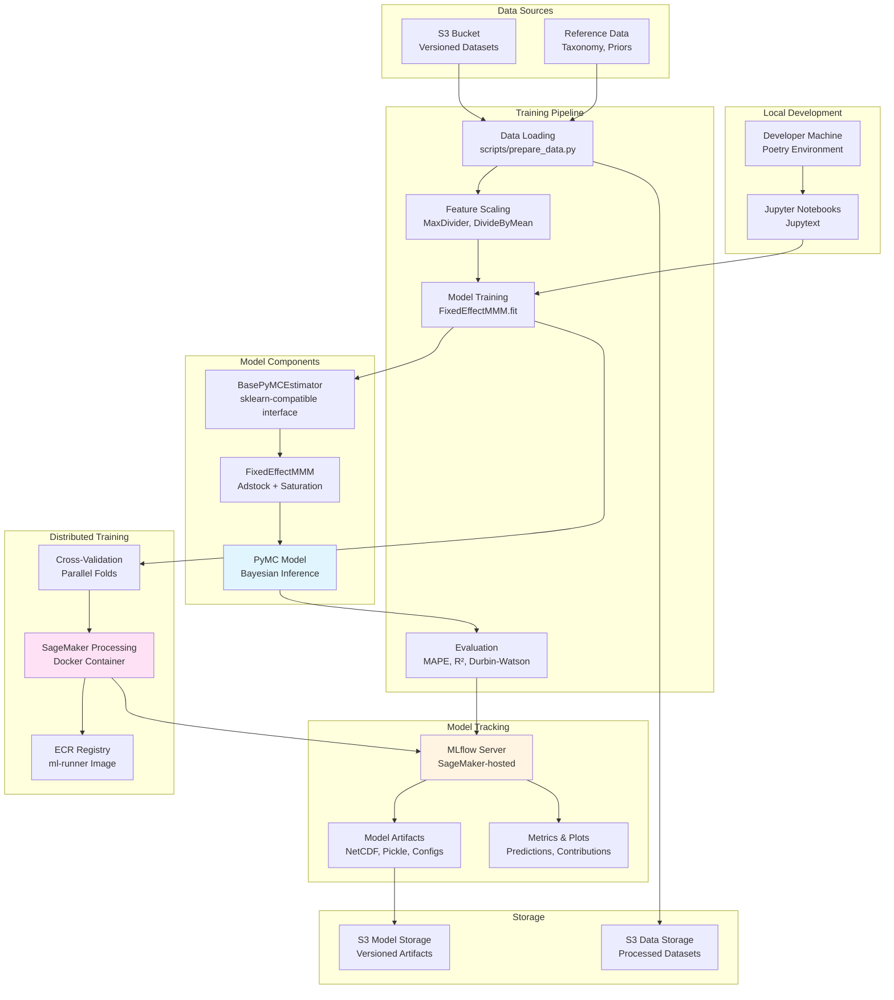
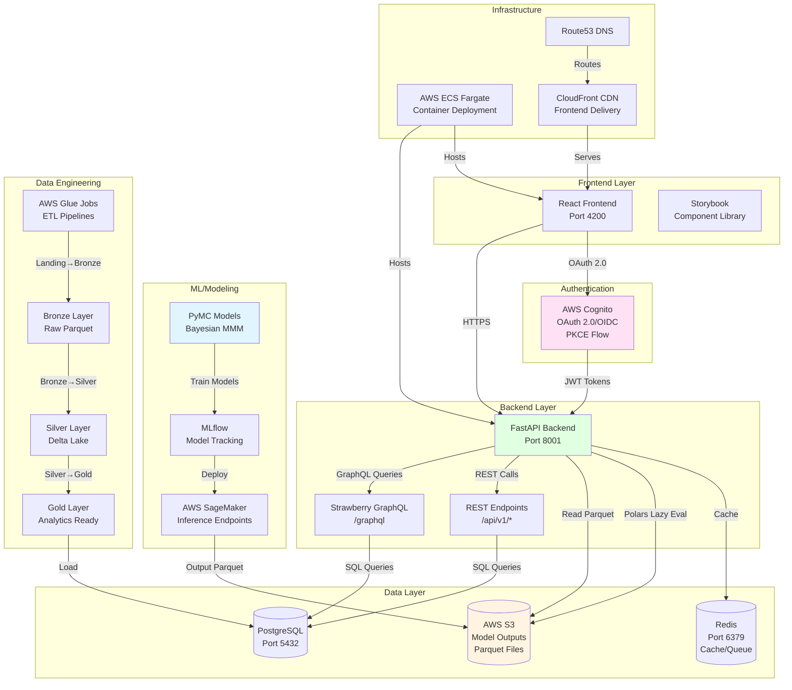

# Code documentation

## Repository 1 — Artemis MMM Workbench (model-training repo)

# Technical & AI Overview: Artemis MMM Workbench (model-training repo)

## 1. High-level Summary

**How this repo fits into the Artemis MMM platform**

Artemis MMM Workbench is the modeling/training layer for Artemis MMM: it trains Bayesian MMM models in PyMC (including cross-validation) and logs results and artifacts via MLflow (optionally orchestrated on AWS SageMaker). 

The Workbench produces pre-computed model outputs (e.g., contribution breakdowns) that are written to cloud storage (S3 is used for versioned datasets and artifacts). 

 These outputs are then consumed by the Artemis MMM full-stack application, which serves and visualizes results in the web UI (the app reads contribution outputs from S3 rather than running model inference in real time).

**What the app does:**
The Artemis MMM Workbench is a Bayesian Marketing Mix Modeling (MMM) system for analyzing marketing channel effectiveness, attribution, and ROI. It uses PyMC for Bayesian inference to estimate the impact of paid media channels, control variables, and external factors on business outcomes (e.g., total transactions).

**AI/ML/GenAI capabilities:**
No GenAI/LLM components detected. This is traditional Bayesian ML using:
- PyMC 5.22.0 for Bayesian inference via MCMC
- PyMC-Marketing for MMM-specific components
- MLflow for experiment tracking and model versioning

**Key high-level properties:**
- Stack: Python 3.12, PyMC, PySpark, MLflow, AWS SageMaker, Docker
- Architecture: Data science workbench with distributed training capabilities
- Major subsystems: Model training, cross-validation, data processing, visualization, MLflow tracking

---

## 2. Components & Modules

| Component / Module | Path(s) | Responsibility / Description (Confirmed / Inferred) |
|-------------------|---------|---------------------------------------------------|
| **Core Estimators** | `src/mmm_workbench/estimators/` | Base PyMC estimator interface and Fixed Effect MMM implementation (Confirmed) |
| **Model Configuration** | `src/mmm_workbench/config.py` | Hydra-based configuration dataclasses for model priors and structure (Confirmed) |
| **Data Utilities** | `src/mmm_workbench/utils/` | S3 data loading, MLflow integration, cross-validation, plotting, metrics (Confirmed) |
| **Training Scripts** | `scripts/train_mmm.py`, `scripts/train_fixed_effect_model_cross_validation.py` | End-to-end training pipelines with MLflow logging (Confirmed) |
| **SageMaker Integration** | `scripts/launch_sagemaker_cv_jobs.py` | Distributed cross-validation job orchestration on AWS SageMaker (Confirmed) |
| **Data Processing** | `scripts/prepare_data.py`, `scripts/clean_spark_data.py` | Data preparation and Spark-based cleaning (Confirmed) |
| **Visualization** | `src/mmm_workbench/utils/plot.py` | Model diagnostics, contribution analysis, waterfall charts (Confirmed) |
| **Configuration Files** | `config/*.yaml` | YAML configs for different model variants (national, audience, experiments) (Confirmed) |
| **Notebooks** | `notebooks/` | Exploratory analysis and model development (Jupytext-synced) (Confirmed) |
| **Tests** | `tests/` | Unit tests for estimators, scalers, cross-validation, pipelines (Confirmed) |

---

## 3. Architecture Diagram

---

## 4. Core Feature Flows / Critical Paths

### Feature 1: Model Training Pipeline

**What it does:**
Trains a Bayesian Fixed Effect MMM to estimate marketing channel contributions with uncertainty quantification.

**Entry points:**
- `scripts/train_mmm.py` - Single model training
- `scripts/train_fixed_effect_model_cross_validation.py` - Cross-validation training
- `scripts/launch_sagemaker_cv_jobs.py` - Distributed SageMaker training

**Flow & modules involved:**
1. Data Loading (`scripts/train_mmm.py:38-64`)
   - Loads CSV from `data/processed/{VERSION}/national_training_data_message_type.csv`
   - Filters by audience segment if specified
   - Parses dates and fills missing values

2. Train/Test Split (`scripts/train_mmm.py:67-95`)
   - Splits at configurable date (default: `2025-04-15`)
   - Includes lookback period (8 weeks) for adstock warmup

3. Feature Scaling (`scripts/train_mmm.py:127-164`)
   - `MaxDivider` for media channels
   - `DivideByMean` for control variables
   - `Center` for holiday indicators
   - `MeanTargetScaler` for target variable

4. Prior Loading (`scripts/train_mmm.py:190-228`)
   - Beta priors from CSV (`data/input/beta_priors_refreshed_v2.csv`)
   - Control priors from CSV (`data/input/control_priors.csv`)

5. Model Initialization (`src/mmm_workbench/estimators/fixed_effect_mmm.py:62-100`)
   - Creates `FixedEffectMMM` with channel/control configuration
   - Sets adstock decay rates and saturation priors per channel

6. Model Building (`src/mmm_workbench/estimators/fixed_effect_mmm.py:158-367`)
   - Applies adstock transformation (recursive decay)
   - Defines PyMC model with:
     - Media channels: Adstock → Saturation → Beta coefficients
     - Control variables: Truncated Normal priors
     - Owned/Earned media: HalfNormal/Normal priors
     - Seasonality: HSGP (Hilbert Space Gaussian Process) with periodic covariance
     - Likelihood: Normal with Exponential prior on sigma

7. MCMC Sampling (`src/mmm_workbench/estimators/base.py:140-195`)
   - Uses NUTS sampler (default: `nutpie` backend)
   - Configurable chains (default: 4), draws (default: 1000), tune (default: 500)
   - Stores posterior samples in ArviZ `InferenceData`

8. Evaluation (`scripts/train_mmm.py:285-342`)
   - Generates predictions (posterior mean)
   - Calculates MAPE, R², Durbin-Watson statistics
   - Extracts contribution breakdowns by channel/control

9. MLflow Logging (`scripts/train_mmm.py:607-660`)
   - Logs parameters (MCMC config, data splits)
   - Logs metrics (MAPE, R², Durbin-Watson)
   - Logs artifacts (predictions, contributions, configs, scalers)
   - Logs model using custom MLflow flavor (`mmm_workbench`)

**AI involvement:**
- Bayesian inference via PyMC MCMC sampling
- No LLM/GenAI components
- Probabilistic modeling with uncertainty quantification

**External dependencies:**
- S3: Versioned datasets and model artifacts
- MLflow: Experiment tracking server (SageMaker-hosted)
- AWS SageMaker: Distributed training infrastructure (optional)

**Edge cases / error handling:**
- Convergence checks: R-hat diagnostics, ESS thresholds (see `src/mmm_workbench/constants.py:120-177`)
- Missing data: Filled with zeros (`data.fillna(0)`)
- Sparse channels: Filtered out if no spend in training data
- Serialization: Models saved as pickle + NetCDF (ArviZ InferenceData)

---

### Feature 2: Cross-Validation Framework

**What it does:**
Performs time-series cross-validation with walking-forward folds to assess model generalization.

**Entry points:**
- `scripts/train_fixed_effect_model_cross_validation.py`
- `scripts/launch_sagemaker_cv_jobs.py` (distributed)

**Flow & modules involved:**
1. Fold Creation (`src/mmm_workbench/utils/cross_validation.py:11-131`)
   - Creates `n_folds` folds with fixed test window size (`test_weeks`)
   - Steps forward by `step_weeks` between folds
   - Includes `test_set_offset` weeks overlap for adstock warmup

2. Parallel Execution (`src/mmm_workbench/utils/cross_validation.py:134-216`)
   - Trains folds in parallel using `joblib.Parallel`
   - Final fold trained sequentially to return model object (serialization limitations)

3. Metric Aggregation (`src/mmm_workbench/utils/cross_validation.py:219-256`)
   - Calculates mean and std across folds for each metric
   - Logs summary statistics to MLflow

**AI involvement:**
- Same Bayesian inference as single training
- No GenAI components

**External dependencies:**
- AWS SageMaker (optional): For distributed CV across multiple instances
- MLflow: Aggregated metrics logging

**Edge cases / error handling:**
- Insufficient data: Raises `ValueError` if folds cannot be created
- Model serialization: Final fold only returns model (others return metrics only)

---

### Feature 3: SageMaker Distributed Training

**What it does:**
Orchestrates cross-validation jobs on AWS SageMaker Processing for parallel execution.

**Entry points:**
- `scripts/launch_sagemaker_cv_jobs.py`

**Flow & modules involved:**
1. Job Configuration (`scripts/launch_sagemaker_cv_jobs.py:28-60`)
   - ECR image: `temp-artemis/ml-runner:latest`
   - Instance type: `ml.m5.2xlarge` (configurable)
   - Data inputs: S3 paths to training/reference data

2. Job Launching (`scripts/launch_sagemaker_cv_jobs.py:283-476`)
   - Creates SageMaker Processing jobs for each CV fold
   - Manages concurrency (max 6 concurrent jobs)
   - Monitors job status and logs to MLflow

3. Entrypoint Script (`scripts/sagemaker_cv_entrypoint.sh`)
   - Runs training script inside Docker container
   - Outputs synced to S3 automatically

**AI involvement:**
- Same Bayesian inference, distributed across cloud instances

**External dependencies:**
- AWS SageMaker: Processing jobs, ECR registry
- S3: Input data and output artifacts
- MLflow: Job metadata and results tracking

**Edge cases / error handling:**
- Job failures: Logged to MLflow, retry logic via `backoff` decorator
- Timeout: Configurable `max_runtime_seconds` (default: 600s)

---

## 5. Data Model & Persistence

**Data models and schemas:**
- No traditional database/ORM. Data stored as:
  - CSV files: Training data (`national_training_data_message_type.csv`)
  - Parquet files: Processed intermediate data (`weekly_spend_impression_message_type.parquet`)
  - Excel files: Reference taxonomy (`Master - Data Taxonomy.xlsx`)
  - NetCDF files: Model posterior samples (ArviZ InferenceData)

**Storage technologies:**
- S3: Primary storage for versioned datasets
  - Path structure: `s3://tb-artemis-nonprod-inputs/processed/{VERSION}/`
  - Reference data: `s3://tb-artemis-nonprod-inputs/reference/{VERSION}/`
- Local filesystem: Development data in `data/processed/` and `data/reference/`
- MLflow Artifact Store: Model artifacts, predictions, plots (backed by S3)

**Key data structures:**
- Training DataFrame: Date-indexed with columns:
  - Target: `total_transactions`
  - Media channels: `{Channel}_{MessageType}` (e.g., `Linear TV_Brand`)
  - Controls: Weather, macro, competitor, holiday indicators
  - Owned/Earned: Social impressions, sentiment
- Model outputs: xarray DataArrays with dimensions `(chain, draw, date, feature)`

**Constraints and indexing:**
- Date column required: Must be named `date` (PyMC-Marketing requirement)
- Versioning: Datasets versioned by timestamp + commit hash
- Data quality: Sparse channels filtered, missing values filled with 0

---

## 6. AI / ML / GenAI Capabilities

**Solution type(s) and patterns used:**
- Bayesian Marketing Mix Modeling (MMM)
- No GenAI/LLM components detected

**Modalities:**
- Text/Structured: Time-series marketing data (spend, impressions, transactions)

**Where in the system AI is invoked and why:**
1. Model Training (`src/mmm_workbench/estimators/fixed_effect_mmm.py:158-367`)
   - PyMC Bayesian model with MCMC sampling
   - Estimates posterior distributions for channel effectiveness

2. Prediction (`src/mmm_workbench/estimators/fixed_effect_mmm.py:369-436`)
   - Posterior predictive sampling for uncertainty quantification
   - Generates prediction intervals

3. Contribution Analysis (`src/mmm_workbench/estimators/fixed_effect_mmm.py:438-471`)
   - Decomposes predictions into channel/control contributions
   - Enables attribution analysis

**Model architecture:**
- Fixed Effect MMM with:
  - Adstock transformation: Recursive decay `x_ad[t] = x[t] + λ * x_ad[t-1]`
  - Saturation: Hill function `x^γ / (x^γ + θ^γ)`
  - Hierarchical priors: Channel-specific adstock/saturation parameters
  - Seasonality: HSGP with 52-week periodicity

---

## 7. Models, Providers & Orchestration

**Model providers:**
- PyMC 5.22.0: Open-source Bayesian modeling framework
- PyMC-Marketing 0.14.0+: MMM-specific extensions
- No external LLM/GenAI providers

**Orchestration frameworks:**
- MLflow: Experiment tracking and model versioning
- AWS SageMaker: Distributed training orchestration (optional)
- Hydra: Configuration management (via dataclasses)

**Prompt templates:**
- Not applicable (no LLM/GenAI)

**RAG / retrieval & vector search:**
- Not applicable

---

## 8. Configuration, Deployment & Infrastructure

**Config mechanisms:**
- Environment variables: `.env` file (via `pydantic-settings`)
  - `MLFLOW_TRACKING_URI`: MLflow server URL
  - `S3_DATA_PATH`: Optional S3 data path override
- YAML configs: `config/*.yaml` files
  - Model features (channels, controls, target)
  - Priors (adstock decays, gamma expectations, control priors)
  - MCMC settings (chains, draws, tune, target_accept)
  - Scaling configuration
- AWS credentials: Via AWS CLI profiles (`AWS_PROFILE`)

**Deployment architecture:**
- Cloud provider: AWS (primary)
  - S3: Data storage (`tb-artemis-nonprod-inputs`, `artemis-temp-modeling-1`)
  - ECR: Docker registry (`temp-artemis/ml-runner`)
  - SageMaker: Processing jobs for distributed training
  - MLflow: Hosted on SageMaker (inferred from docs)
- Compute shape:
  - Local: Poetry virtual environment, Jupyter notebooks
  - Cloud: SageMaker Processing (`ml.m5.2xlarge` instances)
- Containerization: Docker (`Dockerfile` for SageMaker jobs)

**Integrations:**
- AWS S3: Data versioning and artifact storage
- MLflow: Experiment tracking (SageMaker-hosted server)
- GitLab CI/CD: Docker image builds and ECR pushes (`.gitlab-ci.yml`)
- Jupytext: Notebook versioning (syncs `.ipynb` ↔ `.py`)

---

## 9. Data, Governance & Safety

**Types and sources of data:**
- Marketing spend: Paid media channels (TV, digital, audio, etc.)
- Business metrics: Total transactions (target variable)
- External factors: Weather, macroeconomic indicators, competitor spend
- Owned/Earned media: Social impressions, sentiment scores
- Reference data: Feature taxonomy, prior distributions

**Data pipelines and ETL:**
- Data preparation: `scripts/prepare_data.py` (inferred)
- Spark processing: `scripts/clean_spark_data.py` (PySpark 3.5.5)
- Versioning: Timestamp-based versions (`YYYY-MM-DDTHH-MM-SSZ-{hash}`)
- S3 sync: `make pull-data VERSION=...` command

**Data governance:**
- Versioning: All datasets versioned in S3
- Access control: AWS IAM roles for SageMaker jobs
- Data classification: Not explicitly documented (Inferred: Internal proprietary)

**Security, privacy and safety:**
- Authentication: AWS IAM roles for SageMaker
- Secrets: AWS credentials via profiles (not hardcoded)
- Input validation: Data quality checks (sparse channel filtering)
- Model safety: Bayesian uncertainty quantification provides prediction intervals

---

## 10. Cross-cutting Concerns

**Logging, monitoring, observability:**
- Logging: Python `logging` module (structured logs)
- MLflow: Experiment tracking, metrics, artifacts
- Model diagnostics: R-hat, ESS, MCSE (via ArviZ)
- Visualization: Contribution plots, waterfall charts, bubble charts

**Testing strategy:**
- Framework: PyTest (inferred from `tests/` directory)
- Test coverage:
  - `test_fixed_effect_mmm.py`: Model estimator tests
  - `test_cross_validation.py`: CV framework tests
  - `test_scaler.py`: Feature scaling tests
  - `test_plotter.py`: Visualization tests
  - `test_pipelines.py`: End-to-end pipeline tests
- Coverage reporting: Not visible in repo (Unknown)

**Performance, scalability, fault-tolerance:**
- Scalability: SageMaker distributed training (parallel CV folds)
- Performance: NUTS sampler with `nutpie` backend (JAX acceleration)
- Fault tolerance: Job retry logic in SageMaker launcher (`backoff` decorator)
- Convergence: Configurable MCMC settings, diagnostic thresholds

---

## 11. Limitations & Open Questions

**Unknown / Needs manual confirmation:**

1. Production inference deployment:
   - No inference endpoint code found
   - Unknown: How models are served in production (FastAPI? SageMaker endpoints? Azure ML?)
   - Evidence: References to Azure ML in `CLAUDE.md` but no implementation found

2. Real-world performance:
   - Unknown: Production latency, throughput, SLAs
   - Unknown: Model retraining frequency

3. Data scale:
   - Unknown: Typical dataset sizes, number of time periods
   - Unknown: Training time for full models

4. Model registry:
   - MLflow model registry mentioned but not implemented
   - Unknown: Model promotion workflow

5. Monitoring:
   - Unknown: Production monitoring setup (CloudWatch? Application Insights?)
   - Unknown: Model drift detection

6. Security details:
   - Unknown: PII handling in marketing data
   - Unknown: Data encryption at rest/in transit policies

7. Integration with other systems:
   - Unknown: How models integrate with business systems (attribution, budget optimization)
   - Unknown: API contracts for model consumption

8. Governance processes:
   - Unknown: Model review/approval workflows
   - Unknown: Human-in-the-loop steps

---

## Marking Certainty

**Confirmed (based on direct evidence):**
- PyMC Bayesian modeling framework
- MLflow experiment tracking
- SageMaker distributed training
- S3 data versioning
- Fixed Effect MMM architecture
- Cross-validation framework
- Docker containerization

**Inferred (based on patterns/naming):**
- MLflow hosted on SageMaker (from docs mentioning "SageMaker MLflow tracking server")
- Production deployment via Azure ML (mentioned in `CLAUDE.md` but no code found)
- Data governance practices (versioning visible, policies not documented)

**Unknown / Needs manual confirmation:**
- Production inference infrastructure
- Model serving endpoints
- Real-world performance metrics
- Complete data governance policies
- Integration with business systems

---

**Document Generated:** 2025-01-27  
**Repository:** `tacobell/artemis-mmm-workbench`  
**Analysis Scope:** Full codebase crawl with focus on ML/AI components

---

## Repository 2 — Artemis MMM (full-stack platform repo)

# Technical & AI Overview: Artemis MMM (full-stack platform repo)

## 1. High-level Summary

**How this repo fits into the overall system**

Artemis MMM is the full-stack platform (FastAPI backend, React UI, PostgreSQL, and AWS infrastructure) that provides ETL pipelines, metadata management, and user-facing analysis workflows via GraphQL/REST APIs and the web UI. 

Model training is performed outside the main application (via the separate Workbench codebase / workbench directory), and the platform serves results from pre-computed outputs stored in S3 as Parquet files—most notably contributions.parquet under s3://{ARTEMIS_BATCH_OUTPUT_BUCKET}/{ARTEMIS_BATCH_OUTPUT_TIMESTAMP}/.... 

At runtime, the UI requests contributions via GraphQL; the backend reads the Parquet outputs from S3 (using Polars for efficient filtering/aggregation) and returns the results for visualization.

**What the app does:**
Artemis MMM is a full-stack Marketing Mix Modeling (MMM) platform for Bayesian modeling, attribution, and optimization. It provides:
- Bayesian MMM using PyMC
- Data ingestion and ETL pipelines (Bronze/Silver/Gold)
- Web UI for visualization and analysis
- Model output serving via GraphQL/REST APIs

**AI/ML/GenAI capabilities:**
No generative AI or LLM components detected. This is traditional ML:
- Bayesian MMM with PyMC (probabilistic modeling)
- MCMC sampling for inference
- No LLM/GenAI usage (no OpenAI, Anthropic, LangChain, etc.)

**Key properties:**
- Stack: Python (FastAPI) + React (TypeScript) + PostgreSQL + AWS
- Architecture: Monorepo with Repository/Service pattern
- Deployment: AWS ECS (Fargate), S3, CloudFront, Cognito
- ML Framework: PyMC 5.22.0+ with marketing extensions

## 2. Components & Modules

| Component / Module | Path(s) | Responsibility / Description |
|-------------------|---------|------------------------------|
| **Backend API** | `apps/backend/src/app/` | FastAPI application with GraphQL/REST APIs, Repository/Service pattern |
| **Frontend** | `apps/frontend/src/` | React 18.2.0 application with TypeScript, feature-first architecture |
| **Data Engineering** | `apps/data-engineering/src/` | AWS Glue ETL pipelines (Bronze→Silver→Gold medallion architecture) |
| **ML Workbench** | `mmm_workbench/` | PyMC model training and development (separate from main app) |
| **Database Models** | `apps/backend/src/app/models/` | SQLModel database models (User, ModelRun, Channel, Pillar, etc.) |
| **GraphQL API** | `apps/backend/src/app/api/graphql/` | Strawberry GraphQL schema, resolvers, and types |
| **Repositories** | `apps/backend/src/app/repositories/` | Data access layer (S3 Parquet reading with Polars) |
| **Services** | `apps/backend/src/app/services/` | Business logic layer (contributions, filters, driver performance) |
| **UI Components** | `apps/frontend/src/components/` | Shared React component library with Storybook |
| **Features** | `apps/frontend/src/features/` | Feature-specific components (auth, measure) |
| **CI/CD** | `.gitlab-ci.yml`, `.gitlab/ci/` | GitLab CI/CD pipelines for build, test, deploy |

## 3. Architecture Diagram

## 4. Core Feature Flows / Critical Paths

### Feature 1: View Marketing Contributions (Measure View)

**What it does:**
Displays MMM contribution data (channel, pillar, message type) with filtering and aggregation.

**Entry points:**
- Frontend: `/measure` route (React component)
- GraphQL: `contributions` query
- REST: (Not implemented, GraphQL only)

**Flow & modules involved:**
1. Frontend (`apps/frontend/src/features/measure/`) requests contributions via GraphQL
2. GraphQL Resolver (`apps/backend/src/app/api/graphql/resolvers/contributions.py`) parses query
3. Service Layer (`apps/backend/src/app/services/contributions.py`) builds filters and orchestrates
4. Repository (`apps/backend/src/app/repositories/contributions.py`) reads Parquet from S3 using Polars
5. Polars lazy evaluation filters/aggregates before loading data
6. Results serialized to GraphQL response
7. Frontend renders charts/tables

**AI involvement:**
- No LLM calls
- Reads pre-computed model outputs (Parquet) from S3
- Model outputs generated by PyMC Bayesian models (trained separately)

**External dependencies:**
- AWS S3: Model output Parquet files (`ARTEMIS_BATCH_OUTPUT_BUCKET` + timestamp path)
- PostgreSQL: Metadata (channels, pillars, message types)
- AWS Cognito: Authentication (JWT validation)

**Edge cases / error handling:**
- Missing S3 files: Returns empty results
- Invalid date filters: Validated in service layer
- Large datasets: Polars lazy evaluation reduces memory usage
- Timeout: No explicit timeout handling (relies on FastAPI defaults)

**File references:**
- `apps/backend/src/app/api/graphql/schema.py:150-187` - GraphQL query definition
- `apps/backend/src/app/services/contributions.py` - Business logic
- `apps/backend/src/app/repositories/contributions.py:35-107` - S3 data access

### Feature 2: Driver Performance Analysis (Bubble Chart)

**What it does:**
Calculates efficiency (spend/transactions) and effectiveness (transactions/impressions × 1000) for bubble chart visualization.

**Entry points:**
- GraphQL: `driver_performance` query with `group_by` parameter

**Flow & modules involved:**
1. GraphQL query with `group_by` (MESSAGE_TYPE, PILLAR, CHANNEL, etc.)
2. Resolver (`apps/backend/src/app/api/graphql/resolvers/driver_performance.py`) extracts filters
3. Service (`apps/backend/src/app/services/driver_performance.py`) calculates metrics
4. Repository reads contributions data, filters by media variables only (excludes control variables)
5. Aggregates by group_by dimension
6. Calculates efficiency and effectiveness
7. Returns grouped data with legend

**AI involvement:**
- None — uses pre-computed contributions

**External dependencies:**
- S3: Contributions Parquet files
- PostgreSQL: Dimension metadata

**Edge cases:**
- No data: Returns empty arrays
- Division by zero: Handled in service layer
- Prior year comparison: Optional `prior_year` parameter shifts dates back 365 days

**File references:**
- `apps/backend/src/app/api/graphql/schema.py:232-284` - Query definition
- `apps/backend/src/app/services/driver_performance.py` - Metric calculations

### Feature 3: Data Pipeline Execution (ETL)

**What it does:**
Processes raw marketing data through Bronze→Silver→Gold medallion architecture.

**Entry points:**
- AWS Glue Jobs (scheduled or manual trigger)
- CLI: `make run-glue-landing ENTITY=poem SOURCE_PATH=... RUN_DATE=...`

**Flow & modules involved:**
1. Landing Zone: Raw CSV/Parquet files uploaded to S3
2. Bronze Job (`apps/data-engineering/src/jobs/poem/landing_to_bronze_poem_paid.py`):
   - Reads CSV from landing zone
   - Applies schema mappings from YAML config
   - Writes Parquet to bronze layer (partitioned by year/month)
3. Silver Job (`apps/data-engineering/src/jobs/poem/bronze_to_silver_poem_config.py`):
   - Reads bronze Parquet
   - Creates star schema (fact + dimension tables)
   - Writes Delta Lake tables to silver
4. Gold Job (`apps/data-engineering/src/jobs/poem/silver_to_gold_poem.py`):
   - Reads silver Delta tables
   - Applies business logic transformations
   - Creates analytics-ready aggregations
   - Writes to gold layer

**AI involvement:**
- None — data transformation only

**External dependencies:**
- AWS S3: Data lake storage
- AWS Glue: Job execution
- PySpark: Data processing engine

**Edge cases:**
- Missing source files: Job fails with error
- Schema mismatches: Validation errors logged
- Data quality failures: Jobs can be configured to fail or continue

**File references:**
- `apps/data-engineering/src/jobs/poem/` - POEM pipeline jobs
- `apps/data-engineering/configs/entities/poem.yaml` - Config-driven pipeline definition

## 5. Data Model & Persistence

### Database Models (PostgreSQL)

**Core Models** (Confirmed from `apps/backend/src/app/models/`):

- **User**: Authentication and profile (`id`, `username`, `email`, `full_name`, `created_at`)
- **ModelRun**: Tracks MMM model executions (`id`, `name`, `status`, `config` JSON, `output_path` S3, `created_by`, timestamps)
- **Channel**: Marketing channels (`id`, `name`, `channel_group`, `snowflake_id`)
- **Pillar**: Message organization hierarchy (`id`, `name`, `snowflake_id`)
- **MessageType**: Message categorization (`id`, `name`, `pillar_id` FK, `snowflake_id`)
- **Experience**: Marketing experiments (`id`, `name`, `start_date`, `end_date`)
- **ActivationAudience**: Audience segmentation (`id`, `name`, `snowflake_id`)
- **ControlVariable**: Experiment control parameters (`id`, `name`, `value`)
- **BatchHistory**: Data processing batch tracking (`id`, `batch_id`, `status`, `run_date`)

**ORM**: SQLModel (SQLAlchemy + Pydantic) with async support  
**Migrations**: Alembic (`apps/backend/alembic/`)  
**Connection**: PostgreSQL with `ssl=prefer` for AWS RDS compatibility

### Model Outputs (S3 Parquet)

**Storage**: Model outputs stored as Parquet files in S3  
**Path Structure**: `s3://{ARTEMIS_BATCH_OUTPUT_BUCKET}/{ARTEMIS_BATCH_OUTPUT_TIMESTAMP}/contributions.parquet`  
**Schema** (Inferred from repository code):
- Dimensions: `date`, `channel`, `channel_id`, `channel_group`, `pillar`, `pillar_id`, `message_type`, `message_type_id`, `audience`, `customer_segment`
- Metrics: `contribution`, `spend`, `impressions`, `transactions`
- Flags: `is_media_variable`, `is_control_variable`

**Reading**: Polars lazy evaluation (`pl.scan_parquet()`) with pushdown filters

### Data Engineering Data Model

**Bronze Layer**: Raw data in Parquet format, partitioned by `year/month`  
**Silver Layer**: Star schema with fact and dimension tables (Delta Lake)  
**Gold Layer**: Analytics-ready aggregations (Delta Lake)

**Example Entities**:
- **POEM** (Paid/Owned/Earned Media): `fact_poem` + `dim_tactic`, `dim_campaign`, `dim_pillar`, `dim_channel`, `dim_platform`, `dim_date`
- **Revenue Transactions**: Revenue fact table with customer/product dimensions

## 6. AI / ML / GenAI Capabilities

**Solution type**: Traditional ML (Bayesian MMM) — no generative AI

**Patterns implemented**:
- Standard ML inference: PyMC Bayesian models for MMM
- Model training: PyMC MCMC sampling (NUTS sampler)
- Model serving: Pre-computed outputs stored in S3 (not real-time inference)

**Modalities**: Structured tabular data (time-series marketing data)

**Where AI is invoked**:
- Model training: Separate `mmm_workbench/` directory (not in main app)
- Model outputs: Pre-computed and stored in S3 Parquet files
- Application: Reads pre-computed outputs (no model inference in app)

**Model Framework**:
- **PyMC 5.22.0+**: Bayesian probabilistic programming
- **PyMC Marketing**: Marketing-specific extensions (adstock, saturation curves)
- **MCMC Sampling**: NUTS sampler with convergence diagnostics (R-hat, ESS)

**Model Training Process** (Inferred from workbench structure):
1. Load training data (sales, media spend, control variables)
2. Build PyMC model with adstock/saturation transformations
3. Run MCMC sampling (chains=4, draws=1000+)
4. Validate convergence (R-hat < 1.1, ESS > 400)
5. Extract posterior samples for contributions
6. Save model artifacts and outputs to S3

## 7. Models, Providers & Orchestration

**Model providers**: None (self-hosted PyMC models)

**Models used**:
- **PyMC Marketing MMM**: Multi-dimensional MMM with hierarchical structure
- **Adstock**: Geometric adstock transformation (`l_max=4`)
- **Saturation**: Logistic saturation curves
- **Seasonality**: Yearly seasonality (3 harmonics)

**Orchestration frameworks**: None (no LangChain, LlamaIndex, etc.)

**Model tracking**: MLflow (mentioned in workbench, not in main app)

**Prompt engineering**: N/A (no LLM usage)

**RAG/retrieval**: N/A (no vector search or embeddings)

## 8. Configuration, Deployment & Infrastructure

### Configuration

**Environment Variables** (Confirmed from `apps/backend/src/app/core/settings.py`):
- `ARTEMIS_BATCH_OUTPUT_BUCKET`: S3 bucket for model outputs
- `ARTEMIS_BATCH_OUTPUT_TIMESTAMP`: Timestamp subdirectory path
- `ARTEMIS_COGNITO_REGION`: AWS region (default: us-east-1)
- `ARTEMIS_COGNITO_USER_POOL_ID`: Cognito User Pool ID
- `ARTEMIS_COGNITO_CLIENT_ID`: Cognito Client ID
- Database: Constructed from `POSTGRES_*` env vars with `ssl=prefer`

**Config Files**:
- `docker-compose.yml`: Local development services
- `.gitlab-ci.yml`: CI/CD pipeline configuration
- `apps/data-engineering/configs/entities/*.yaml`: ETL pipeline configs

**Secrets Management**: Environment variables (no explicit secrets manager integration visible)

### Deployment Architecture

**Cloud Provider**: AWS (Confirmed)

**Compute**:
- **Frontend**: AWS ECS Fargate (nonprod: 256 CPU/512 MB, prod: 512 CPU/1024 MB)
- **Backend**: AWS ECS Fargate (nonprod: 512 CPU/1024 MB, prod: 1024 CPU/2048 MB)
- **Frontend Hosting**: S3 + CloudFront CDN + Route53 DNS

**Containerization**:
- Docker with multi-stage builds
- Frontend: Nginx serving static files (port 80)
- Backend: Python 3.12 with FastAPI/Uvicorn (port 8000)

**Deployment Triggers**:
- Nonprod: Automatic on `main` branch push
- Production: Version tags (e.g., `v1.0.0`)

**CI/CD**: GitLab CI/CD with stages: validate → build → test → deploy

### Integrations

- **AWS Cognito**: OAuth 2.0/OIDC authentication (PKCE flow)
- **AWS S3**: Model outputs and data lake storage
- **AWS Glue**: ETL job execution
- **AWS CloudFront**: Frontend CDN delivery
- **AWS Route53**: DNS management

## 9. Data, Governance & Safety

### Data Types & Sources

**Data Sources**:
- **Marketing Data**: Paid media (Spark), owned media (Sprout Social), earned media
- **Sales Data**: Weekly sales by brand/region/store
- **Model Outputs**: Pre-computed contributions stored in S3 Parquet

**Data Classification** (Inferred):
- Internal proprietary: Marketing and sales data
- No explicit PII handling visible (user authentication data handled by Cognito)

### Data Pipelines & ETL

**Architecture**: Medallion (Bronze→Silver→Gold)

**Tools**:
- **PySpark**: Data processing engine
- **Delta Lake**: Silver and Gold layers
- **AWS Glue**: Job orchestration
- **Config-driven**: YAML configs define pipeline behavior

**Pipeline Flow**:
1. Landing Zone: Raw CSV/Parquet files
2. Bronze: Raw data in Parquet (partitioned by year/month)
3. Silver: Star schema with fact/dimension tables (Delta Lake)
4. Gold: Analytics-ready aggregations (Delta Lake)

**Data Quality**: Validation rules in YAML configs (required fields, key columns, validation rules)

### Security, Privacy & Safety

**Authentication & Authorization**:
- AWS Cognito OAuth 2.0/OIDC with PKCE
- JWT token validation using JWKS
- Role-based access control (RBAC) via brand associations

**Data Security**:
- Encryption: TLS 1.3 in transit (HTTPS)
- Database: SSL connections (`ssl=prefer` for RDS)
- Secrets: Environment variables (no explicit secrets manager)

**AI Safety**: N/A (no LLM/GenAI components)

**Guardrails**: None (not applicable to traditional ML)

## 10. Cross-cutting Concerns

### Logging, Monitoring & Observability

**Logging Strategy**:
- FastAPI: Structured logging (Python `logging` module)
- Log levels: INFO, DEBUG, ERROR
- No explicit structured log format (JSON) visible

**Observability Tooling**:
- **Health Checks**: `/health` endpoint for liveness probes
- **CloudWatch**: AWS native logging (ECS tasks write to CloudWatch Log Groups)
- **No explicit metrics**: No Prometheus/CloudWatch metrics visible

**LLM Observability**: N/A

**A/B Testing**: None visible

### Testing

**Test Organization** (Inferred from structure):
- **Backend**: `apps/backend/tests/` (PyTest)
- **Frontend**: `apps/frontend/src/**/*.test.tsx` (Vitest + React Testing Library)
- **Component Tests**: Storybook stories for UI components

**Test Coverage**: Unknown (no coverage reports visible)

**AI-Specific Tests**: N/A

**Strengths**:
- Component library has Storybook stories
- Test infrastructure present

**Gaps** (Inferred):
- Limited test files visible
- No integration test examples
- No E2E test framework visible

### Performance, Scalability, Fault Tolerance

**Performance Considerations**:
- **Polars Lazy Evaluation**: Reduces memory usage for large datasets
- **Column Selection**: Only selects needed columns from S3
- **Connection Pooling**: Async database sessions with connection pooling
- **GZip Compression**: FastAPI middleware compresses responses > 1KB

**Scalability**:
- **Horizontal Scaling**: ECS Fargate supports multiple tasks
- **Stateless Backend**: JWT-based auth (no server-side sessions)
- **S3 Scalability**: Handles large Parquet files

**Fault Tolerance**:
- **Health Checks**: ECS health checks for container restart
- **Error Handling**: Global exception handler in FastAPI
- **Retry Logic**: No explicit retry logic visible (relies on AWS SDK defaults)

## 11. Limitations & Open Questions

### Unknown / Needs Manual Confirmation

1. **Production Deployment Topology**
   - Unknown: Exact ECS service configuration, ALB setup, auto-scaling policies
   - Reason: Only dev `docker-compose.yml` and ECS task definitions visible

2. **Real Data Scale**
   - Unknown: Data volumes, query performance, S3 file sizes
   - Reason: No performance benchmarks or load testing visible

3. **Test Coverage**
   - Unknown: Actual test coverage percentages
   - Reason: No coverage reports in repository

4. **Model Training Details**
   - Unknown: Training frequency, model versioning strategy, retraining triggers
   - Reason: `mmm_workbench/` not fully explored, training happens separately

5. **Monitoring & Alerting**
   - Unknown: Production monitoring dashboards, alerting rules, SLOs/SLAs
   - Reason: No monitoring configuration files visible

6. **Data Retention**
   - Unknown: How long model outputs are retained in S3, archival policies
   - Reason: No lifecycle policies visible

7. **Disaster Recovery**
   - Unknown: Backup strategies, RTO/RPO, failover procedures
   - Reason: No DR documentation visible

8. **Cost Optimization**
   - Unknown: S3 storage costs, ECS compute costs, optimization strategies
   - Reason: No cost analysis visible

### Ambiguous Items

1. **Model Inference**: Pre-computed outputs vs real-time inference unclear
   - Evidence: Repository reads Parquet files (pre-computed)
   - Question: Is there a real-time inference endpoint?

2. **Background Jobs**: Celery/Redis mentioned but not implemented
   - Evidence: Redis in `docker-compose.yml`, Celery mentioned in README
   - Question: Are background jobs actually used?

3. **MLflow Integration**: Mentioned but not visible in main app
   - Evidence: MLflow mentioned in workbench, commented out in docker-compose
   - Question: Is MLflow used in production?

---

**Document Generated**: Based on repository crawl of `/Users/47264/projects/tacobell/artemis-mmm`  
**Analysis Date**: 2025-01-27  
**Certainty Level**: Items marked as (Confirmed) are based on direct code evidence; items marked as (Inferred) are based on patterns and documentation

# Insights, Learning & Anecdotes

## How Artemis got traction at Taco Bell
- **It started with ambition at the top.** Artemis conversations with the Taco Bell CMO began during an AI-driven marketing project in **Q3–Q4 2024**, with an explicit appetite to “swing big” (take risks and invest in something meaningfully differentiated).
- **A “make it real” diagnostic mattered.** A **6-week Phase 1 diagnostic (June)** was used to solidify the vision and business case, run discovery and a data diagnostic, and translate the concept into a concrete roadmap and resourcing plan.

## The phased delivery approach (and why it worked)
Artemis was intentionally structured as a sequence of buyable, de-risking steps:
1. **Phase 1 — Diagnostic (6 weeks):** build belief, align stakeholders, and validate data feasibility.
2. **Phase 2A — Build MEASURE + pipelines:** focus on backward-looking measurement functionality, establish pipelines, and build the “value-capture backlog” (hypotheses and experiments that will monetize insights).
3. **Phase 2B — Build FORECAST + MAXIMIZE + experiment:** extend the feature set into forward-looking forecasting and optimization, and launch value-capture experimentation in-market.

This pacing helped balance two realities: marketing leaders want **speed to results**, while D&T organizations demand **scalability and architectural rigor**.

## What proved critical in selling
- **The right sponsor profile:** a CMO willing to take a first-mover stance, invest, and stay committed through a long sales cycle.
- **The “OG Artemis Crew” as a rapid-response line:** having experienced Artemis builders available for fast advice and unblockers reduced execution risk and increased client confidence.
- **Commercial flexibility:** structuring terms so a meaningful portion of build costs could be treated as CapEx, offering category exclusivity (first-mover feeling within QSR), and exploring performance-based fees.
- **Stamina through complexity:** the work required grit—long, complex cycles and the willingness to bridge scarce SME capacity.

## What proved critical in delivery
- **Front-loaded “pre-work” before the build clock:** lining up the right team, securing most data access (including multiple third-party vendors), upskilling the team, and resolving partner/subcontracting details early.
- **A complementary, multi-disciplinary team:** strong marketing + AIS-enabled delivery with clear roles spanning AI/tech builds, marketing decisioning, value capture, UI/UX, and modeling/forecasting.
- **High-trust teaming to manage coordination load:** empowered decision-making, active async collaboration, and frequent “loops” to co-create quickly helped mitigate meeting overload.
- **Development access to client systems / sandbox:** not relying on the client to push tickets improved throughput.
- **AI-enabled technical delivery as a multiplier:** the team began experimenting with AI to accelerate delivery tasks (reported as 4–10× faster in some areas), enabling agility.

## What was hard (and what nearly always bites later)
- **Speed vs. scalability tension:** marketeers want results yesterday; D&T wants scalable, approved architecture. Artemis sits directly in this conflict.
- **Large, siloed client teams:** orchestration across many stakeholders and vendors is non-trivial and demands crisp governance.
- **Hidden architecture approvals:** an approval process surfaced late created disruption—highlighting the need for a verification/checklist in future diagnostics.
- **Data access dependencies:** reliance on third-party agencies and vendors can become the pacing factor.
- **Building trust in “new truths”:** Artemis outputs can differ starkly from prior MMMs or entrenched beliefs; explaining why and earning belief is a core part of value delivery.
- **A “leap of faith” period:** early market tests must show wins to convert model insights into accepted, attributable transaction growth.

## Commercialization beyond the first deployment
- **First priority: prove bankable results at Taco Bell.** Once value is defensible, the path to scale becomes far easier.
- **Expand within Yum:** extend to the next largest Yum brand-market units (e.g., KFC) and carry learnings forward.
- **Move from a product to a capability:** use Artemis learnings to inform an experimentation-at-scale operating model and potentially a centralized media capability (Media CoE).
- **Create a reusable “value calculator”:** codify ROI logic from Taco Bell so other teams can size benefits and pursue similar deployments with clearer economics.

## Practical advice for future teams scaling Artemis
- **Use the diagnostic to surface “gotchas”** (approvals, vendor dependencies, access constraints) and lock a mitigation plan early.
- **Staff for orchestration, not just build.** Large teams require dedicated program leadership and tight cadence (often a “trio at the top”).
- **Treat data access as a workstream with owners and deadlines,** not a background dependency.
- **Plan for adoption.** The fastest path to value is pairing model outputs with a clear experimentation backlog and an in-market test plan.
