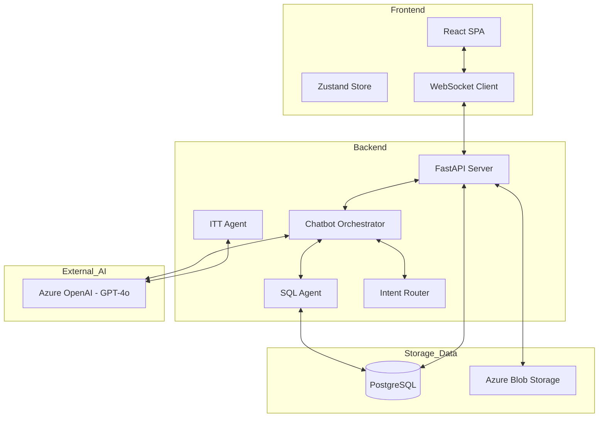

# Saipem — CYPEM (AIS J5HN Planner) | Wave 1

## Overview

Saipem (energy EPC: engineering, procurement, construction for onshore/offshore plants) partnered with Bain to build **CYPEM – Wave 1**, an AI-assisted project scheduling tool for the **bidding phase** (Invitation to Tender / RFP). The goal is to produce a credible first-draft schedule early—improving time and cost estimation accuracy and reducing the effort required to reach a workable plan.

### What was delivered (Wave 1)

- **AI-assisted schedule draft generation** for onshore EPC projects, producing a **Gantt-style plan** with **dependencies**, **durations**, and **man-hours**.
- **Primavera compatibility** to fit standard planner workflows.
- **Chatbot MVP** to query historical project data in natural language (via **text-to-SQL**) for numeric planning questions (durations, delays, milestones).
- **Static knowledge base** in Wave 1 (no live integration with internal systems).

## Development process

The work followed a pragmatic “planner-first” build cycle, shaped by the complexity and rigor of EPC scheduling:
1. **Domain immersion & requirements**: Rapid onboarding into refinery/plant construction planning standards and the way Saipem builds bid schedules; early alignment with engineering teams to set quality bars and acceptance criteria.
2. **UX-first design**: Strong upfront UX/Figma design to lock key user journeys (schedule creation, drill-down, chat-based querying), reducing rework and guiding backend structure.
3. **Schedule generation logic**: Rule-based activation of activities grounded in engineering standards, combined with **duration inference from historical projects** (≈13–15 past projects).
4. **Data foundations**: Establishing project schemas and historical datasets to support both schedule creation and analytics queries (primarily numerical questions).
5. **GenAI assistant layer**: Implementing a multi-agent chatbot orchestration to route intents and generate safe, high-precision SQL queries against curated tables.
6. **Industrialization**: Deploying the application into Saipem’s environment (Wave 1 kept the knowledge base static due to fragmented data landscape; deeper live integrations remain a Wave 2 question).

## Code documentation

Below is the full technical documentation transcript provided for Phase 1.

# Technical & AI Overview

## 1. High-level Summary
The **AIS J5HN Planner** (also referred to as **AI Project Schedule**) is a sophisticated planning and decision-support application developed for **Saipem**. It enables project planners to interact with complex engineering, procurement, and construction (EPC) data using natural language, powered by **Generative AI**.

- **Core Functionality**: Chat-based interface for querying project schedules, historical procurement data, and document extraction (ITT). 
- **AI/ML/GenAI**: Uses a multi-agent system based on **Azure OpenAI (GPT-4o)** for conversation analysis, intent routing, SQL generation (Text-to-SQL RAG), and document summarization.
- **Tech Stack**:
    - **Backend**: Python 3.12+, FastAPI, SQLAlchemy, Psycopg 3, OpenAI SDK.
    - **Frontend**: React 19, TypeScript, Vite, Zustand (State Management), React Router, Chart.js.
    - **Database**: PostgreSQL 15 (Azure Flexible Server) with `pg_trgm` for fuzzy search.
    - **Infrastructure**: Azure (ACR, OpenAI, PostgreSQL, Storage), managed via Terraform. AI Search is provisioned but unused for the primary retrieval flow.
    - **DevOps**: GitLab CI for automated infrastructure (Terraform) and application pipelines.

## 2. Components & Modules
| Component / Module | Path(s) | Responsibility / Description (Confirmed / Inferred) |
| :--- | :--- | :--- |
| **Backend API** | [00-src/backend/src/api](00-src/backend/src/api) | FastAPI routers for documents, projects, and WebSockets **(Confirmed)**. |
| **AI Agents** | [00-src/backend/src/infra/agents](00-src/backend/src/infra/agents) | Multi-agent logic for SQL generation, intent detection, and ITT analysis **(Confirmed)**. |
| **Chatbot Orchestrator**| [00-src/backend/src/infra/chatbot.py](00-src/backend/src/infra/chatbot.py) | Manages the flow between different AI agents and the user conversation **(Confirmed)**. |
| **Infrastructure** | [00-src/infrastructure](00-src/infrastructure) | Terraform manifests for Azure cloud resources **(Confirmed)**. |
| **Frontend Web** | [00-src/frontend/src](00-src/frontend/src) | React SPA for the user interface, including real-time chat via WebSockets **(Confirmed)**. |
| **Core Entities** | [00-src/backend/src/core](00-src/backend/src/core) | Domain models for projects, activities, documents, and chatbot entities **(Confirmed)**. |
| **Data Migrations** | [00-src/backend/migrations](00-src/backend/migrations) | SQL scripts for initializing and updating the PostgreSQL schema **(Confirmed)**. |

## 3. Architecture Diagram

## 4. Core Feature Flows / Critical Paths

### AI-Powered Schedule Query (Chat)
- **What it does**: Allows users to ask questions like "What is the duration of the Procurement phase?" and receive data-backed answers.
- **Entry points**: [00-src/backend/src/api/routers/v1/websocket.py](00-src/backend/src/api/routers/v1/websocket.py#L38)
- **Flow & modules**:
    1.  User sends a prompt via WebSocket.
    2.  `Chatbot` calls `ConversationAnalyzer` to determine the state.
    3.  `IntentRouterAgent` identifies the relevant table.
    4.  `SQLAgent` ([00-src/backend/src/infra/agents/sqlagent.py](00-src/backend/src/infra/agents/sqlagent.py)) generates a PostgreSQL query using table-specific instructions.
    5.  The query is executed against PostgreSQL ([00-src/backend/src/infra/postgres.py](00-src/backend/src/infra/postgres.py)).
    6.  `ExplanationAgent` summarizes the results for the user.
- **AI involvement**: Multiple LLM calls for intent, SQL generation, and result translation.
- **External dependencies**: PostgreSQL, Azure OpenAI.
- **Edge cases / error handling**: LLM hallucination checks via manual history traversal for confirmed tables/queries in [00-src/backend/src/infra/chatbot.py](00-src/backend/src/infra/chatbot.py#L29-L49).

### Document Extraction (ITT Analysis)
- **What it does**: Processes "Invitation to Tender" (ITT) documents to extract milestones, tasks, and project summaries.
- **Entry points**: `ITTAgent` invoked via document processing pipelines.
- **Flow & modules**:
    - `ITTAgent` ([00-src/backend/src/infra/agents/ittagent.py](00-src/backend/src/infra/agents/ittagent.py)) uses a detailed system prompt to parse Docx-extracted Markdown.
- **AI involvement**: Information extraction and summarization into structured JSON.
- **External dependencies**: Azure OpenAI.

### Project Document Management
- **What it does**: Upload and validation of project Excel files (Equipment Lists, Boff).
- **Entry points**: [00-src/backend/src/api/routers/v1/documents.py](00-src/backend/src/api/routers/v1/documents.py#L38)
- **Flow & modules**:
    1.  User uploads file via REST API.
    2.  `read_excel_from_api` ([00-src/backend/src/core/document/services.py](00-src/backend/src/core/document/services.py)) validates the schema.
    3.  File stored in Azure Blob Storage via `AzureBlobStorageDocumentRepository`.
    4.  Metadata registered in PostgreSQL via `register_project_document`.

## 5. Data Model & Persistence
- **PostgreSQL**:
    - **Schemas**: `app` (project-specific data), `master_data` (historical and reference data).
    - **Key Tables**: `standard_schedule`, `historical_procurement`, `schedule_dependencies`.
    - **Performance**: Uses `PG_TRGM` extension for similarity-based text searching in `SQLAgent`.
- **Azure Blob Storage**: Stores documents (Excel, Docx) organized by project.
- **Infrastructure Note**: Azure AI Search is provisioned via Terraform but is currently unused for semantic retrieval.

## 6. AI / ML / GenAI Capabilities
- **Solution Types**:
    - **Multi-Agent System**: Orchestrates specialized agents for SQL, Documentation, and Intent.
    - **Text-to-SQL RAG**: Implements retrieval by generating domain-specific SQL queries to fetch structured data from PostgreSQL based on user natural language.
    - **Domain-Specific SQL Generation**: Heavily prompted SQL expert for engineering/procurement domain.
- **Modalities**: Text (natural language questions), Structured Data (SQL/JSON), Documents (Docx/Excel).
- **Location**: AI logic is encapsulated in `src.infra.agents` and invoked through the `Chatbot` class in the backend.

## 7. Models, Providers & Orchestration
- **Model Provider**: Azure OpenAI.
- **Models**: `gpt-4o` (confirmed version `2024-11-20` in [00-src/infrastructure/openai.tf](00-src/infrastructure/openai.tf#L16)).
- **Orchestration**: Custom implementation using Pydantic for schema validation and a `BaseAgent` class for prompt management ([00-src/backend/src/core/chatbot/entities.py](00-src/backend/src/core/chatbot/entities.py)).
- **Retrieval**: Pure SQL-based retrieval flow. There is no evidence of vector embeddings or semantic search implementations for the core user assistant.

## 8. Configuration, Deployment & Infrastructure
- **Configuration**: Managed via environment variables and `envyaml`.
    - `AzureOpenAIChatConfig` handles API keys, endpoints, and deployment names ([00-src/backend/src/core/common/config.py](00-src/backend/src/core/common/config.py#L55)).
- **Deployment**:
    - **Containerization**: Dockerfiles for both backend and frontend. `docker-compose.yml` for local development.
    - **Infrastructure as Code**: Terraform scripts in `00-src/infrastructure/`.
    - **CI/CD**: GitLab CI pipelines for Infra (`infra-pipeline.yml`) and App (`app-pipeline.yml`).
- **Integrations**: Azure Managed Services (PostgreSQL, OpenAI, Storage).

## 9. Data, Governance & Safety
- **Data Types**: Internal proprietary engineering data, project schedules, and procurement history.
- **Governance**:
    - RBAC is implied by backend logic (e.g., `project_id` filtering in SQL).
    - PII protection is not explicitly visible but `SQLAgent` is restricted from accessing certain tables unless instructed.
- **Safety**: SQL generation is restricted to `SELECT` and `WITH` statements via Pydantic validators ([00-src/backend/src/infra/agents/sqlagent.py](00-src/backend/src/infra/agents/sqlagent.py#L52)).

## 10. Cross-cutting Concerns
- **Logging**: Structured logging using `logging_config.py`.
- **Testing**: Presence of `00-src/backend/tests/` suggests unit and integration testing focus.
- **Observability**: Azure-native monitoring (inferred from provider config).
- **Scalability**: Azure PostgreSQL Flexible Server provides the primary data plane.

## 11. Limitations & Open Questions
- **Production Topology**: Exact scaling and High Availability (HA) configurations are inferred from Terraform but depend on final stage environments **(Inferred)**.
- **Input Sanitization**: While SQL generation checks for `SELECT`, advanced prompt injection protection mechanisms were not deeply analyzed **(Unknown)**.
- **Unused Infrastructure**: Azure AI Search is provisioned but not integrated into the application's retrieval or search logic **(Confirmed)**.
- **Quality Metrics**: No explicit evidence of automated offline/online LLM evaluation frameworks (e.g., Ragas, Arize) was found in the codebase **(Unknown)**.

## Insights, Learning & Anecdotes

### What made this use case hard (and interesting)

- **EPC scheduling is unforgiving**: Refinery and plant construction involve many tightly coupled activities; Saipem’s engineering teams have a **low tolerance for error**, so “close enough” outputs are not acceptable.
- **Numeric questions dominate**: The chatbot wasn’t primarily answering open-ended questions—it had to return **precise numbers** (durations, delays, milestones), increasing the bar for text-to-SQL accuracy.
- **Team formation pressure**: The delivery started with a **large, newly formed team** on a new client, with limited shared working history—making alignment, conventions, and governance especially important.

### Key technical lessons learned

- **Bring client experts in early and often**: Do not assume domain understanding; embed validation loops with technical SMEs to confirm activity logic, dependency patterns, and the meaning of key schedule metrics.
- **UX decisions shape architecture**: Upfront UX work reduced backend churn by clarifying how planners would browse, filter, export, and interrogate the schedule—particularly important with real-time chat and document-driven workflows.
- **Text-to-SQL needs guardrails**: Achieving reliability requires: (1) intent routing to the right curated tables, (2) table-specific instructions/prompts, (3) SQL safety constraints (e.g., restricting to SELECT/WITH), and (4) strong result-to-explanation translation so planners can trust the output.

### Business and delivery impact

- **Time to first draft schedule** fell from **weeks/months** to **hours** for an initial plan.
- Reported improvement is roughly **3–5× faster** time to a first viable schedule, enabling earlier iteration and better bid estimates.
- The tool is **live and actively used** in Saipem systems, though a formal, quantified financial impact has not yet been shared.

### Reusable assets and patterns

- **SQL agent pattern (NL → SQL → DB → answer)**: Highly reusable for analytics-heavy assistants where answers must be grounded in structured data.
- **Planning/scheduling algorithms** (job-shop / operations research style logic): Reusable across other planning problems (resource planning, procurement sequencing, commissioning plans).
- **AI-assisted structured plan generation**: A general pattern of turning sparse bid inputs into structured schedules and workplans that can be refined by experts.

### Open questions for Wave 2 and beyond

- Will Wave 2 include **live integrations** to Saipem internal databases (vs. the static knowledge base in Wave 1)?
- Will the schedule outputs expand into **workforce** and/or **cost estimation** on top of man-hour outputs?
- Can the impact be measured more precisely (e.g., bid effort saved, schedule quality, win-rate lift)?

### Anecdotes

No client-approved anecdote was captured in the provided materials. If needed for internal storytelling, good candidates would be a moment when a planner validated (or corrected) the first AI-generated schedule draft, or a “before vs. after” bid cycle comparison that shows the shift from weeks to hours.

---

## Source notes

- This document was compiled from the Wave 1 codification summary and the Phase 1 technical documentation transcript provided by the team.