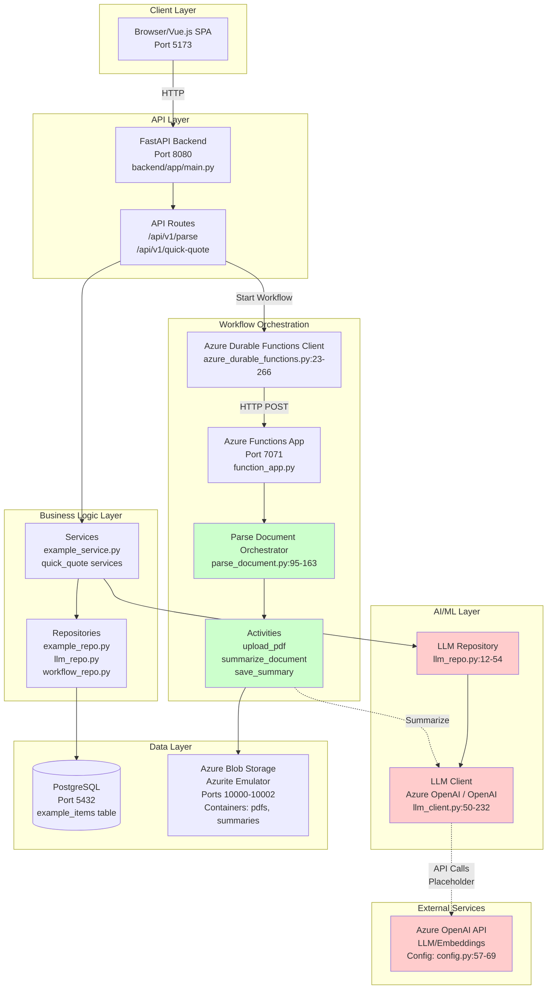

# Builders FirstSource AI Applications

## What was built

Bain and BFS co-developed **two AI-powered applications** to modernize the intake-to-quote workflow for truss/roof design work:

1. **Plan Scrape (PDF / plan-parsing tool)** for **trust administrators and designers** to rapidly review incoming building plans, validate completeness, and generate customer follow-ups.

2. **Quick Quote** for **estimators / sales / commercial teams** to generate a quote quickly using predicted material quantities—without needing a full engineering design for every bid.

## Primary user groups

- **Trust administrators**: triage incoming RFQs/plans, check completeness, initiate follow-ups.

- **Trust designers / engineers**: review extracted plan parameters, focus design effort on won work.

- **Estimators / sales / commercial teams**: produce fast quotes and improve responsiveness.

## Problem statements addressed

### 1) Slow discovery of missing information in technical documents

- Incoming technical packages often required **manual review**, with missing information discovered only after work had started.

- Plan Scrape accelerates completeness checks and drafts **RFIs** (requests for information) to customers.

### 2) Quoting was gated by time-intensive engineering design

- Previously, engineers could spend **hours** building detailed models for each quote—much of which was wasted on bids not won.

- Quick Quote shifts early-stage quoting to a **15–20 minute** workflow by predicting material quantities and producing an accurate-enough quote.

## End-to-end workflow

1. **RFQ intake** → upload plan set / technical documents.

2. **Plan Scrape** extracts key parameters, flags gaps, and drafts RFIs.

3. **Quick Quote** uses a small set of user inputs + a predictive model to estimate material quantities and produce a quote.

4. **If the quote is won**: BFS proceeds with the traditional detailed engineering design and final optimization.

## High-level architecture

Both applications were deployed on **Microsoft Azure**, using a modular architecture designed to scale from POC to production:

- **Web app / API layer**: Azure Web Apps / REST APIs

- **Processing pipelines**: Azure Functions, with **Durable Functions** used for long-running orchestration

- **Storage**: SQL database for extracted fields and application state; Azure Blob Storage for PDFs and artifacts

- **AI components**: Azure OpenAI (LLM extraction/generation), OCR / Computer Vision for plan text extraction; integration with an existing BFS CV/classification model in the pipeline

- **Modeling (Quick Quote)**: an **XGBoost** model to predict material quantities from a small set of building characteristics

## Business impact (as captured during the engagement)

- **Quick Quote**

  - Targeted **~€25M/year gross profit uplift** at full rollout.

  - Improved turnaround time from **~11 days to ~2 days** for quotes in the business case.

  - Improved win-rate by **~10 percentage points** for speed-sensitive customers.

  - Typical model error ~**7%** on key material inputs; overall quote vs actual cost discrepancy ~**10%**.

- **Plan Scrape**

  - Estimated **€3–5M/year gross profit** at steady state driven by faster intake processing, fewer manual checks, and more consistent data capture.

- **Broader BFS program framing (from case materials)**

  - ~$85M gross profit opportunity identified across ~14 use cases; two priority use cases moved from POC → MVP → production.

  - CEO sponsorship and strong Field pull supported acceleration toward enterprise rollout targets (e.g., Q1 2026 stated ambition).

## Data and evaluation approach

- For Plan Scrape, the team created a **custom labeling and benchmarking framework** for extracting parameters from technical plan diagrams—~600 plans, ~14 parameters per plan.

- For Quick Quote, a key dependency was extracting training data from a proprietary design system and file formats, requiring custom scripts and vendor coordination.

## Delivery, ownership, and handover

- Development began in Bain’s environment and later migrated into BFS’s cloud environment.

- Because long-term ownership required external support, the solution was transitioned to a third-party vendor over the final months, increasing the emphasis on documentation, maintainability, and clear operational handoffs.

# Code documentation

> Full transcript of the technical/code documentation provided for this case.

# Technical & AI Overview

**Repository**: `ai-poc-to-production-app-template`  
**Generated**: 2024  
**Analysis Type**: Full Repository Crawl

---

## 1. High-level Summary

### What the Application Does

This is an **AI application template** designed to scale from POC to production. The system provides:

1. **Document Parsing & Summarization**: PDF document processing workflow that uploads documents, generates summaries using Azure OpenAI, and stores results in blob storage.
2. **Quick Quote Service**: A simple inference endpoint that returns pre-set quote estimates (currently non-AI, but structured for future ML integration).
3. **Example CRUD API**: Template endpoints demonstrating standard REST API patterns with domain-driven design.

### AI/ML/GenAI Capabilities

**Confirmed AI Components:**
- **Azure OpenAI Integration** (infrastructure ready, placeholder implementations)
  - Text completion/generation via `AzureOpenAIClient` and `OpenAIClient`
  - Embedding generation support
  - Document summarization workflow (placeholder)
- **LLM Abstraction Layer**: Repository pattern for provider-agnostic LLM operations
- **Workflow Orchestration**: Azure Durable Functions for long-running AI pipelines

**AI Implementation Status:**
- Infrastructure and abstractions are in place
- Actual OpenAI SDK calls are commented out (TODOs present)
- Placeholder implementations return mock responses
- Configuration supports Azure OpenAI (endpoint, API key, deployment name)

### Key High-level Properties

- **Stack**: Python 3.11 + FastAPI (backend), Vue.js 3 (frontend), PostgreSQL, Azure Functions
- **Architecture Style**: Modular monolith with clear domain boundaries
- **Deployment**: Docker Compose (local), designed for Azure cloud deployment
- **Major Subsystems**:
  - FastAPI REST API (`backend/app/`)
  - Vue.js SPA (`frontend/`)
  - Azure Durable Functions (`azure-functions/`)
  - PostgreSQL database
  - Azure Blob Storage (Azurite emulator locally)

---

## 2. Components & Modules

| Component / Module | Path(s) | Responsibility / Description | Status |
|-------------------|---------|------------------------------|--------|
| **FastAPI Application** | `backend/app/main.py` | Application entry point, router discovery, middleware setup | **(Confirmed)** |
| **API Endpoints** | `backend/app/api/v1/` | REST API routes (parse_document_endpoints.py, quick_quote_endpoints.py) | **(Confirmed)** |
| **Core Configuration** | `backend/app/core/config.py` | Pydantic Settings for environment variables | **(Confirmed)** |
| **Core Security** | `backend/app/core/security.py` | JWT/auth placeholders, RBAC hooks | **(Inferred - placeholders)** |
| **Core Errors** | `backend/app/core/errors.py` | Custom exception hierarchy, error handlers | **(Confirmed)** |
| **Core Logging** | `backend/app/core/logging.py` | Structured JSON logging (prod) / colored (dev) | **(Confirmed)** |
| **Core Observability** | `backend/app/core/observability/` | Metrics, tracing hooks (placeholders) | **(Inferred - placeholders)** |
| **Database Models** | `backend/app/db/models.py` | SQLAlchemy ORM models | **(Confirmed)** |
| **Database Migrations** | `backend/app/db/migrations/` | Alembic migration scripts | **(Confirmed)** |
| **Domain Models** | `backend/app/domain/` | Business logic models, DTOs, validators | **(Confirmed)** |
| **Repositories** | `backend/app/repositories/` | Data access layer (example_repo.py, llm_repo.py, workflow_repo.py) | **(Confirmed)** |
| **Services** | `backend/app/services/` | Business logic orchestration | **(Confirmed)** |
| **LLM Client** | `backend/app/integrations/llm_client.py` | Azure OpenAI / OpenAI client abstractions | **(Confirmed - placeholders)** |
| **LLM Repository** | `backend/app/repositories/llm_repo.py` | Business-facing LLM interface | **(Confirmed)** |
| **Azure Durable Functions Client** | `backend/app/integrations/azure_durable_functions.py` | HTTP client for workflow orchestration | **(Confirmed)** |
| **Azure Blob Storage Client** | `backend/app/integrations/azure_blob.py` | Blob storage operations (placeholder) | **(Inferred - placeholders)** |
| **Azure Functions App** | `azure-functions/function_app.py` | Durable Functions entry point | **(Confirmed)** |
| **Parse Document Workflow** | `azure-functions/workflows/parse_document.py` | Orchestrator + activities for PDF parsing | **(Confirmed)** |
| **Frontend App** | `frontend/src/App.vue` | Vue.js SPA entry point | **(Confirmed)** |
| **Quick Quote Components** | `frontend/src/components/` | Vue components for quote UI | **(Confirmed)** |
| **PDF Utilities** | `backend/app/utils/pdf_utils.py` | PDF text extraction (placeholder) | **(Inferred - placeholders)** |
| **Text Utilities** | `backend/app/utils/text_utils.py` | Text processing helpers | **(Confirmed)** |

---

## 3. Architecture Diagram

**Information Flow for Document Parsing:**
1. User uploads PDF via FastAPI endpoint (`parse_document_endpoints.py:107-155`)
2. FastAPI calls Azure Durable Functions client (`azure_durable_functions.py:45-109`)
3. Azure Functions starts orchestrator (`parse_document.py:31-87`)
4. Orchestrator coordinates activities:
   - Upload PDF to blob storage (`parse_document.py:171-222`)
   - Summarize document via Azure OpenAI (`parse_document.py:225-273`) **[Placeholder]**
   - Save summary to blob storage (`parse_document.py:276-324`)
5. Status polling via FastAPI endpoint (`parse_document_endpoints.py:162-187`)

---

## 4. Core Feature Flows / Critical Paths

### Feature 1: Document Parsing & Summarization

**What it does:**
- Accepts PDF documents (base64 or file upload)
- Orchestrates a multi-step workflow: upload → summarize → save
- Returns workflow instance ID for status polling

**Entry points:**
- `POST /api/v1/parse/document` - Base64 encoded PDF (`parse_document_endpoints.py:54-99`)
- `POST /api/v1/parse/document/upload` - File upload (`parse_document_endpoints.py:102-155`)
- `GET /api/v1/parse/status/{instance_id}` - Status check (`parse_document_endpoints.py:158-187`)
- `DELETE /api/v1/parse/cancel/{instance_id}` - Cancel workflow (`parse_document_endpoints.py:190-220`)

**Flow & modules involved:**
1. **API Endpoint** (`parse_document_endpoints.py:59-99`)
   - Validates request
   - Creates `AzureDurableFunctionsClient`
   - Calls `start_workflow()` with workflow name "parse_document"
2. **Durable Functions Client** (`azure_durable_functions.py:45-109`)
   - HTTP POST to `{function_app_url}/api/parse_document`
   - Returns instance ID
3. **Azure Functions HTTP Trigger** (`parse_document.py:31-87`)
   - Receives request, starts orchestrator
4. **Orchestrator** (`parse_document.py:95-163`)
   - Calls `upload_pdf_activity` → `summarize_document_activity` → `save_summary_activity`
5. **Activities** (`parse_document.py:171-324`)
   - Upload: Saves PDF to blob storage (`parse_document.py:171-222`)
   - Summarize: Downloads PDF, calls Azure OpenAI (placeholder) (`parse_document.py:225-273`)
   - Save: Stores summary text in blob storage (`parse_document.py:276-324`)

**AI involvement:**
- **LLM Call**: `summarize_document_activity_handler()` (`parse_document.py:225-273`)
  - Currently returns placeholder text
  - Intended to call Azure OpenAI for summarization
  - Configuration: `azure_openai_endpoint`, `azure_openai_api_key`, `azure_openai_deployment` (`config.py:57-69`)
- **Prompt**: Not visible in code (would be constructed in activity function)
- **Model**: Configured via `AZURE_OPENAI_DEPLOYMENT` (default: "gpt-5") **(Inferred - likely placeholder name)**

**External dependencies:**
- Azure Blob Storage (Azurite locally)
- Azure Durable Functions runtime
- Azure OpenAI API (when implemented)

**Edge cases / error handling:**
- HTTP exceptions caught and returned as 503 (`parse_document_endpoints.py:94-99`)
- Activity failures return `{"success": False, "error": ...}` (`parse_document.py:217-222`)
- Orchestrator checks activity results and returns failure state (`parse_document.py:122-128, 139-145`)
- Status endpoint handles 404 for missing instances (`azure_durable_functions.py:152-160`)

### Feature 2: Quick Quote Inference

**What it does:**
- Accepts project parameters (sqft, region, building_type)
- Returns pre-set quote estimates (bdft, labor, price)
- Currently non-AI (hardcoded values), structured for future ML integration

**Entry points:**
- `POST /api/v1/quick-quote/quick-quote-inference` (`quick_quote_endpoints.py:35-69`)
- Frontend: `QuickQuoteInputs.vue` component (`frontend/src/components/QuickQuoteInputs.vue:69-94`)

**Flow & modules involved:**
1. **Frontend** (`QuickQuoteInputs.vue:69-94`)
   - Collects form data
   - POSTs to `/api/v1/quick-quote/quick-quote-inference`
2. **API Endpoint** (`quick_quote_endpoints.py:40-69`)
   - Validates request via Pydantic model
   - Returns hardcoded response
   - Logs request metadata

**AI involvement:**
- **None currently** - Returns static values (`quick_quote_endpoints.py:62-69`)
- Structure suggests future ML model integration

**External dependencies:**
- None (self-contained)

**Edge cases / error handling:**
- Pydantic validation handles invalid input
- FastAPI error handlers catch exceptions (`errors.py:164-270`)

### Feature 3: Example CRUD API

**What it does:**
- Standard CRUD operations for "example items"
- Demonstrates domain-driven design patterns

**Entry points:**
- CRUD endpoints (inferred from `example_service.py` and repository pattern)
- Service layer: `ExampleService` (`example_service.py:22-194`)

**Flow & modules involved:**
1. **Service** (`example_service.py:22-194`)
   - Business logic, validation
   - Calls repository for data access
2. **Repository** (`example_repo.py` - inferred)
   - Database operations
3. **Domain Models** (`domain/example/models.py`, `domain/example/dto.py` - inferred)
   - Business entities and DTOs

**AI involvement:**
- None

**External dependencies:**
- PostgreSQL database

**Edge cases / error handling:**
- `NotFoundError` for missing resources (`example_service.py:90-92`)
- Validation errors via domain validators (`example_service.py:54-55`)

---

## 5. Data Model & Persistence

### Data Models and Schemas

**Confirmed Models:**

1. **ExampleItemORM** (`db/models.py:14-31`)
   - Table: `example_items`
   - Fields:
     - `id` (Integer, PK)
     - `name` (String(100), indexed, nullable=False)
     - `description` (Text, nullable=True)
     - `created_at` (DateTime, timezone-aware, server default)
     - `updated_at` (DateTime, timezone-aware, on update)

**Inferred Models:**
- Quick Quote data: Request/Response DTOs (`quick_quote_endpoints.py:16-32`) - no persistence
- Workflow state: Stored in Azure Durable Functions storage (not in PostgreSQL)

### Storage Technologies

1. **PostgreSQL** (Confirmed)
   - Primary relational database
   - Connection: `database_url` env var (`config.py:34-37`)
   - Default: `postgresql://postgres:password@db:5432/app`
   - Migrations: Alembic (`alembic.ini`, `db/migrations/`)

2. **Azure Blob Storage** (Confirmed)
   - Containers:
     - `pdfs` - Uploaded PDF documents (`config.py:72-74`)
     - `summaries` - Generated summaries (`config.py:76-78`)
   - Local: Azurite emulator (ports 10000-10002)
   - Connection: `azure_storage_connection_string` (`config.py:46-54`)
   - Client: `AzureBlobStorageClient` (`azure_blob.py:18-162`) - placeholder implementation

3. **Azure Durable Functions Storage** (Confirmed)
   - Workflow state, history, queues
   - Uses Azure Storage (Tables, Queues) via connection string
   - Managed by Azure Functions runtime

### Constraints, Relationships, Indexing

- **Indexes**: `name` field indexed on `example_items` (`db/models.py:25`)
- **Constraints**: Primary key on `id`, NOT NULL on `name` and `created_at`
- **Relationships**: None visible (single table example)

**Performance Considerations:**
- Index on `name` for lookup performance
- Blob storage organized by `instance_id/{filename}` for workflow isolation (`parse_document.py:194`)

---

## 6. AI / ML / GenAI Capabilities

### Solution Type(s) and Patterns Used

**Pattern: Simple LLM API Integration** (Infrastructure Ready)
- Single LLM call per request pattern
- Abstracted via repository pattern for provider flexibility

**Pattern: Workflow-Orchestrated AI Pipeline** (Implemented)
- Multi-step pipeline: document upload → AI summarization → storage
- Uses Azure Durable Functions for reliability and state management

**Pattern: RAG / Retrieval-Augmented Generation** (Not Detected)
- Embedding generation infrastructure exists (`llm_client.py:37-47`)
- No vector store integration found
- No retrieval logic found

**Pattern: Multi-Agent Systems** (Not Detected)

**Pattern: Tool-Calling / Function-Calling** (Not Detected)

### Modalities

- **Text**: Primary modality
  - Text completion/generation (`llm_client.py:23-34`)
  - Embeddings (`llm_client.py:37-47`)
  - Document summarization (intended)
- **PDF Documents**: Input format for parsing workflow
- **Multimodal** (image, audio, video): Not detected

### Where in the System AI is Invoked and Why

1. **Document Summarization Workflow** (`parse_document.py:225-273`)
   - **Why**: Generate summaries of uploaded PDF documents
   - **When**: Called as activity function in orchestrator
   - **Status**: Placeholder implementation

2. **LLM Repository Interface** (`llm_repo.py:29-41, 43-54`)
   - **Why**: Business-facing abstraction for LLM operations
   - **When**: Called by services needing LLM capabilities
   - **Status**: Wrapper around client (client is placeholder)

3. **Future Quick Quote ML** (Inferred)
   - Structure suggests future ML model integration
   - Currently returns hardcoded values

---

## 7. Models, Providers & Orchestration

### Model Providers and Specific Models Used

**Azure OpenAI** (Confirmed - Configuration Ready)
- **Provider**: Azure OpenAI Service
- **Configuration** (`config.py:57-69`):
  - Endpoint: `azure_openai_endpoint` (env var)
  - API Key: `azure_openai_api_key` (env var)
  - Deployment: `azure_openai_deployment` (default: "gpt-5") **(Inferred - likely placeholder)**
  - API Version: "2024-08-01-preview" (`llm_client.py:62`)
- **Client Implementation**: `AzureOpenAIClient` (`llm_client.py:50-146`)
  - Methods: `complete()`, `embed()`
  - Status: Placeholder (TODOs present, `llm_client.py:78-84, 102-112`)

**OpenAI** (Confirmed - Configuration Ready)
- **Provider**: OpenAI Public API
- **Configuration**:
  - API Key: Constructor parameter (`llm_client.py:156`)
  - Model: Default "gpt-4" (`llm_client.py:156`)
- **Client Implementation**: `OpenAIClient` (`llm_client.py:149-231`)
  - Status: Placeholder

**Model Configuration:**
- Temperature, max_tokens: Passed via `**kwargs` (`llm_client.py:23, 86`)
- System prompts: Not visible in code (would be in activity functions)
- Tools/abilities: Not configured

**Model Deployment:**
- **Managed API Integration**: Both providers use API calls (not self-hosted)
- **Credentials**: Environment variables (no secret manager integration visible)

### Orchestration Frameworks and Agent Patterns

**Azure Durable Functions** (Confirmed)
- **Role**: Workflow orchestration for long-running, stateful processes
- **Pattern**: Orchestrator + Activities
  - Orchestrator: Coordinates activities (`parse_document.py:95-163`)
  - Activities: Execute work (upload, summarize, save)
- **Client**: `AzureDurableFunctionsClient` (`azure_durable_functions.py:23-266`)
- **Integration**: HTTP-based (FastAPI calls Functions endpoints)

**Agent Design Patterns:**
- **Sequential Chain**: Document parsing workflow executes steps sequentially (`parse_document.py:112-155`)
- **Error Handling**: Orchestrator checks activity results and fails fast (`parse_document.py:122-128`)

**No Other Orchestration Frameworks Detected:**
- LangChain: Not found
- LlamaIndex: Not found
- Semantic Kernel: Not found
- Custom agent frameworks: Not found

### Prompt Templates and Management

**Prompt Management:**
- **Not Found**: No prompt templates (YAML/JSON/Markdown) detected
- **Inferred**: Prompts would be constructed in activity functions or services
- **System vs User Prompts**: Not visible in code
- **Prompt Versioning**: Not implemented

**Prompt Construction:**
- Would occur in `summarize_document_activity_handler()` (`parse_document.py:225-273`)
- Currently placeholder, so prompt logic not visible

### RAG / Retrieval & Vector Search

**Not Implemented:**
- No vector store detected (Pinecone, Weaviate, Qdrant, pgvector, etc.)
- Embedding generation infrastructure exists but unused
- No indexing pipelines
- No retrieval logic
- No hybrid search (BM25 + vectors)

**Infrastructure Ready:**
- `LLMClient.embed()` method exists (`llm_client.py:37-47`)
- Would require vector store integration and retrieval logic

---

## 8. Configuration, Deployment & Infrastructure

### Config Mechanisms

**Environment Variables** (Confirmed)
- Managed via Pydantic Settings (`config.py:11-104`)
- Loaded from `.env` file (local) or environment (production)
- Settings class: `Settings` (`config.py:11-104`)

**Key Configuration Categories:**
1. **Application** (`config.py:18-25`)
   - `app_name`, `environment`, `debug`, `api_v1_prefix`
2. **Logging** (`config.py:27-31`)
   - `log_level`
3. **Database** (`config.py:33-37`)
   - `database_url`
4. **Azure Function App** (`config.py:39-43`)
   - `function_app_url`
5. **Azure Storage** (`config.py:45-54`)
   - `azure_storage_connection_string`
6. **Azure OpenAI** (`config.py:57-69`)
   - `azure_openai_api_key`, `azure_openai_endpoint`, `azure_openai_deployment`
7. **Blob Containers** (`config.py:71-78`)
   - `blob_container_pdfs`, `blob_container_summaries`
8. **Authentication** (`config.py:81-93`)
   - `auth_secret_key`, `auth_algorithm`, `auth_access_token_expire_minutes`

**Config Files:**
- `.env` file (gitignored, not in repo)
- `.env.example` referenced in README but not found in repo

**Feature Flags:**
- Not detected

**Secrets Management:**
- **Local**: `.env` file (gitignored)
- **Production**: Not implemented (documented as Azure Key Vault integration point in `docs/REPO_STRUCTURE_OUTLINE.md:275-278`)
- **Secrets**: API keys stored as environment variables (not in secret manager)

**AI-Specific Config:**
- Model name: `azure_openai_deployment` (default: "gpt-5") **(Inferred - placeholder)**
- Base URL: `azure_openai_endpoint`
- Temperature, max_tokens: Passed per-request (not in config)
- Safety settings: Not configured
- Tools/abilities: Not configured

### Deployment Architecture

**Cloud Provider:** (Inferred)
- **Azure**: Strong evidence (Azure Functions, Azure Blob Storage, Azure OpenAI)
- **Local Development**: Docker Compose with Azurite emulator

**Compute Shape:**
- **Containers**: Docker Compose for local (`docker-compose.yml`)
- **Backend**: FastAPI in container (`backend/Dockerfile`)
- **Frontend**: Vue.js in container (`frontend/Dockerfile`)
- **Azure Functions**: Containerized (`azure-functions/Dockerfile`)
- **Production**: Likely Azure App Service / Azure Functions (inferred from Azure integrations)

**Component Deployment:**
- **Monolithic Backend**: Single FastAPI service
- **Separate Functions App**: Azure Functions for workflows
- **Frontend**: Separate container/service
- **Database**: PostgreSQL container (local) / Managed PostgreSQL (production inferred)

**AI Component Deployment:**
- **Same Service**: LLM clients in FastAPI backend (`backend/app/integrations/llm_client.py`)
- **Workflow Activities**: Azure Functions (serverless)
- **Model Access**: Managed API (Azure OpenAI)

**Docker Configuration:**
- `docker-compose.yml`: Base configuration
- `docker-compose.override.yml`: Development overrides (hot reload, debugpy)
- Dockerfiles: `backend/Dockerfile`, `frontend/Dockerfile`, `azure-functions/Dockerfile`

### Integrations with External Systems

**Confirmed Integrations:**
1. **Azure Blob Storage**
   - Client: `AzureBlobStorageClient` (`azure_blob.py:18-162`)
   - Usage: PDF storage, summary storage
   - Status: Placeholder implementation

2. **Azure Durable Functions**
   - Client: `AzureDurableFunctionsClient` (`azure_durable_functions.py:23-266`)
   - Usage: Workflow orchestration
   - Status: Implemented (HTTP client)

3. **Azure OpenAI** (when implemented)
   - Client: `AzureOpenAIClient` (`llm_client.py:50-146`)
   - Usage: Text generation, embeddings
   - Status: Placeholder

**No Other Integrations Detected:**
- CRM (Salesforce, HubSpot): Not found
- ERP: Not found
- Slack: Not found
- ServiceNow: Not found
- Internal APIs: Not found

---

## 9. Data, Governance & Safety

### Types and Sources of Data

**Data Types:**
1. **Structured Data** (Confirmed)
   - Example items (name, description, timestamps)
   - Quick quote requests/responses (sqft, region, building_type, estimates)

2. **Unstructured Data** (Confirmed)
   - PDF documents (uploaded via API)
   - Text summaries (generated by AI, stored as text files)

3. **Workflow State** (Confirmed)
   - Durable Functions orchestration state (in Azure Storage)

**Data Sources:**
- **User Input**: API requests, file uploads
- **AI-Generated**: Document summaries (when implemented)
- **System-Generated**: Timestamps, workflow instance IDs

**Data Sensitivity:**
- **PII**: Not explicitly classified in code
- **Sensitive Data**: PDF documents may contain sensitive information (not validated)
- **Public vs Internal**: Not classified

**Data Classification / Masking:**
- Not implemented
- No anonymization/pseudonymization logic found

### Data Pipelines and ETL

**ETL Tooling:**
- Not detected (no Airflow, dbt, Glue, Dataflow)

**Data Flow:**
1. **Ingestion**: API endpoints receive data
2. **Processing**: Services/repositories transform and validate
3. **Persistence**: PostgreSQL (structured), Blob Storage (files)
4. **Retrieval**: Repositories query database, blob clients download files

**AI Data Pipeline:**
- Document upload → Blob Storage → AI summarization → Summary storage
- Orchestrated via Azure Durable Functions

### Data Governance Aspects

**Access Control:**
- Authentication: Placeholder (`security.py:14-44`)
- Authorization: RBAC hooks exist but not implemented (`security.py:68-89`)
- Database: Connection string-based (no explicit access control in code)

**Data Validation:**
- Pydantic models for request/response validation
- Domain validators (`domain/example/validators.py` - inferred)

**Data Retention:**
- Not configured (no TTL policies visible)

**Audit Logging:**
- Structured logging with request IDs (`logging.py:15-42`)
- Correlation IDs for request tracking (`errors.py:272-291`)
- No explicit audit trail for data access

### Security, Privacy and Safety Practices for AI

**Prompt Protections:**
- **Not Implemented**: No prompt injection detection
- **Input Validation**: Pydantic validation on API requests (general, not AI-specific)

**Guardrails:**
- **Not Implemented**: No output filters, moderation APIs
- **Error Handling**: Generic exception handling (`errors.py:164-270`)

**PII Handling:**
- **Not Explicit**: No PII detection/redaction in prompts
- **Logging**: Request data logged (may include PII if present in requests)
- **Storage**: PDFs stored in blob storage (no encryption at rest visible)

**Zero-Trust / Least Privilege:**
- **Not Implemented**: Authentication placeholders
- **Service Identity**: Not configured (would use Azure Managed Identity in production)

**Risks Identified:**
- **(Inferred Risk)**: No prompt injection protections
- **(Inferred Risk)**: No output moderation/filtering
- **(Inferred Risk)**: PII may be logged/stored without explicit handling
- **(Inferred Risk)**: Authentication not implemented (placeholder)

---

## 10. Cross-cutting Concerns

### Logging, Monitoring, Observability

**Logging Strategy:**
- **Structured Logging**: JSON format in production (`logging.py:15-42`)
- **Human-Readable**: Colored format in development (`logging.py:45-69`)
- **What is Logged**:
  - Request method, path, duration (`main.py:112-143`)
  - Slow requests (>5s) logged as warnings (`main.py:120-129`)
  - Application errors with context (`errors.py:170-178`)
  - LLM operations (placeholder logs, `llm_client.py:100, 115`)
- **Log Structure**: JSON with timestamp, level, logger, message, request_id, correlation_id (`logging.py:18-42`)

**Observability Tooling:**
- **Metrics**: Placeholder hooks (`metrics.py:17-123`)
  - `track_metric()`, `track_counter()`, `track_timing()`
  - Decorators: `@metric_timer()`
  - Status: Logs to debug, not integrated with backend
- **Tracing**: Placeholder hooks (`tracing.py:16-123`)
  - `get_tracer()`, `trace_function()`, `@trace_decorator()`
  - Status: Logs to debug, OpenTelemetry integration points documented
- **APM**: Not integrated

**LLM/AI-Specific Observability:**
- **Prompt/Response Tracing**: Not implemented (would use tracing hooks)
- **Latency Dashboards**: Not configured
- **Cost Tracking**: Not implemented
- **LLM Evaluations**: Not found
- **A/B Tests**: Not configured

**Request Tracking:**
- Correlation IDs: Middleware adds `X-Correlation-ID` header (`errors.py:272-291`)
- Request IDs: Generated per request (`errors.py:133-137`)
- Included in error responses (`errors.py:140-161`)

### Testing Strategy and Coverage

**Test Presence:**
- **Unit Tests**: Present (`tests/` directory)
  - `test_example_service.py`
  - `test_example_repo.py`
  - `test_validators.py`
  - `test_text_utils.py`
  - `test_quick_quote_endpoints.py`
  - `test_router_discovery.py`
- **Integration Tests**: Not clearly separated
- **End-to-End Tests**: Not found
- **Load Tests**: Not found
- **Smoke Tests**: Not found

**Test Configuration:**
- Framework: pytest (`pyproject.toml:38-40`)
- Async support: `pytest-asyncio` (`pyproject.toml:40`)
- Coverage: `pytest-cov` (`pyproject.toml:42`)
- Config: `pytest.ini_options` in `pyproject.toml:94-102`

**AI-Specific Tests:**
- **Not Found**: No heuristic evals, golden datasets, RAG evaluation
- **Not Found**: No toxicity/safety checks

**Coverage by Area (Inferred):**
- **Services**: Some coverage (`test_example_service.py`)
- **Repositories**: Some coverage (`test_example_repo.py`)
- **API Endpoints**: Some coverage (`test_quick_quote_endpoints.py`, `test_router_discovery.py`)
- **Domain Logic**: Some coverage (`test_validators.py`)
- **AI Components**: Not tested (LLM clients are placeholders)
- **Workflows**: Not tested

**Strengths and Gaps:**
- **Strengths**: Test infrastructure in place, some coverage for core features
- **Gaps**: AI components untested, workflows untested, no E2E tests

### Performance, Scalability, Fault-Tolerance

**Performance Considerations:**
- **Database Indexing**: Index on `name` field (`db/models.py:25`)
- **Request Timing**: Logged, slow request detection (`main.py:112-143`)
- **Async Operations**: FastAPI async endpoints, async database operations
- **Caching**: Not implemented

**Scalability:**
- **Horizontal Scaling**: FastAPI can scale horizontally (stateless)
- **Database**: Single PostgreSQL instance (no read replicas visible)
- **Blob Storage**: Azure Blob Storage scales automatically
- **Functions**: Azure Functions auto-scales

**Fault-Tolerance:**
- **Error Handling**: Comprehensive exception handlers (`errors.py:164-270`)
- **Retries**: Not configured (would be in HTTP client or activity functions)
- **Circuit Breakers**: Not implemented
- **Timeouts**: HTTP client timeout configured (`azure_durable_functions.py:43`)
- **Fallbacks**: No fallback behavior when AI calls fail (would need implementation)

**Workflow Reliability:**
- **Durable Functions**: Provides state persistence, retries, error handling
- **Activity Failures**: Handled in orchestrator (`parse_document.py:122-128`)

---

## 11. Limitations & Open Questions

### Items that are Unknown or Ambiguous

1. **Production Deployment Topology**
   - **Unknown**: Actual Azure deployment configuration (App Service, Functions, etc.)
   - **Why**: Only Docker Compose files present, no Terraform/ARM templates
   - **Needs**: Infrastructure as Code manifests

2. **Real Data Scale, Latency Requirements, SLAs/SLOs**
   - **Unknown**: Production performance requirements
   - **Why**: Not documented in codebase
   - **Needs**: Requirements documentation

3. **Exact Test Coverage**
   - **Unknown**: Actual coverage percentage
   - **Why**: Coverage reports not generated/committed
   - **Needs**: Run `pytest --cov` and review

4. **Real-World Performance, Reliability, Safety Incidents**
   - **Unknown**: Production metrics, incidents
   - **Why**: Not in repository
   - **Needs**: Production monitoring data

5. **Model Training/Fine-Tuning Details**
   - **Unknown**: Training pipelines, fine-tuning processes
   - **Why**: Not in repository (likely proprietary or separate)
   - **Needs**: Training pipeline documentation

6. **Governance Processes and Human Review Workflows**
   - **Unknown**: Approval workflows, human-in-the-loop steps
   - **Why**: Not implemented in code
   - **Needs**: Process documentation

7. **Actual Model Names Used in Production**
   - **Unknown**: Real Azure OpenAI deployment names
   - **Why**: Default is "gpt-5" (likely placeholder)
   - **Needs**: Production configuration review

8. **Secrets Management in Production**
   - **Unknown**: Azure Key Vault integration status
   - **Why**: Documented but not implemented
   - **Needs**: Production secrets management review

9. **CI/CD Pipeline Configuration**
   - **Unknown**: GitHub Actions, Azure DevOps, etc.
   - **Why**: No workflow files found
   - **Needs**: CI/CD configuration files

10. **Frontend Routing Configuration**
    - **Unknown**: Vue Router setup, routes
    - **Why**: `main.js` not read, router config not visible
    - **Needs**: Review `frontend/src/main.js` and router config

11. **Database Connection Pooling**
    - **Unknown**: Pool size, connection limits
    - **Why**: SQLAlchemy config not visible in code read
    - **Needs**: Review database connection configuration

12. **Rate Limiting and Throttling**
    - **Unknown**: API rate limits, LLM rate limit handling
    - **Why**: Not implemented in code
    - **Needs**: Rate limiting middleware/configuration

### Explicit Notes on Where Human Input is Required

1. **Complete LLM Implementation**
   - Uncomment and implement OpenAI SDK calls in `llm_client.py`
   - Add error handling, retries, rate limiting
   - Configure actual model deployment names

2. **Implement PDF Text Extraction**
   - Add PDF libraries (PyPDF2, pdfplumber) to dependencies
   - Implement `extract_text_from_pdf()` in `pdf_utils.py`
   - Use extracted text in summarization workflow

3. **Implement Azure Blob Storage Client**
   - Uncomment blob storage SDK calls in `azure_blob.py`
   - Add error handling and retries

4. **Add Authentication/Authorization**
   - Implement JWT validation in `security.py`
   - Add RBAC logic
   - Configure identity provider integration

5. **Add Prompt Engineering**
   - Create prompt templates for document summarization
   - Add system prompts, user prompts
   - Consider prompt versioning strategy

6. **Add AI Safety/Guardrails**
   - Implement prompt injection detection
   - Add output moderation/filtering
   - Configure content safety policies

7. **Add Observability Backends**
   - Integrate metrics backend (Prometheus, Application Insights)
   - Integrate tracing backend (OpenTelemetry, Jaeger)
   - Add LLM-specific observability (cost tracking, latency)

8. **Add Production Infrastructure**
   - Create Terraform/ARM templates for Azure deployment
   - Configure CI/CD pipelines
   - Set up production secrets management

9. **Add Testing for AI Components**
   - Unit tests for LLM clients (mocked)
   - Integration tests for workflows
   - Evaluation tests for summarization quality

10. **Document Production Configuration**
    - Document actual model names, endpoints
    - Document scaling configuration
    - Document monitoring/alerting setup

---

## Marking Certainty

**Confirmed**: Based on direct evidence in code/config files  
**Inferred**: Based on naming, patterns, or partial information  
**Unknown**: Not found in repository, requires manual confirmation

---

**Document Generated**: 2024  
**Repository Path**: `C:\Users\56486\Development\ai-poc-to-production-app-template`  
**Analysis Scope**: Full repository crawl with focus on AI/ML components

# Insights, Learning & Anecdotes

## What made this case feel different

- **Field-led use case discovery**: BFS end-users helped map the intake-to-manufacturing workflow, called out pain points, and co-created solution concepts. This helped avoid “innovation theater” and ensured the tools fit real day-to-day work.

- **Two-tool pairing created compounding value**: Plan Scrape reduced friction at the front door (cleaner, faster intake), while Quick Quote reduced the expensive downstream design effort applied to losing bids.

- **Momentum mattered**: Case materials describe unusually strong adoption signals—leaders and the Field actively pulling for rollout—helping the program cross the typical “tool resistance” barrier.

## Key product decisions and tradeoffs

### Quick Quote: choose ‘accurate enough’ over ‘perfect’

- The team evaluated multiple modeling approaches (plan-level vs section-level vs component-level/3D reconstruction). BFS chose a **plan-level model** as the right tradeoff: fastest to run and deploy while still holding error within a tolerable range (aiming around **~10% of manufacturing cost**).

- A notable learning: removing an input feature that users struggled to estimate would have reduced user friction, but would have degraded model accuracy materially (from ~7% to ~15%). Instead, the team invested ~6 weeks redesigning inputs and UX to preserve accuracy *and* usability.

### Plan Scrape: scaling long-running, API-heavy workflows

- The parsing pipeline orchestrates many calls (OCR/CV, LLM extraction, client model, database writes). Early implementations can work in a low-usage MVP but break under production concurrency.

- The team experienced slowdown at rollout, requiring a stronger orchestration pattern and queueing/scaling approach (e.g., Durable Functions) to reliably process many plans in parallel.

## Engineering and delivery lessons that stuck

- **Build production foundations earlier than feels comfortable**: repo structure, logging/monitoring, and orchestration patterns are easy to defer—but rework is more expensive once adoption begins.

- **Start minimal; avoid bloated starter kits**: pulling in unused modules created dead code that lingered into production phases. A slim baseline with additive modules is easier to maintain.

- **Simplify database schemas early**: initial over-complexity didn’t pay off and slowed iteration.

## Client context that shaped the build

- **Fragmented operating model and data landscape**: BFS’s regional differences and disparate systems made it hard to find and align the right data. The team started with one region and worked closely with SMEs to iterate based on what was actually available.

- **Existing BFS AI capabilities**: BFS had an acquired AI team and a pre-existing CV/classification model that the solution needed to integrate with—useful, but it also introduced dependency and maturity risks.

- **Data access constraints (proprietary formats)**: Quick Quote’s training labels depended on data inside a proprietary design tool and file format, requiring custom extraction scripts and external coordination.

## Capability transfer in practice

- Beyond shipping tools, the engagement built BFS’s “muscle” for AI delivery: decision points, business casing, end-user co-design, and value measurement.

- Handover to a third-party implementation/support partner was treated as a first-class design constraint (documentation quality, operability, clear boundaries of ownership).

## Anecdotes captured in the materials

- Leaders described the tools as unusually “pull-driven,” with teams ‘fighting over who goes first’ for rollout in contrast to typical change resistance.

- Executive sponsorship explicitly tied to an aggressive enterprise rollout ambition (e.g., goal to scale the tools broadly by **Q1 2026** in the program narrative).

- The case was positioned internally as highly referenceable because it moved from **POC → MVP → production** with measurable value capture.
