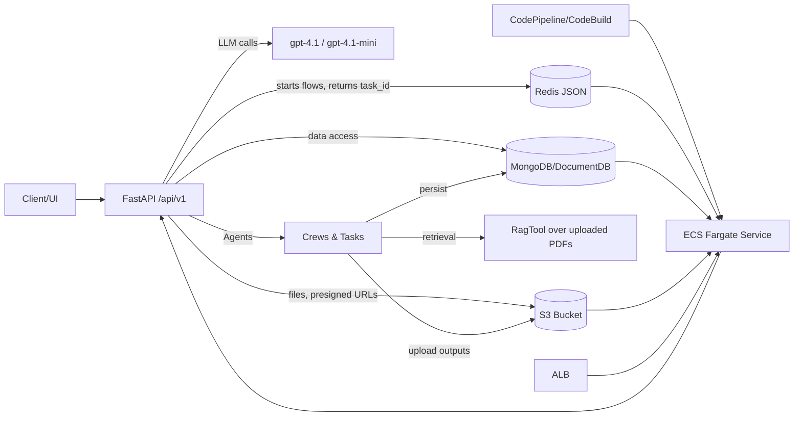

## Code documentation

# Technical & AI Overview

## 1. High-level Summary
- FastAPI backend for GenAI-powered academic content creation: syllabus generation, lecture document drafting, editing with comments, and infographic generation (Confirmed, Python 3.11, FastAPI, crewai, OpenAI SDK).
- Heavy AI/LLM use: multi-agent flows via CrewAI, OpenAI chat models, RAG over user-uploaded materials (Confirmed).
- Data layer: MongoDB/DocumentDB for content, Redis for progress tracking/caching, S3 for documents (Confirmed).
- Deployment: containerized with Docker; infra via AWS CloudFormation (ECS Fargate service, ALB, S3, ElastiCache Redis, DocumentDB, CodePipeline/CodeBuild) (Confirmed).
- Architecture style: modular monolith with async background flows and task tracking in Redis (Inferred).

## 2. Components & Modules
| Component / Module | Path(s) | Responsibility / Description (Confirmed / Inferred) |
| - | - | - |
| FastAPI app | backend/content_creation/src/main.py | App creation, CORS, router/exception registration (Confirmed) |
| API routers (v1) | backend/content_creation/src/api/routers/v1/*.py | REST endpoints for syllabus flow, lecture doc flow, document editing, infographics, uploads, project info (Confirmed) |
| Exception handling | backend/content_creation/src/api/exceptionhandlers/* | Generic + domain exceptions to HTTP responses (Confirmed) |
| Config | backend/content_creation/src/config/* | Env-backed config (OpenAI, Redis, Mongo, S3/AWS, flow limits, steps) (Confirmed) |
| Infra adapters | backend/content_creation/src/infra/{redis.py,mongodb.py,s3_utils.py} | Redis JSON helper + progress tracker; Mongo client; S3 manager (presigned URLs, CRUD) (Confirmed) |
| Core domain: project/syllabus/book | backend/content_creation/src/core/{project_info,syllabus,book,...} | Pydantic entities, repositories to Mongo, flow state (Confirmed) |
| Flows – syllabus | backend/content_creation/src/core/syllabus_flow/* | CrewAI agents for syllabus generation & validation, orchestration entry in main (Confirmed) |
| Flows – lecture document | backend/content_creation/src/core/lecture_document_flow/* | Multi-agent writing + validation of chapters/sections; RAG + Serper tool use (Confirmed) |
| Flows – syllabus change | backend/content_creation/src/core/syllabus_change_flow/* | Validates modified syllabi, surfaces warnings (Confirmed) |
| Flows – document editing | backend/content_creation/src/core/document_editing_flow/* | Applies reviewer comments via agents; saves edits (Confirmed) |
| Flows – infographics | backend/content_creation/src/core/infographics_flow/* | CrewAI agents to plan/write infographics per section (Confirmed) |
| Upload/download | backend/content_creation/src/core/upload_and_download/* | Presigned URLs, file ingestion, S3 interactions, task tracking (Confirmed) |
| RAG helper | backend/content_creation/src/core/rag/rag_entities.py | Builds crewai RagTool from S3 documents (Confirmed) |
| Utilities (LLM/logging/backoff) | backend/content_creation/src/core/utils/* | OpenAI client with backoff, logger, formatting, file helpers, embedchain S3 loader (Confirmed) |
| Infra IaC | infra/*.yml | CloudFormation templates for ECS service, Redis, DocumentDB, S3, pipelines, SGs (Confirmed) |
| Local dev | backend/content_creation/docker-compose.yml, Dockerfile, Makefile | Local stack with Redis, Mongo, FastAPI (Confirmed) |

## 3. Architecture Diagram

## 4. Core Feature Flows / Critical Paths
- **Syllabus generation & approval**
  - Entry: `POST /api/v1/syllabus_flow` (kickoff), `GET /api/v1/syllabus_flow/{task_id}` for status, plus CRUD/advance endpoints (`/modified_syllabus`, `/approve_syllabus`, etc.) in `src/api/routers/v1/syllabus_flow.py` (~1–820).
  - Flow: Validates project state → async `kickoff_syllabus_flow` (core/syllabus_flow/main.py) → CrewAI writers/validators generate syllabus/book outline; progress tracked in Redis (`ProgressTracker`) → results stored in Mongo and uploaded to S3 (Confirmed).
  - AI: CrewAI agents defined in `core/syllabus_flow/crews/*/config/agents.yaml`, `tasks.yaml` using OpenAI models `gpt-4.1`/`gpt-4.1-mini` (Confirmed).
  - External deps: Redis, Mongo, S3, OpenAI.
  - Error handling: HTTP exceptions for invalid steps; generic 503 fallback; flow retry/backoff encapsulated in utilities.

- **Lecture document generation (chapters/sections)**
  - Entry: `POST /api/v1/lecture_document_flow` (router file), status `GET /api/v1/lecture_document_flow/{task_id}` in `src/api/routers/v1/lecture_document_flow.py` (not shown but analogous).
  - Flow: `core/lecture_document_flow/main.py` (~1–240) initializes validated syllabus; per-section writing via CrewAI `Writers` (agents/tasks configs) with RAG + SerperDev; backoff on OpenAI rate limits; validation via `Validators` crew; book saved to Mongo and S3; progress in Redis.
  - AI: Multi-agent sequential steps, OpenAI chat completions, RAG tool `initialize_rag_tool` (Confirmed).
  - Errors: Section count mismatch raises; backoff wrappers; failures mark Redis task as failed.

- **Document editing with reviewer comments**
  - Entry: `POST /api/v1/document_editing_flow` endpoints in `src/api/routers/v1/document_editing_flow.py` (Inferred).
  - Flow: `core/document_editing_flow/main.py` loads comments (Mongo), builds `BookEdits`, runs editors/validators crews per chapter/section; applies edits to book; saves edits & statuses; updates project info (Confirmed).
  - AI: CrewAI editors/validators using OpenAI small model; uses comment history and instructions in prompts.
  - Edge cases: No comments → error; section mismatch guarded; backoff on OpenAI.

- **Infographics generation**
  - Entry: `POST /api/v1/infographics_flow` (router) (Inferred).
  - Flow: `core/infographics_flow/main.py` loads validated book; per chapter crew `GraphicDesigners` plans/writes infographics; validates sequence; saves to Mongo, uploads to S3 (Confirmed).
  - AI: CrewAI agents/tasks YAML; OpenAI model from config.

- **Uploads/downloads & presigned URLs**
  - Entry: `POST /api/v1/upload_description`, `/upload_general_objectives_debug`, `/upload_files_presign`, `/download_*` etc. in `src/api/routers/v1/upload_and_download.py` (~1–150).
  - Flow: Creates S3 folders per project, presigned upload/download URLs via `S3Manager.create_presigned_*`; ingests metadata to Mongo; task status via Redis (`get_task`) (Confirmed).
  - Edge cases: Validates project step; 422/404 for wrong state.

- **Project info & state machine**
  - Entry: `src/api/routers/v1/project.py` (not inspected, Inferred).
  - Flow: Tracks steps (syllabus/book/edit), flags (validated, closed), and S3 paths; used by all flows to gate actions (Confirmed via usage).

## 5. Data Model & Persistence
- Pydantic models across syllabus, book, chapter, comments, edits, project info (Confirmed).
- Storage:
  - MongoDB/DocumentDB: primary persistence for project info, syllabi, books, comments, edits, bibliography (repositories under `src/core/*/repository.py`) (Confirmed).
  - Redis: JSON documents for flow progress (`ProgressTracker`), task status, TTL from config (`redis.ttl`) (Confirmed).
  - S3: User uploads (description, general objectives, RAG materials), generated syllabi/books (PDF/Docx), infographics; presigned URLs provided to clients (Confirmed).
- Relationships: project_id as main foreign key across entities; chapters/sections keyed by IDs and indices; comments tied to chapter/section IDs (Confirmed).

## 6. AI / ML / GenAI Capabilities
- Patterns:
  - Multi-agent orchestration (CrewAI) for writing, validation, editing, infographic creation (Confirmed).
  - RAG: crewai_tools RagTool built from user-uploaded PDFs in S3; used in lecture writing agents alongside Serper search (Confirmed: `core/rag/rag_entities.py`, writers tasks/agents configs).
  - Tool-calling/function-calling: OpenAI `client.beta.chat.completions.parse` with pydantic output (structured outputs) in `core/utils/llm_utils.py` (Confirmed).
  - Automation/document generation: full syllabus/book/infographic creation; comment-based edits (Confirmed).
- Modalities: Text + image generation instructions (infographics prompts); image generation itself inferred via agents’ outputs (Inferred).

## 7. Models, Providers & Orchestration
- Provider: OpenAI via `openai`/`AsyncOpenAI`; models from config default `gpt-4.1` and `gpt-4.1-mini` (Confirmed: src/config/config.yaml).
- Orchestration: CrewAI flows/crews (`crewai.flow.Flow`, `crew().kickoff_async`), LangChain tracing enabled; backoff via `backoff` for OpenAI errors (Confirmed).
- Prompt templates: YAML-based agent/task configs under `core/*/crews/*/config/{agents,tasks}.yaml`; include detailed role/goals and task descriptions (Confirmed).
- RAG: RagTool ingestion from S3; allowed formats `.docx`/`.pdf` (config); embedchain S3 loader available for bulk ingestion (`embdechain_utils.py`) (Confirmed).
- Credentials: OpenAI keys via env (`OPENAI_API_KEY`); Serper for web search; AgentOps API key; AWS credentials via profile/IRSA in ECS; not stored in repo (Confirmed).

## 8. Configuration, Deployment & Infrastructure
- Config: `.env` + `src/config/config.yaml` with env expansion; controls models, Redis/Mongo/S3/AWS, flow semaphores, steps (Confirmed).
- Deployment (Confirmed):
  - Containers built from `backend/content_creation/Dockerfile`.
  - Local: `docker-compose.yml` runs FastAPI + Redis Stack + Mongo.
  - AWS: CloudFormation templates create S3 bucket, DocumentDB, ElastiCache Redis, ECS Fargate service behind ALB, CodePipeline/CodeBuild for infra and app deployments (infra/README.md, ecs-service.yml, pipeline-app.yml, pipeline-infra.yml).
  - Logs: presumably CloudWatch via ECS task (implied in templates, not inspected).
- Integrations: Serper for search; AgentOps telemetry; Embedchain optional; AWS services (S3, Redis, DocumentDB) (Confirmed).

## 9. Data, Governance & Safety
- Data types: Course descriptions, objectives, syllabi, textbooks, comments (likely internal/proprietary). RAG ingest of user docs (PDF/Docx). Potential PII via course data (Inferred).
- Governance: No explicit masking/anonymization. No RBAC/auth visible in API (Confirmed absence).
- Safety/AI guardrails: None explicit (no moderation/prompt injection defenses). Reliance on agent/task prompts and validation steps for consistency (Confirmed/Infer risk).
- Access control: S3 presigned URLs time-bound; Redis TTL; Mongo unrestricted in code (security group enforced in infra) (Confirmed).

## 10. Cross-cutting Concerns
- Logging: Custom logger (`logger_utils.get_logger`) writing to `./data/logs`; flow-level info logs; backoff logging (Confirmed). No structured telemetry or LLM-specific tracing beyond LangChain tracing flag.
- Observability: No metrics/tracing exporters; AgentOps key suggests optional observability but not visible (Inferred).
- Testing: No tests found (Confirmed absence). Risk: complex AI flows untested.
- Performance/scalability: Concurrency limits via `asyncio.Semaphore` from config; backoff on OpenAI rate limits; Redis progress to avoid polling DB; ECS desiredCount=1 by default—may be a bottleneck (Confirmed/Inferred).
- Fault tolerance: Errors mark Redis task as failed; limited retries around LLM calls; no circuit breakers or idempotency on writes (Inferred risk).

## 11. Limitations & Open Questions
- Unknown: Actual frontend/UI (frontend folder empty), client auth/identity model, rate limiting, multi-tenancy constraints.
- Unknown: Real deployment parameters (cluster size, desiredCount overrides, ALB domain/HTTPS termination).
- Unknown: LLM cost/latency monitoring, AgentOps usage, prompt/version governance.
- Unknown: Data retention, backups, compliance (GDPR/PII handling).
- Unknown: How infographics are finally rendered (LLM text only vs image generation pipeline not present).

Natural next steps:
1) Add auth/RBAC and input validation to endpoints if exposed publicly.
2) Add tests for core flows and AI prompts; include offline golden sets for RAG/LLM outputs.
3) Instrument observability (OpenTelemetry, cost/latency metrics for OpenAI, CrewAI tracing).

## Insights, Learning & Anecdotes

### What the team set out to build
The goal was to use GenAI to produce a **highly detailed, accurate, reliable** set of university course materials—described as a coherent, “textbook-like” output of roughly **200–300+ pages**—while keeping a **professor in the loop** rather than running fully unsupervised generation. The work sat inside a broader “Next Gen Student Experience Transformation” program that included multiple GenAI-powered initiatives (e.g., Tutor Chatbot, Exam Generator, Exam Planner, StudyBuddy, and **Content Creator**).

### The two hardest problems: content quality and workflow design
**1) University-level content quality at scale**  
Generating long-form, higher-education content that remains insightful and coherent across hundreds of pages was called out as “not trivial.” The team addressed this by generating a structured outline first (syllabus + analytical index), then progressively expanding into chapters/sections, and using validation agents to reduce redundancy, overlaps, and inconsistencies.

**2) Designing human review into an end-to-end, resumable process**  
Because reviewing hundreds of pages takes time, the workflow needed to support a **pause/resume** experience without losing state. The team designed an interaction pattern similar to collaborative document review: professors/reviewers leave **comments** requesting changes, then the system runs an “agent crew” to apply them and produce a revised draft—repeating as needed.

A practical constraint was that a professor couldn’t be “full-time” validating everything. Instead, the team generated the whole structure/content and then focused review on a subset of critical chapters (e.g., ~3 chapters), iterating until the quality met expectations. They reported reaching acceptable quality in about **two iteration cycles** with professor feedback.

### How they approached validation without a “golden” syllabus
Rather than overfitting to a single professor’s style or one reference syllabus, they defined **“golden rules”** for what a syllabus should look like and used those rules as the quality bar, alongside professor review. They also chose a professor with **didactics** expertise to ensure feedback aligned with educational design principles and taxonomy, not only “technical completeness.”

### Orchestration and context-limit reality
They explicitly noted that you can’t hold 300 pages in a single prompt window. The mitigation was a structured, multi-stage generation approach (outline → expand → validate), implemented with an agentic framework (**CrewAI**) so the “crew” understands what belongs in each chapter/section and avoids drifting into content owned elsewhere in the book.

### Lessons learned in the trenches
- **Agentic frameworks were new territory.** The team started with limited experience in agentic orchestration and learned quickly, benefiting from informal advice from other Bain colleagues while still building the solution from scratch.
- **Cost measurement was harder than expected.** Early monitoring produced “weird” numbers (sometimes unrealistically low, sometimes implying very high spend). Establishing a trustworthy view of token/cost consumption required additional effort and tooling (they referenced “Agent Ops” in this context).

### Reusability beyond this use case
While the domain is specific, they described a reusable blueprint:
- portable patterns for agents/tools (e.g., **RAG-style retrieval**, **web/Google querying** for research)
- copy/paste reuse encouraged by the way agentic frameworks modularize capabilities

### Observed impact signals (early)
They relayed a professor-based estimate that writing a full syllabus plus course materials from scratch can take **~one month**, and that the tool could reduce that effort by **~85%**. They also cited generation speed on the order of **1–2 hours** to draft ~300–400 pages (with review and revisions still requiring human time).

From the broader transformation one-pager, the GenAI suite (including Content Creator) was positioned as reaching **200k+ students**, with an indicated **~20% NPS increase** after tools integration, as part of a roadmap of 30+ initiatives.
