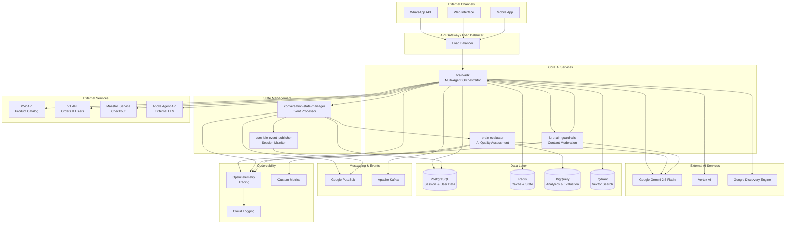

# Code documentation

Below is the full technical codification transcript as provided in the source documentation.

---

# Technical & AI Overview - Magalu Lu Brain System

## 1. High-level Summary

**What the app does**: Lu Brain is a sophisticated multi-agent conversational AI system built for Magalu (Magazine Luiza), Brazil's largest e-commerce platform. It provides comprehensive customer support through a WhatsApp-based virtual assistant named "Lu" that handles sales inquiries, order management, product recommendations, customer authentication, store localization, and general customer service.

**AI/ML/GenAI capabilities**: **(Confirmed)** The system implements advanced multi-agent architecture with:
- **Multi-agent orchestration** using Google ADK (Agent Development Kit)
- **Large Language Model integration** with Gemini 2.5 Flash models
- **Multimodal AI capabilities** for text, image, and audio processing
- **AI-powered evaluation and observability** for conversation quality assessment
- **Content moderation and guardrails** for safety and compliance
- **Retrieval-Augmented Generation (RAG)** for product search and recommendations

**Key high-level properties**: 
- **Architecture**: Microservices with event-driven communication via Google Pub/Sub
- **Stack**: Python 3.11/3.12, FastAPI, Google Cloud Platform, PostgreSQL, Redis, Kafka
- **Deployment**: Containerized with Docker, GitLab CI/CD, Google Cloud infrastructure
- **Observability**: OpenTelemetry tracing, structured logging, real-time evaluation metrics

## 2. Components & Modules

| Component / Module | Path(s) | Responsibility / Description (Confirmed / Inferred) |
|---|---|---|
| **brain-adk** | `/brain-adk/` | **(Confirmed)** Core AI agent orchestration service. Multi-agent system with specialized sub-agents for different customer service domains. Handles conversation routing, tool calling, memory management, and external integrations. |
| **brain-evaluator** | `/brain-evaluator/` | **(Confirmed)** AI conversation evaluation service. Provides real-time and batch evaluation of conversation quality using multimodal metrics, intent classification, and product category analysis. |
| **conversation-state-manager** | `/conversation-state-manager/` | **(Confirmed)** Event-driven service managing conversation state and orchestrating cross-service actions. Handles session lifecycle, follow-up messages, webhook notifications, and state persistence. |
| **lu-brain-guardrails** | `/lu-brain-guardrails/` | **(Confirmed)** AI safety and content moderation service. Provides text, image, and audio moderation using Gemini models to ensure safe and compliant interactions. |
| **csm-idle-event-publisher** | `/csm-idle-event-publisher/` | **(Confirmed)** Background service that detects idle conversation sessions and publishes timeout events to trigger appropriate actions like session closure or follow-up messages. |

## 3. Architecture Diagram

### 3.1 Overall System Architecture

### 3.2 Agent Architecture & Message Flow

**(Confirmed)** The brain-adk implements a hierarchical multi-agent system with specialized sub-agents for each business domain. Here's the agent architecture focusing on the key workstreams:

```mermaid
graph TD
    subgraph "Customer Channels"
        USER[Customer Message<br/>WhatsApp/Web/Mobile]
    end

    subgraph "Root Agent Layer"
        ROOT[Lu Root Agent<br/>Intent Classification & Routing]
    end

    subgraph "Specialized Sub-Agents"
        AUTH[Authentication Agent<br/>User Identity & Verification]
        SALES[Sales Manager Agent<br/>Product Search & Recommendations]
        EXTERNAL[External Provider Agent<br/>Apple API Integration]
        PAYMENT[Payment Processing Agent<br/>Credit Card & Checkout]
        INFO[Info Specialist Agent<br/>General Support]
        ORDER[Order Agent<br/>Order Status & Management]
    end

    subgraph "Service Layer"
        GUARD[Guardrails Service<br/>Content Moderation]
        CSM[Conversation State Manager<br/>Session Management]
        EVAL[Brain Evaluator<br/>Quality Assessment]
    end

    subgraph "External Services & APIs"
        GEMINI[Gemini 2.5 Flash<br/>LLM Processing]
        APPLE_API[Apple Agent API<br/>External LLM Service]
        P52_API[P52 API<br/>Product Catalog]
        MAESTRO_API[Maestro API<br/>Payment Processing]
        V1_API[V1 API<br/>User & Order Data]
        SEARCH_ENGINE[Google Discovery Engine<br/>Semantic Search]
    end

    subgraph "Data & State"
        POSTGRES[(PostgreSQL<br/>Session & User Data)]
        REDIS[(Redis Cache<br/>Authentication & State)]
        QDRANT[(Qdrant Vector DB<br/>Product Embeddings)]
    end

    %% Message Flow
    USER --> ROOT
    ROOT --> GUARD
    GUARD --> ROOT

    %% Agent Routing based on Intent
    ROOT --> AUTH
    ROOT --> SALES
    ROOT --> EXTERNAL
    ROOT --> PAYMENT
    ROOT --> INFO
    ROOT --> ORDER

    %% Agent-to-Service Communication
    AUTH --> V1_API
    AUTH --> REDIS
    SALES --> P52_API
    SALES --> SEARCH_ENGINE
    SALES --> QDRANT
    EXTERNAL --> APPLE_API
    PAYMENT --> MAESTRO_API
    PAYMENT --> V1_API
    
    %% All agents use Gemini for LLM processing
    ROOT --> GEMINI
    AUTH --> GEMINI
    SALES --> GEMINI
    EXTERNAL --> GEMINI
    PAYMENT --> GEMINI
    INFO --> GEMINI
    ORDER --> GEMINI

    %% State management
    ROOT --> CSM
    AUTH --> POSTGRES
    SALES --> POSTGRES
    PAYMENT --> POSTGRES
    
    %% Evaluation and monitoring
    CSM --> EVAL
    ROOT --> EVAL

    %% Styling
    classDef agentStyle fill:#e1f5fe,stroke:#01579b,stroke-width:2px
    classDef serviceStyle fill:#f3e5f5,stroke:#4a148c,stroke-width:2px
    classDef dataStyle fill:#e8f5e8,stroke:#1b5e20,stroke-width:2px
    classDef externalStyle fill:#fff3e0,stroke:#e65100,stroke-width:2px
    
    class ROOT,AUTH,SALES,EXTERNAL,PAYMENT,INFO,ORDER agentStyle
    class GUARD,CSM,EVAL serviceStyle
    class POSTGRES,REDIS,QDRANT dataStyle
    class GEMINI,APPLE_API,P52_API,MAESTRO_API,V1_API,SEARCH_ENGINE externalStyle
```

### 3.3 Typical Message Flow Examples

#### Authentication Flow
1. **User**: "I want to check my orders"
2. **Root Agent**: Detects authentication requirement → Routes to **Authentication Agent**
3. **Auth Agent**: 
   - Checks Redis cache for existing session
   - If not authenticated → Requests CPF/phone via V1 API
   - Validates credentials and creates session
   - Stores auth state in Redis and PostgreSQL
4. **Root Agent**: Receives auth confirmation → Routes to **Order Agent**
5. **Order Agent**: Retrieves orders via V1 API using authenticated session

#### Product Search Flow
1. **User**: "I'm looking for an iPhone"
2. **Root Agent**: Detects search intent → Routes to **Sales Manager Agent**
3. **Sales Manager Agent**:
   - Processes query through semantic search (Qdrant vectors)
   - Calls P52 API for product catalog data
   - Uses Google Discovery Engine for enhanced search
   - Applies filters and ranking algorithms
   - Generates product recommendations via Gemini
4. **Root Agent**: Receives recommendations → Formats response for user

#### Apple Agent Integration Flow
1. **User**: "What's the latest iPhone price from Apple?"
2. **Root Agent**: Detects Apple-specific query → Routes to **External Provider Agent**
3. **External Provider Agent**:
   - Formats query with conversation context
   - Calls Apple Agent API (external LLM service)
   - Processes response from external agent
   - Integrates Apple data with Magalu catalog (via Sales Agent if needed)
4. **Root Agent**: Combines external and internal data → Returns comprehensive response

#### Credit Card Payment Flow
1. **User**: "I want to buy this product with my credit card"
2. **Root Agent**: Detects payment intent → Routes to **Payment Processing Agent**
3. **Payment Agent**:
   - Validates user authentication (coordinates with Auth Agent)
   - Retrieves cart data and pricing via P52 API
   - Initiates payment flow via Maestro API
   - Handles credit card validation and processing
   - Manages payment status and confirmations
4. **Root Agent**: Receives payment confirmation → Provides order summary

## 4. Core Feature Flows / Critical Paths

### Customer Conversation Flow
- **What it does**: Routes customer messages through appropriate AI agents based on intent detection and conversation context
- **Entry points**: [brain-adk/app/main.py](brain-adk/app/main.py#L1), WhatsApp webhooks, web interface endpoints
- **Flow & modules involved**:
  1. Message reception at [brain-adk/app/magalu/agent.py](brain-adk/app/magalu/agent.py#L25-45) - Root agent analyzes intent
  2. Agent routing via [brain-adk/app/magalu/prompt.py](brain-adk/app/magalu/prompt.py#L1-30) - Prompt-based decision making
  3. Sub-agent execution in `/brain-adk/app/magalu/sub_agents/` - Specialized handling
  4. Tool execution from [brain-adk/app/magalu/tools/](brain-adk/app/magalu/tools/) - External API calls
  5. Response generation and memory management
- **AI involvement**: Gemini 2.5 Flash for intent classification, response generation, tool calling decisions
- **External dependencies**: P52 API (products), V1 API (orders), Redis (caching), PostgreSQL (session state)
- **Edge cases / error handling**: Retry mechanisms with exponential backoff, fallback to human handoff, graceful degradation

### AI Quality Evaluation
- **What it does**: Real-time and batch evaluation of conversation quality using multimodal AI metrics
- **Entry points**: [brain-evaluator/app/routes/evaluate_route.py](brain-evaluator/app/routes/evaluate_route.py#L28-35) POST `/evaluate`
- **Flow & modules involved**:
  1. Evaluation request processing in [brain-evaluator/app/evaluator/evaluation_def.py](brain-evaluator/app/evaluator/evaluation_def.py#L32-60)
  2. Data retrieval from BigQuery conversations
  3. Intent classification via [brain-evaluator/app/evaluator/preprocess/intent_classifier.py](brain-evaluator/app/evaluator/preprocess/intent_classifier.py)
  4. Metric evaluation using [brain-evaluator/app/evaluator/metrics/](brain-evaluator/app/evaluator/metrics/) classes
  5. Results storage in BigQuery
- **AI involvement**: Gemini models for contextual relevance assessment, similarity scoring, recommendation evaluation
- **External dependencies**: BigQuery (conversation data), Google Cloud Storage (artifacts), authentication services
- **Edge cases / error handling**: Conversation criteria validation, metric failure handling, batch processing recovery

### Content Moderation & Safety
- **What it does**: Real-time content moderation for text, images, and audio using AI-powered safety checks
- **Entry points**: [lu-brain-guardrails/app/routes/guardrails.py](lu-brain-guardrails/app/routes/guardrails.py#L25-85) multiple moderation endpoints
- **Flow & modules involved**:
  1. Request validation and authentication
  2. Content analysis via Gemini models in [lu-brain-guardrails/app/services/guardrails.py](lu-brain-guardrails/app/services/guardrails.py)
  3. Safety scoring and classification
  4. Response generation with moderation results
- **AI involvement**: Gemini models for multimodal content analysis, safety classification, toxicity detection
- **External dependencies**: Google Cloud AI services, authentication middleware
- **Edge cases / error handling**: Model timeout handling, content type validation, fallback safety measures

### Apple Agent Integration
- **What it does**: Integrates with external Apple Agent service powered by a separate language model to handle Apple-specific queries and services
- **Entry points**: [brain-adk/app/magalu/tools/external_providers/ask_apple.py](brain-adk/app/magalu/tools/external_providers/ask_apple.py#L16-30) Apple Agent API tool
- **Flow & modules involved**:
  1. Apple-related intent detection in root agent
  2. Apple service initialization with authentication
  3. Query forwarding to external Apple Agent LLM
  4. Response processing and integration into conversation
- **AI involvement**: Intent recognition for Apple-specific scenarios, conversation context analysis, external LLM coordination
- **External dependencies**: Apple Agent API with external language model, secure credential management
- **Edge cases / error handling**: External API failure handling, response validation, fallback mechanisms

## 5. Data Model & Persistence

**Data models and schemas**: **(Confirmed)**
- **Session data**: User conversations, agent states, memory storage in PostgreSQL
- **Evaluation schemas**: [brain-evaluator/app/schemas/evaluate.py](brain-evaluator/app/schemas/evaluate.py) - Request/response models for AI evaluation
- **Event schemas**: [conversation-state-manager/app/schemas/](conversation-state-manager/app/schemas/) - CSM events, actions, state updates

**Storage technologies**:
- **PostgreSQL**: **(Confirmed)** Primary persistence for session state, user data, conversation history
- **Redis**: **(Confirmed)** Caching layer for agent state, authentication tokens, temporary data
- **BigQuery**: **(Confirmed)** Analytics warehouse for conversation data, evaluation metrics, business intelligence
- **Qdrant**: **(Confirmed)** Vector database for semantic search and RAG operations
- **Google Cloud Storage**: **(Inferred)** Blob storage for artifacts, images, audio files

**Key relationships and indexing**: **(Inferred)**
- Session-User relationships with foreign key constraints
- Time-series indexing for conversation timestamps
- Vector similarity indexes in Qdrant for product recommendations

## 6. AI / ML / GenAI Capabilities

**Solution types and patterns**: **(Confirmed)**
- **Multi-agent conversational system** - Hierarchical agent architecture with specialized sub-agents
- **Tool-calling/function-calling** - Dynamic tool selection based on conversation context
- **Retrieval-Augmented Generation (RAG)** - Product search with semantic similarity
- **Real-time AI evaluation** - Conversation quality assessment using LLM-as-a-judge patterns
- **Multimodal content moderation** - Safety assessment across text, image, and audio
- **Intent classification** - Automated routing to appropriate service agents

**Modalities**: **(Confirmed)**
- **Text**: Primary conversation interface, prompt engineering, response generation
- **Images**: Product images, user-uploaded content, visual product recommendations
- **Audio**: Voice message processing, audio content moderation

**Where AI is invoked**:
- **Request routing**: Every message processed through intent classification
- **Response generation**: All customer interactions use LLM for natural language generation
- **Quality assurance**: Post-conversation evaluation for continuous improvement
- **Safety filtering**: Pre and post-processing content moderation
- **Product recommendations**: Semantic search with embedding-based matching

## 7. Models, Providers & Orchestration

**Model providers and models**: **(Confirmed)**
- **Google Gemini 2.5 Flash**: Primary conversational model ([brain-adk/app/magalu/settings/config.py](brain-adk/app/magalu/settings/config.py#L27))
- **Gemini 2.5 Flash Image**: Specialized multimodal model for visual content
- **Google Vertex AI**: Platform for model serving and management
- **Google Discovery Engine**: Semantic search capabilities

**Orchestration frameworks**: **(Confirmed)**
- **Google ADK (Agent Development Kit)**: Core orchestration framework ([brain-adk/requirements/base.txt](brain-adk/requirements/base.txt#L5))
- **Custom agent architecture**: Multi-level agent hierarchy with specialized sub-agents
- **Event-driven coordination**: Pub/Sub messaging for cross-service communication

**Prompt templates and management**: **(Confirmed)**
- **Structured prompts**: [brain-adk/app/magalu/prompt.py](brain-adk/app/magalu/prompt.py#L1-30) - Centralized prompt definitions
- **Agent-specific instructions**: Each sub-agent has specialized prompt templates
- **Dynamic context injection**: Memory and conversation history integration
- **Guardrail prompts**: [lu-brain-guardrails/app/prompts/system_prompts.yaml](lu-brain-guardrails/app/prompts/system_prompts.yaml) - Safety moderation prompts

**RAG & Vector Search**: **(Confirmed)**
- **Qdrant integration**: Vector database for semantic product search
- **Embedding generation**: Google embeddings for product and conversation similarity
- **Retrieval strategies**: Hybrid search combining semantic and keyword matching
- **Context augmentation**: Retrieved product data enriches agent responses

## 8. Configuration, Deployment & Infrastructure

**Configuration mechanisms**: **(Confirmed)**
- **Environment variables**: Comprehensive config via `.env` files across all services
- **Service-specific settings**: [brain-adk/app/magalu/settings/config.py](brain-adk/app/magalu/settings/config.py#L1-50) - Centralized configuration classes
- **Secret management**: Google Cloud credentials, API keys via environment variables
- **Feature flags**: Experiment toggles for search algorithms and model selection

**Deployment architecture**: **(Confirmed)**
- **Cloud provider**: Google Cloud Platform (GCP)
- **Containerization**: Docker with multi-stage builds ([brain-adk/Dockerfile](brain-adk/Dockerfile#L1-30))
- **Orchestration**: GitLab CI/CD with automated deployment pipelines ([brain-adk/.gitlab-ci.yml](brain-adk/.gitlab-ci.yml#L1-20))
- **Environment separation**: Development, staging (homolog), production environments

**Infrastructure components**: **(Confirmed)**
- **Compute**: Google Kubernetes Engine (GKE) or Cloud Run **(Inferred)**
- **Messaging**: Google Pub/Sub for event-driven communication
- **Databases**: Google Cloud SQL (PostgreSQL), Google Cloud Memorystore (Redis)
- **AI Services**: Vertex AI, Google Discovery Engine, Gemini API

**Integrations**: **(Confirmed)**
- **Magalu APIs**: P52 (product catalog), V1 (orders/users), Maestro (checkout)
- **External AI services**: Apple Agent API with separate language model
- **Communication**: WhatsApp Business API
- **Analytics**: Google BigQuery for data warehousing

## 9. Data, Governance & Safety

**Types and sources of data**: **(Confirmed)**
- **Customer conversations**: WhatsApp messages, user queries, agent responses
- **Product catalog**: Magalu's extensive e-commerce inventory data
- **User profiles**: Authentication data, preferences, purchase history
- **Evaluation metrics**: AI performance data, conversation quality scores

**Data pipelines and ETL**: **(Inferred)**
- **Real-time ingestion**: Event streaming via Pub/Sub and Kafka
- **Batch processing**: Scheduled evaluation jobs for conversation analysis
- **Data transformation**: Conversation preprocessing, intent classification, sentiment analysis

**Data governance and safety**: **(Confirmed)**
- **Access control**: JWT-based authentication across all services
- **Content moderation**: Multi-modal AI safety checks before and after processing
- **Privacy protection**: **(Inferred)** PII handling via structured data schemas
- **Audit logging**: Comprehensive request/response logging with OpenTelemetry

**AI Safety measures**: **(Confirmed)**
- **Input validation**: Structured schemas for all AI service inputs
- **Content filtering**: [lu-brain-guardrails](lu-brain-guardrails/) service for real-time moderation
- **Output sanitization**: Response filtering and safety scoring
- **Rate limiting**: Request throttling and timeout controls
- **Model monitoring**: Continuous evaluation for quality and safety metrics

## 10. Cross-cutting Concerns

**Logging, monitoring, observability**: **(Confirmed)**
- **OpenTelemetry integration**: Distributed tracing across all services ([lu-brain-guardrails/app/utils/opentelemetry.py](lu-brain-guardrails/app/utils/opentelemetry.py#L1-50))
- **Structured logging**: JSON-formatted logs with correlation IDs
- **AI-specific monitoring**: Conversation quality metrics, model performance tracking
- **Custom dashboards**: Real-time evaluation results via brain-evaluator service

**Testing strategy**: **(Confirmed)**
- **Unit testing**: Pytest frameworks across all services
- **Integration testing**: API endpoint validation and cross-service communication
- **AI evaluation testing**: Automated conversation quality assessment
- **End-to-end testing**: Full conversation flow validation **(Inferred)**

**Performance and scalability**: **(Confirmed)**
- **Microservices architecture**: Independent scaling of AI components
- **Caching strategies**: Redis for session state and authentication tokens
- **Async processing**: FastAPI with asyncio for concurrent request handling
- **Event-driven design**: Decoupled services via Pub/Sub messaging

**Security considerations**: **(Confirmed)**
- **Authentication**: JWT tokens with service-to-service validation
- **Network security**: HTTPS/TLS encryption for all communications
- **Container security**: Non-root user execution in Docker containers
- **Credential management**: Environment-based secret injection

## 11. Limitations & Open Questions

**Items that are unknown or ambiguous**:

- **Production scaling metrics**: Actual request volumes, concurrent user limits, latency SLAs **(Unknown - No production metrics visible in code)**
- **Model fine-tuning**: Whether Gemini models are fine-tuned for Magalu-specific use cases **(Unknown - Only base model configurations visible)**
- **Data retention policies**: Long-term storage strategies for conversation data and evaluation metrics **(Unknown - No retention policies in code)**
- **Disaster recovery**: Backup strategies, failover mechanisms, multi-region deployment **(Unknown - No DR configuration visible)**
- **Cost optimization**: Model usage costs, optimization strategies for AI service consumption **(Unknown - No cost tracking visible)**
- **Human-in-the-loop workflows**: Escalation procedures, human agent handoff mechanisms **(Unknown - Limited evidence of human agent integration)**
- **A/B testing infrastructure**: Experiment management for prompt variations and model comparisons **(Partially visible - Search experiments mentioned but not fully documented)**
- **Real-time model monitoring**: Drift detection, performance degradation alerts **(Unknown - Basic metrics visible but not comprehensive monitoring)**

**Explicit notes where human input is required**:

- **Production deployment topology**: Actual GCP resource allocation and network architecture requires infrastructure team confirmation
- **Business metrics and KPIs**: Customer satisfaction scores, conversion rates, operational efficiency metrics need business stakeholder input
- **Compliance requirements**: LGPD, data protection regulations specific to Brazilian e-commerce need legal team review
- **Integration details**: Complete API specifications for Magalu's internal services require API documentation review
- **Performance requirements**: Actual latency, throughput, and availability requirements need product team confirmation

---

# Insights, Learning & Anecdotes

## What was built and why it mattered
Magalu set out to create an end-to-end conversational commerce experience inside WhatsApp, powered by a digital persona (“Lu”) that could guide customers from inspiration and discovery to checkout and after-sales, without forcing them to leave the chat context. The engagement paired product/UX journey design with a future-ready AI platform build, including agent orchestration, integrations (catalog, orders, payments), and a measurement layer for both business outcomes and AI quality.

## Development approach and delivery model
- **Co-building with strategic partners**: The solution was developed in close collaboration with Google and Meta, leveraging partner capabilities while also shaping them through real-world feedback and implementation constraints.
- **Episode-based agent design**: The overall customer journey was decomposed into discrete “episodes” (e.g., discovery, recommendation, checkout, after-sales). Specialized agents were orchestrated to handle each episode, coordinated by a root router.
- **Platform-first build**: Alongside customer-facing features, the team invested heavily in cross-cutting platform components—guardrails, evaluation, observability, and session management—so the system could scale safely.

## Technical learnings that shaped the build
### 1) Partner frameworks can accelerate—but only if you plan for gaps
The team used a newly developed Google framework that was still evolving and missing features. This created additional engineering load (workarounds, bug triage, and frequent partner touchpoints), but it also allowed the team’s field feedback to influence Google’s backlog and releases (e.g., improvements around agent interruption when new messages arrive).

### 2) Testing GenAI systems needs system-level evaluation, not just unit tests
Interview participants emphasized that classic unit testing is insufficient for non-deterministic systems. Prompt edits, routing tweaks, or retrieval changes can shift outcomes in subtle ways—so the team built evaluation methods closer to “integration tests for agents,” supported by metrics and acceptance criteria to differentiate normal variance from true regressions.

### 3) Observability became a product enabler—not just an ops tool
During the Black Friday launch, the team integrated WhatsApp flows with Apple’s APIs so the assistant could retrieve authoritative Apple product information rather than relying on the LLM’s internal knowledge. Apple’s strict QA made this challenging, but strong observability helped track call frequency and latency and connect them to session/business metrics. Those metrics were also shared with Apple to demonstrate performance and usage, which reinforced partner trust and enabled faster iteration.

### 4) Guardrails and security required architectural depth
The system adopted layered protections (e.g., preprocessing and dedicated models to detect/flag unsafe inputs like adult imagery or harmful code). Legal advisors helped prioritize risk scenarios; the team created dedicated test sets to probe jailbreak/prompt-injection robustness, and wired guardrails into the orchestration flow so moderation became part of the “happy path,” not a bolt-on.

## Practical anecdotes (what ‘good’ looked like in the wild)
- **Ambiguous query success**: A customer asked for “the thing for the thing,” with no clear product name. The assistant still returned the correct item, illustrating the value of strong intent understanding and retrieval/search capabilities.
- **Intent extraction from images**: In testing, an image included code and comments in the background. The agent inferred intent from the code comments and recommended the correct product—demonstrating multimodal reasoning and the importance of robust guardrails/evaluation for edge-case inputs.

## Reusability and cross-project learning
While the team did not directly reuse code from some similar AI-shopping engagements, they carried forward practical learnings—especially around adopting the same evolving Google framework. The evaluation and observability approaches were explicitly recognized as reusable assets that could generalize to other agentic systems and client contexts.

## What to preserve for future versions
- **A measurement-first culture**: Keep the discipline of tying engineering changes (prompts, retrieval, tools) to evaluation results and business KPIs.
- **Partner-quality integrations**: Prefer authoritative integrations (like Apple API data) for domains where correctness is critical, and use LLMs to orchestrate, explain, and personalize rather than hallucinate.
- **Safety as a core service**: Maintain guardrails as a first-class microservice with clear taxonomies, severity levels, and incident signaling, enabling faster iteration without compromising safety.

